某次QClub大连聚会以后，与[侯伯薇](http://weibo.com/houbowei)[http://weibo.com/houbowei](http://weibo.com/houbowei) 微博上通气，问能不能有一个专门的聚会讨论编程语言，伯薇也正有此意，于是我就选了Lua作为题目。侯伯薇联系到七牛的许式伟[http://weibo.com/xushiweizh](http://weibo.com/xushiweizh) ，专程从上海飞到大连介绍Go语言。

周六这天大连天公不作美下起了阵雨，我在微博上稍稍担心了一下，到了中荷人寿，发现许式伟已经在那里和侯伯薇聊天，还有liteIDE的作者也在。许式伟和微博照片基本没差别，但是感觉更瘦一些，另外也不不是很善言谈。稍稍聊了一阵我们就开始分享环节了，观察了一下到场的大概有20多人吧，不算很多。

开始先由我介绍Lua编程语言，做了一个调查，发现到场的C++、C#、Java基本上差不多比例，听说过Lua编程语言的也有几个，后来聊天知道某位兄弟是欧兰辉老师公司里面做pascal连接Lua的。首先介绍了为什么选择Lua，最主要一点是用来玩，比如弱引用，基于原型面向对象这些概念都是用Lua学起。由于担心我讲的时间太长影响许式伟，稍稍把速度提前了一些，有些内容简单提一下就略过了，后来发现还是讲快了。

许式伟关于Go语言的分享主要是两部分，一个是为什么选择Go，因为他喜欢Go语言的哲学，并且坚信Go会成为云计算最重要的编程语言，互联网时代的汇编（这个倒是觉得JS已经是了，没法争）。然后许式伟主要针对Go语言一些让人眼前一亮的地方着重介绍，比如接口机制，defer等等。本来我期望许老师介绍一下goroutine和channel，但这方面没有提。

由于许式伟提了某些Go有趣的地方，我也想补充一下，首先Lua也支持多返回值，这是CLU的特色。另外Lua也没有try catch，但是有pcall和xpcall调用机制，另外对于接口这个机制，完全可以用table模拟出来。

由于家里有事情，我在openspace环节听了一阵就离开了，非常不好意思，本来打算多聊一阵，和伯薇小聚一下，也只能等下次了。

最后大力感谢许式伟到大连做了如此精彩的分享，这是大连本地技术圈很难得的好事。也感谢侯伯薇一直坚持组织QClub大连的活动，给我们这些喜欢技术、喜欢一起聊天的开发者这么好的一个活动，十分不容易，再次感谢！

一些PPT截屏，完整的可以到这里下载： “Lua 编程语言0921.pptx” http://vdisk.weibo.com/s/d7vUZ

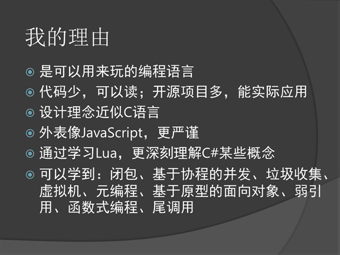

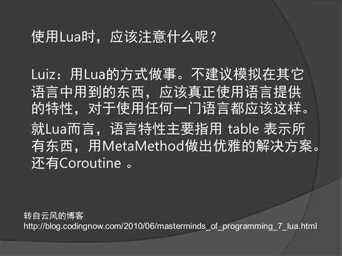

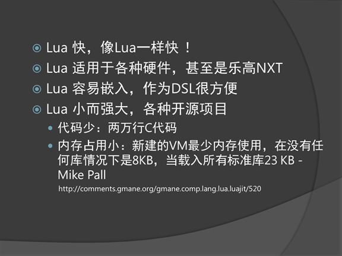

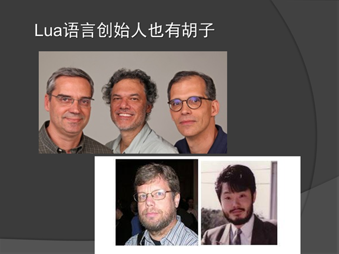

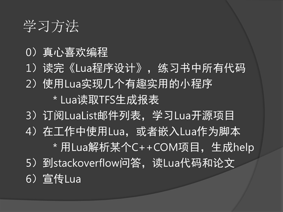

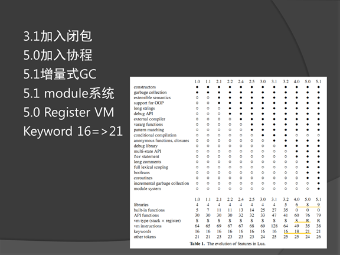

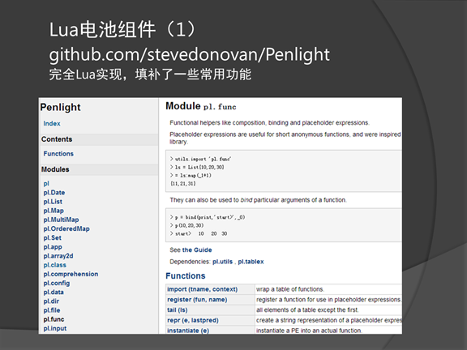

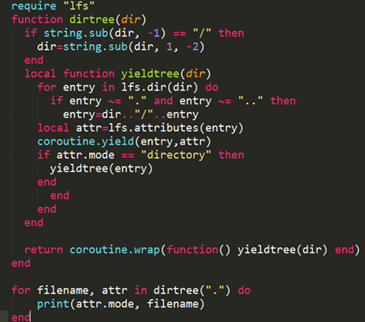

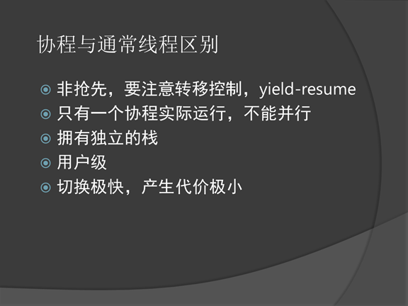

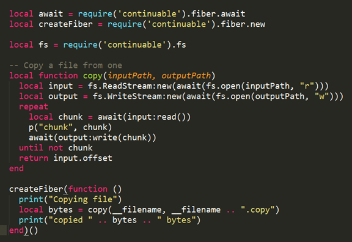

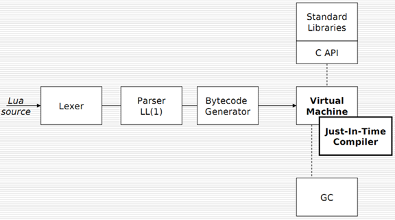

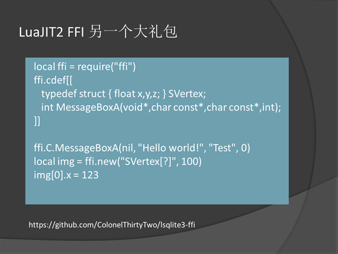

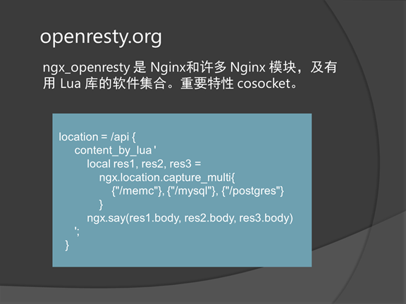

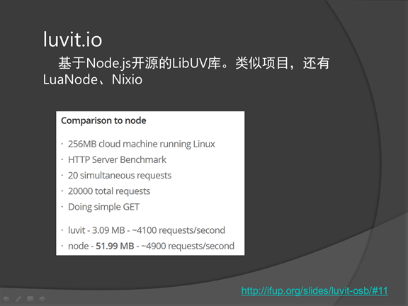

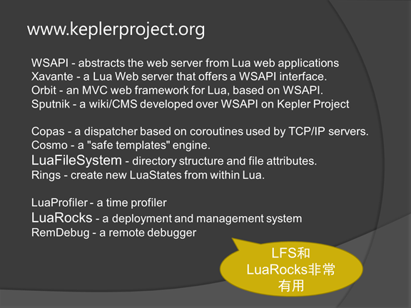

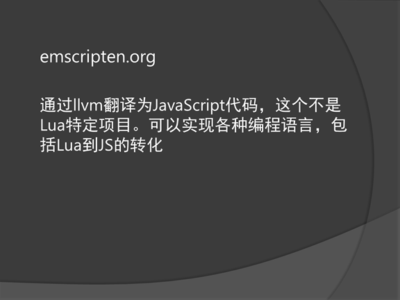

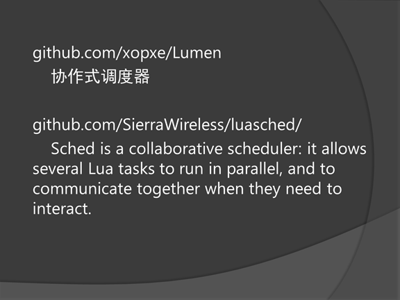

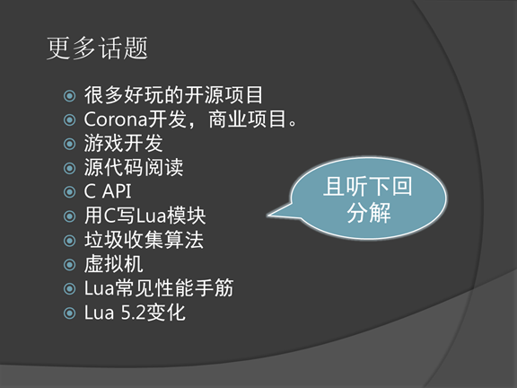

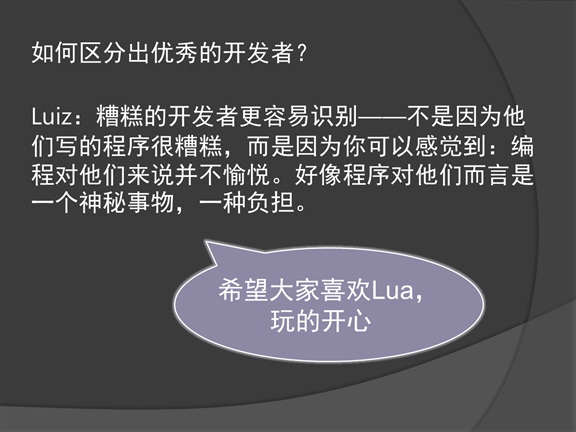

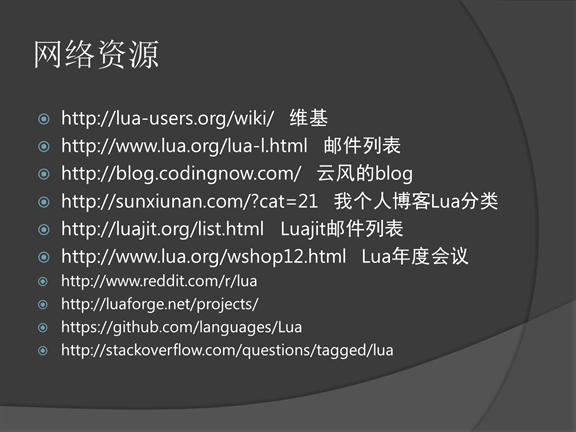
