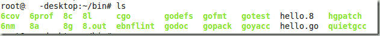
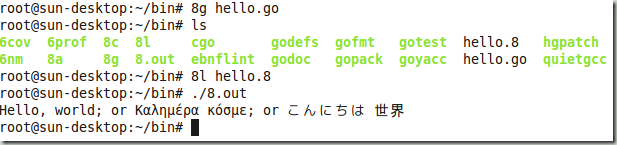
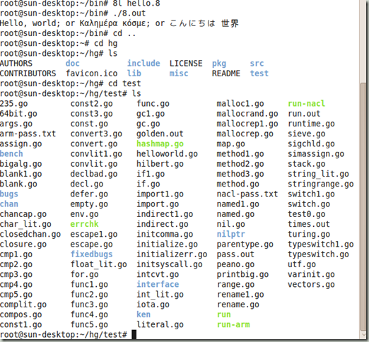
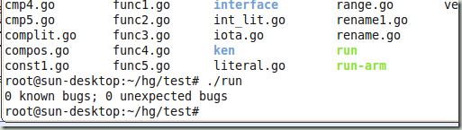

Go编程语言是Google中一些大牛（尤其是有着plan9前科的大牛们）如Rob Pike，Ken Thomason这两位赫赫有名的程序高手、技术作家。

很多人认为Go编程语言有点像是C语言与Python的混血，在Golang主页上也清楚写着Go的祖先有C，有Pascal/Modula（也是C++的祖先）/Oberon，还有CSP这个语言，另外很多基础代码也来自Plan 9操作系统。

我是在一个Ubuntu9.10的虚拟机上试用的Go，大家可以跟着我的脚步一探Go的究竟。

1，准备

安装Go之前需要安装mercurial，这是Go的版本控制工具，可以直接通过ubuntu的安装程序搜索添加。

然后为当前用户定义下面几个bash变量。在ubuntu下敲入cd $HOME，一般是/home/username，然后敲vim .bashrc，修改.bashrc

在这个文件中添加如下（我的cpu是intel，所以是GOARCH是386，具体可参考golang.org说明）：

GOROOT="$HOME/Go"

export GOROOT

GOOS=linux

export GOOS

GOARCH=386

export GOARCH

GOBIN="$HOME/bin"

export GOBIN

在帮助里写GOBIN是可选的，但我试了，必须有。

在.bashrc最后还要加上这一行，保证能正确编译安装。

PATH=$PATH:$GOBIN

2，下载源代码编译

在你的用户目录下运行这个命令

hg clone -r release https://go.googlecode.com/hg/ $GOROOT

这样在你的用户目录下应该有个Go目录了。

确保你的ubuntu安装了gcc（可以在软件包管理中添加build-essential）

进入Go\\src

然后敲./all.bash

如果前面没有问题，编译应该可以正确完成。编译后可以进入$HOME/bin查看是不是有6g 6l 8g 8l这样的可执行文件。

3，试用Go

一般x86机器是使用8开头的命令，如8g进行编译，8l进行链接，6开头的是给AMD cpu使用，如果编译安装没错，那么$HOME/username/bin这个目录应该已经在PATH中（可以通过echo $PATH确认）。

这时候应该hello world了，编辑一个hello.go如下：

package main  
import "fmt"

func main() {   
    fmt.Printf("Hello, world; or Καλημέρα κόσμε; or こんにちは 世界\\n");  
}

运行8g hello.go编译，正常情况下什么都不提示就执行完了，但是ls可以发现多了个hello.8文件

运行8l hello.8链接，会产生一个8.out.

运行./8.out应该打出如下消息：

然后可以进入Go的目录中（因为我设置的有问题，下载Go的目录名是hg，但是不影响什么），有个test目录，进去test目录，运行./run命令。

也可以单独编译某个代码运行，如果正确的话，不会有任何提示信息输出。

OK，基本上Go编程语言的大致试用情况就是这样，真正要学Go编程语言的朋友，还是需要花时间来读文档，写写代码不断练习的。
