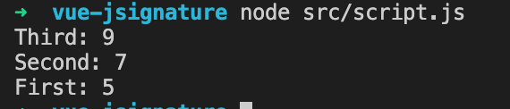
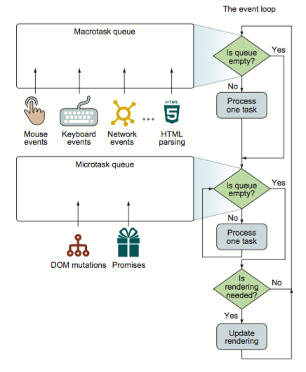

最近碰到这样一个问题，JavaScript可以通过Promise.resolve()来转化一个值或者thenable对象成为一个Promise。

Promise可以通过then串联起来（chain），then的函数中，可以直接return val，也可以return Promise.resolve(val)，那么这两种方式有什么区别么？

我听到的回答是没什么不同，但是我理解不深，所以打算自己研究一下。构造以下代码例子，猜猜运行结果是什么呢？

```
Promise.resolve(1)
    .then(v => Promise.resolve(v + 1))
    .then(v => Promise.resolve(v + 3))
    .then(v => console.log(`First: ${v}`));
Promise.resolve(1)
    .then(v => v + 1)
    .then(v => Promise.resolve(v + 5))
    .then(v => console.log(`Second: ${v}`));
Promise.resolve(1)
    .then(v => v + 1)
    .then(v => v + 7)
    .then(v => console.log(`Third: ${v}`));
```

根据我对并发asynchronous的理解，如果这两种形式一样的话，结果有可能是顺序的First，Second，Third。也有可能是乱序的，First Second Third顺序不一定，在浏览器运行有可能因为某种原因，一直出现同样的结果，所以我们分别试试Chrome和Safari的操作台。但是结果很一致，哪怕在本地node直接跑nodejs也是一样。



结论是什么呢？return Promise.resolve(val)和return val这两种方式在结果上是一样的，对于不关注运行顺序的代码来说效果也是一样的。但对于开发人员来说，需要知道这两种方式的运行时间点是不同的，这个不同在某些复杂情况下需要考虑到。简单的说，如果不是故意要延迟结果的产生返回，return val这种方式既简单又快捷，用它就好了。

BTW。

参考这篇SO回答[https://stackoverflow.com/questions/58217603/what-is-the-difference-between-returned-promise](https://stackoverflow.com/questions/58217603/what-is-the-difference-between-returned-promise) 以及这一篇[https://dev.to/deepal/promises-next-ticks-and-immediates-nodejs-event-loop-part-3-2f57](https://dev.to/deepal/promises-next-ticks-and-immediates-nodejs-event-loop-part-3-2f57) 可以知道Promise.resolve是一种微任务。

我大概能理解开发人员对于这些名词的怨念，微任务（microtask）又是什么？参考MDN这篇文章[https://developer.mozilla.org/en-US/docs/Web/API/HTML\_DOM\_API/Microtask\_guide](https://developer.mozilla.org/en-US/docs/Web/API/HTML_DOM_API/Microtask_guide) 大概就是如下图所示。一个task完成以后，开始查询微任务队列microtask queue然后运行，接着运行下一个任务或者开始render。



这些内容有些高阶了，但对于JavaScript框架作者来说是必须的，想写框架的，可以参考这一篇[https://blog.risingstack.com/writing-a-javascript-framework-execution-timing-beyond-settimeout/](https://blog.risingstack.com/writing-a-javascript-framework-execution-timing-beyond-settimeout/)
