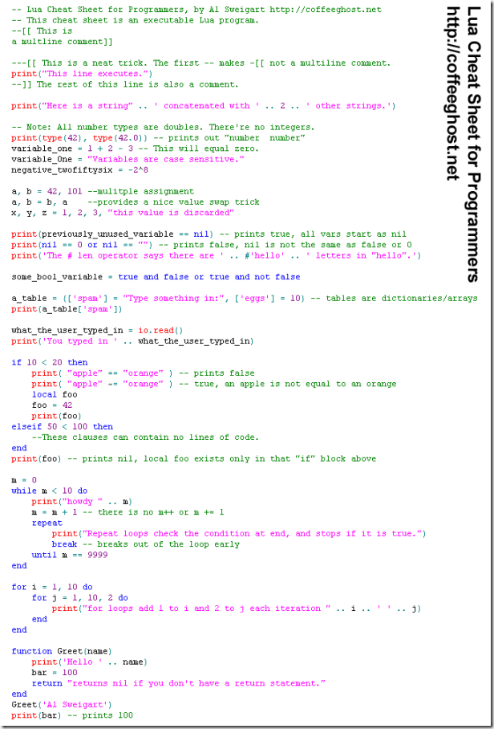

[http://coffeeghost.net/images/lua\_cheat\_sheet.png](http://coffeeghost.net/images/lua_cheat_sheet.png "http://coffeeghost.net/images/lua_cheat_sheet.png")

做一些简单说明。

关于所有数字都是double，在《programming in lua》第二版中有详细说明。除了极少数情况，可以满足大部分数值计算的需求。

对于table的说明比较详细。但是对于一些高阶问题没有涉及。比如协程，算是Lua的一大特色。还有函数作为first-class value，也可以做出很多有意思的东西。另外还有meta-table，是Lua模拟OO的关键。另外限于篇幅C API也没有介绍，相比其它编程语言，Lua与C的配合几乎可以说是无缝的。

相比而言，维基百科上对于Lua的介绍更为全面，而且篇幅也不长。感兴趣的可以参考这个链接作为补充 [http://en.wikipedia.org/wiki/Lua\_%28programming\_language%29](http://en.wikipedia.org/wiki/Lua_%28programming_language%29 "http://en.wikipedia.org/wiki/Lua_%28programming_language%29")
