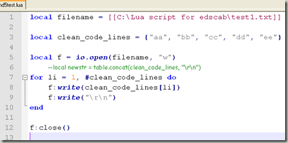
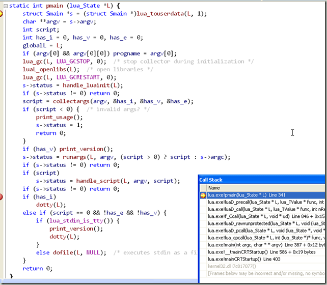
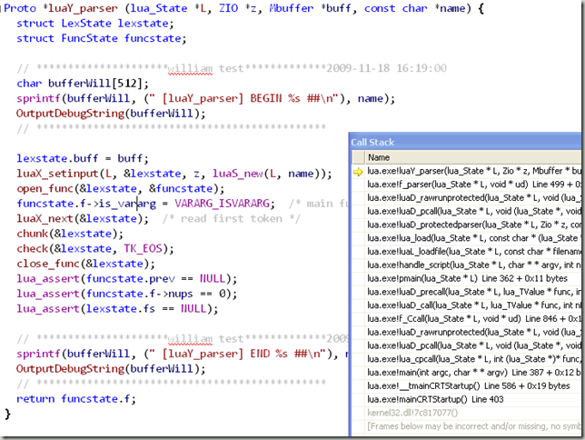
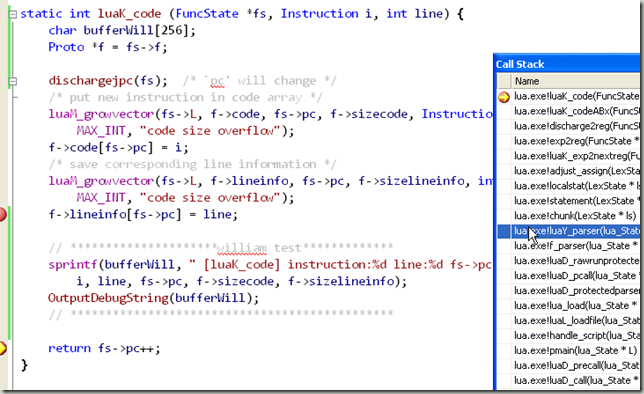
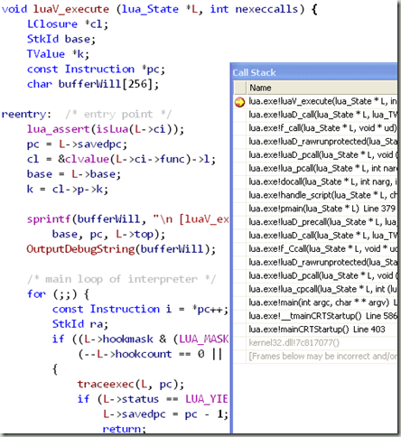
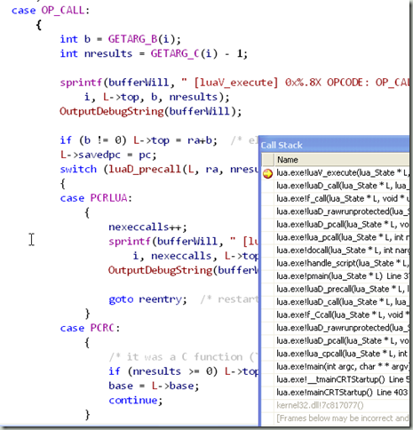
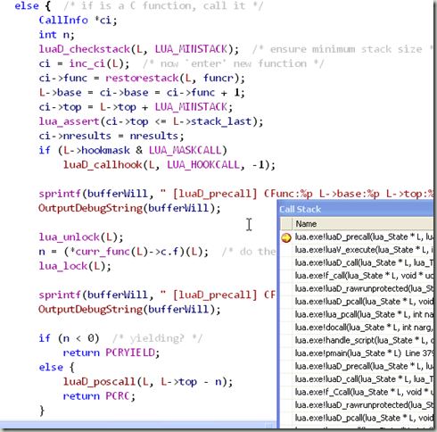

 

You could download the project for VC2008 in [http://groups.google.com/group/lua5/web/lua\_vc2008.rar](http://groups.google.com/group/lua5/web/lua_vc2008.rar "http://groups.google.com/group/lua5/web/lua_vc2008.rar")

The project will use parameter like "c:\\test.lua", and the lua script like above image.

The code starting point is pmain().

lua parser will parse the code file, and use LexState \*ls to store the information.

After the binary code generating, opcodes will run in function luaV\_execute().

for the code in standard library (c function), it will be called in function luaD\_precall().

Output like:

 \[luaD\_precall\] CFunc:0044D0E0 L->base:00393368 L->top:00393378 ci->func:00393358  ##

\[pmain\] 00393190 BEGIN ##  
\[luaL\_openlibs\] lib->name:\[\] func:0041E4C9 ##  
\[lua\_pushcclosure\] fn:0041E4C9 n:0 L->top:00393378 — cl:00396B00 L->top:00393388 ##  
\[luaD\_precall\] CFunc:0041E4C9 L->base:00393388 L->top:00393398 ci->func:00393378  ##  
\[lua\_pushcclosure\] fn:004265E0 n:0 L->top:003933A8 — cl:00396D10 L->top:003933B8 ##  
\[luaI\_openlib\] libname:\[\_G\] \[assert\] func:004265E0 ##  
\[lua\_pushcclosure\] fn:00425F00 n:0 L->top:003933A8 — cl:00396DC0 L->top:003933B8 ##  
\[luaI\_openlib\] libname:\[\_G\] \[collectgarbage\] func:00425F00 ##  
\[lua\_pushcclosure\] fn:00426520 n:0 L->top:003933A8 — cl:003936B8 L->top:003933B8 ##  
\[luaI\_openlib\] libname:\[\_G\] \[dofile\] func:00426520 ##  
\[lua\_pushcclosure\] fn:004256F0 n:0 L->top:003933A8 — cl:00396F90 L->top:003933B8 ##  
\[luaI\_openlib\] libname:\[\_G\] \[error\] func:004256F0 ##  
\[lua\_pushcclosure\] fn:00425E90 n:0 L->top:003933A8 — cl:00396E78 L->top:003933B8 ##  
\[luaI\_openlib\] libname:\[\_G\] \[gcinfo\] func:00425E90 ##  
\[lua\_pushcclosure\] fn:00425950 n:0 L->top:003933A8 — cl:00397180 L->top:003933B8 ##  
\[luaI\_openlib\] libname:\[\_G\] \[getfenv\] func:00425950 ##  
\[lua\_pushcclosure\] fn:004257C0 n:0 L->top:003933A8 — cl:00397230 L->top:003933B8 ##  
\[luaI\_openlib\] libname:\[\_G\] \[getmetatable\] func:004257C0 ##  
\[lua\_pushcclosure\] fn:004262E0 n:0 L->top:003933A8 — cl:003972E8 L->top:003933B8 ##  
\[luaI\_openlib\] libname:\[\_G\] \[loadfile\] func:004262E0 ##  
\[lua\_pushcclosure\] fn:00426360 n:0 L->top:003933A8 — cl:00397040 L->top:003933B8 ##  
\[luaI\_openlib\] libname:\[\_G\] \[load\] func:00426360 ##  
\[lua\_pushcclosure\] fn:00426180 n:0 L->top:003933A8 — cl:003970F0 L->top:003933B8 ##  
\[luaI\_openlib\] libname:\[\_G\] \[loadstring\] func:00426180 ##  
\[lua\_pushcclosure\] fn:004260E0 n:0 L->top:003933A8 — cl:00397630 L->top:003933B8 ##  
\[luaI\_openlib\] libname:\[\_G\] \[next\] func:004260E0 ##  
\[lua\_pushcclosure\] fn:00426930 n:0 L->top:003933A8 — cl:003976E0 L->top:003933B8 ##  
\[luaI\_openlib\] libname:\[\_G\] \[pcall\] func:00426930 ##  
\[lua\_pushcclosure\] fn:00425320 n:0 L->top:003933A8 — cl:00397790 L->top:003933B8 ##  
\[luaI\_openlib\] libname:\[\_G\] \[print\] func:00425320 ##  
\[lua\_pushcclosure\] fn:00425CD0 n:0 L->top:003933A8 — cl:00397840 L->top:003933B8 ##  
\[luaI\_openlib\] libname:\[\_G\] \[rawequal\] func:00425CD0 ##  
\[lua\_pushcclosure\] fn:00425D60 n:0 L->top:003933A8 — cl:003978F0 L->top:003933B8 ##  
\[luaI\_openlib\] libname:\[\_G\] \[rawget\] func:00425D60 ##  
\[lua\_pushcclosure\] fn:00425DF0 n:0 L->top:003933A8 — cl:003979A0 L->top:003933B8 ##  
\[luaI\_openlib\] libname:\[\_G\] \[rawset\] func:00425DF0 ##  
\[lua\_pushcclosure\] fn:00426820 n:0 L->top:003933A8 — cl:00397E90 L->top:003933B8 ##  
\[luaI\_openlib\] libname:\[\_G\] \[select\] func:00426820 ##  
\[lua\_pushcclosure\] fn:00425BA0 n:0 L->top:003933A8 — cl:00397F40 L->top:003933B8 ##  
\[luaI\_openlib\] libname:\[\_G\] \[setfenv\] func:00425BA0 ##  
\[lua\_pushcclosure\] fn:00425860 n:0 L->top:003933A8 — cl:00397398 L->top:003933B8 ##  
\[luaI\_openlib\] libname:\[\_G\] \[setmetatable\] func:00425860 ##  
\[lua\_pushcclosure\] fn:004254F0 n:0 L->top:003933A8 — cl:00397450 L->top:003933B8 ##  
\[luaI\_openlib\] libname:\[\_G\] \[tonumber\] func:004254F0 ##  
\[lua\_pushcclosure\] fn:00426AC0 n:0 L->top:003933A8 — cl:00397500 L->top:003933B8 ##  
\[luaI\_openlib\] libname:\[\_G\] \[tostring\] func:00426AC0 ##  
\[lua\_pushcclosure\] fn:00426050 n:0 L->top:003933A8 — cl:00397FF0 L->top:003933B8 ##  
\[luaI\_openlib\] libname:\[\_G\] \[type\] func:00426050 ##  
\[lua\_pushcclosure\] fn:00426690 n:0 L->top:003933A8 — cl:003980A0 L->top:003933B8 ##  
\[luaI\_openlib\] libname:\[\_G\] \[unpack\] func:00426690 ##  
\[lua\_pushcclosure\] fn:004269F0 n:0 L->top:003933A8 — cl:00396800 L->top:003933B8 ##  
\[luaI\_openlib\] libname:\[\_G\] \[xpcall\] func:004269F0 ##  
\[lua\_pushcclosure\] fn:004276B0 n:0 L->top:003933A8 — cl:003983E8 L->top:003933B8 ##  
\[lua\_pushcclosure\] fn:00427770 n:1 L->top:003933B8 — cl:00398440 L->top:003933B8 ##  
\[lua\_pushcclosure\] fn:004260E0 n:0 L->top:003933A8 — cl:00398500 L->top:003933B8 ##  
\[lua\_pushcclosure\] fn:00427620 n:1 L->top:003933B8 — cl:00398558 L->top:003933B8 ##  
\[lua\_pushcclosure\] fn:00427810 n:1 L->top:003933B8 — cl:00398728 L->top:003933B8 ##  
\[lua\_pushcclosure\] fn:00427110 n:0 L->top:003933B8 — cl:00396CB0 L->top:003933C8 ##  
\[luaI\_openlib\] libname:\[coroutine\] \[create\] func:00427110 ##  
\[lua\_pushcclosure\] fn:00426E70 n:0 L->top:003933B8 — cl:00398AB8 L->top:003933C8 ##  
\[luaI\_openlib\] libname:\[coroutine\] \[resume\] func:00426E70 ##  
\[lua\_pushcclosure\] fn:004273A0 n:0 L->top:003933B8 — cl:00398B68 L->top:003933C8 ##  
\[luaI\_openlib\] libname:\[coroutine\] \[running\] func:004273A0 ##  
\[lua\_pushcclosure\] fn:00426C90 n:0 L->top:003933B8 — cl:00398C18 L->top:003933C8 ##  
\[luaI\_openlib\] libname:\[coroutine\] \[status\] func:00426C90 ##  
\[lua\_pushcclosure\] fn:004271E0 n:0 L->top:003933B8 — cl:00398CC8 L->top:003933C8 ##  
\[luaI\_openlib\] libname:\[coroutine\] \[wrap\] func:004271E0 ##  
\[lua\_pushcclosure\] fn:00427340 n:0 L->top:003933B8 — cl:00398D78 L->top:003933C8 ##  
\[luaI\_openlib\] libname:\[coroutine\] \[yield\] func:00427340 ##  
\[luaD\_precall\] CFunc return n:2 ##  
\[luaL\_openlibs\] lib->name:\[package\] func:0041E07D ##  
\[lua\_pushcclosure\] fn:0041E07D n:0 L->top:00393378 — cl:00398E28 L->top:00393388 ##  
\[luaD\_precall\] CFunc:0041E07D L->base:00393388 L->top:00393398 ci->func:00393378  ##  
\[lua\_pushcclosure\] fn:0043D480 n:0 L->top:003933A8 — cl:00398F90 L->top:003933B8 ##  
\[lua\_pushcclosure\] fn:0043BB60 n:0 L->top:003933B8 — cl:003989E0 L->top:003933C8 ##  
\[luaI\_openlib\] libname:\[package\] \[loadlib\] func:0043BB60 ##  
\[lua\_pushcclosure\] fn:0043D140 n:0 L->top:003933B8 — cl:00399240 L->top:003933C8 ##  
\[luaI\_openlib\] libname:\[package\] \[seeall\] func:0043D140 ##  
\[lua\_pushcclosure\] fn:0043C850 n:0 L->top:003933C8 — cl:00399410 L->top:003933D8 ##  
\[lua\_pushcclosure\] fn:0043C0B0 n:0 L->top:003933C8 — cl:00399468 L->top:003933D8 ##  
\[lua\_pushcclosure\] fn:0043C520 n:0 L->top:003933C8 — cl:003994C0 L->top:003933D8 ##  
\[lua\_pushcclosure\] fn:0043C6E0 n:0 L->top:003933C8 — cl:00399518 L->top:003933D8 ##  
\[lua\_pushcclosure\] fn:0043CC80 n:0 L->top:003933C8 — cl:00399C28 L->top:003933D8 ##  
\[luaI\_openlib\] libname:\[(null)\] \[module\] func:0043CC80 ##  
\[lua\_pushcclosure\] fn:0043C940 n:0 L->top:003933C8 — cl:00399CD8 L->top:003933D8 ##  
\[luaI\_openlib\] libname:\[(null)\] \[require\] func:0043C940 ##  
\[luaD\_precall\] CFunc return n:1 ##  
\[luaL\_openlibs\] lib->name:\[table\] func:0041E0C3 ##  
\[lua\_pushcclosure\] fn:0041E0C3 n:0 L->top:00393378 — cl:00397A50 L->top:00393388 ##  
\[luaD\_precall\] CFunc:0041E0C3 L->base:00393388 L->top:00393398 ci->func:00393378  ##  
\[lua\_pushcclosure\] fn:0044C1F0 n:0 L->top:003933A8 — cl:00397DA0 L->top:003933B8 ##  
\[luaI\_openlib\] libname:\[table\] \[concat\] func:0044C1F0 ##  
\[lua\_pushcclosure\] fn:0044BC50 n:0 L->top:003933A8 — cl:0039A5C8 L->top:003933B8 ##  
\[luaI\_openlib\] libname:\[table\] \[foreach\] func:0044BC50 ##  
\[lua\_pushcclosure\] fn:0044BB20 n:0 L->top:003933A8 — cl:0039A678 L->top:003933B8 ##  
\[luaI\_openlib\] libname:\[table\] \[foreachi\] func:0044BB20 ##  
\[lua\_pushcclosure\] fn:0044BE60 n:0 L->top:003933A8 — cl:0039A728 L->top:003933B8 ##  
\[luaI\_openlib\] libname:\[table\] \[getn\] func:0044BE60 ##  
\[lua\_pushcclosure\] fn:0044BD60 n:0 L->top:003933A8 — cl:0039A7D8 L->top:003933B8 ##  
\[luaI\_openlib\] libname:\[table\] \[maxn\] func:0044BD60 ##  
\[lua\_pushcclosure\] fn:0044BF60 n:0 L->top:003933A8 — cl:0039A888 L->top:003933B8 ##  
\[luaI\_openlib\] libname:\[table\] \[insert\] func:0044BF60 ##  
\[lua\_pushcclosure\] fn:0044C0C0 n:0 L->top:003933A8 — cl:0039A938 L->top:003933B8 ##  
\[luaI\_openlib\] libname:\[table\] \[remove\] func:0044C0C0 ##  
\[lua\_pushcclosure\] fn:0044BEE0 n:0 L->top:003933A8 — cl:0039A9E8 L->top:003933B8 ##  
\[luaI\_openlib\] libname:\[table\] \[setn\] func:0044BEE0 ##  
\[lua\_pushcclosure\] fn:0044C4D0 n:0 L->top:003933A8 — cl:0039AA98 L->top:003933B8 ##  
\[luaI\_openlib\] libname:\[table\] \[sort\] func:0044C4D0 ##  
\[luaD\_precall\] CFunc return n:1 ##  
\[luaL\_openlibs\] lib->name:\[io\] func:0041E438 ##  
\[lua\_pushcclosure\] fn:0041E438 n:0 L->top:00393378 — cl:0039AB48 L->top:00393388 ##  
\[luaD\_precall\] CFunc:0041E438 L->base:00393388 L->top:00393398 ci->func:00393378  ##  
\[lua\_pushcclosure\] fn:00435410 n:0 L->top:003933A8 — cl:0039AD68 L->top:003933B8 ##  
\[luaI\_openlib\] libname:\[(null)\] \[close\] func:00435410 ##  
\[lua\_pushcclosure\] fn:00437230 n:0 L->top:003933A8 — cl:00393798 L->top:003933B8 ##  
\[luaI\_openlib\] libname:\[(null)\] \[flush\] func:00437230 ##  
\[lua\_pushcclosure\] fn:00435E80 n:0 L->top:003933A8 — cl:0039AFB0 L->top:003933B8 ##  
\[luaI\_openlib\] libname:\[(null)\] \[lines\] func:00435E80 ##  
\[lua\_pushcclosure\] fn:00436950 n:0 L->top:003933A8 — cl:0039B008 L->top:003933B8 ##  
\[luaI\_openlib\] libname:\[(null)\] \[read\] func:00436950 ##  
\[lua\_pushcclosure\] fn:00436FB0 n:0 L->top:003933A8 — cl:0039AEF0 L->top:003933B8 ##  
\[luaI\_openlib\] libname:\[(null)\] \[seek\] func:00436FB0 ##  
\[lua\_pushcclosure\] fn:004370C0 n:0 L->top:003933A8 — cl:0039B1F8 L->top:003933B8 ##  
\[luaI\_openlib\] libname:\[(null)\] \[setvbuf\] func:004370C0 ##  
\[lua\_pushcclosure\] fn:00436EA0 n:0 L->top:003933A8 — cl:0039B2A8 L->top:003933B8 ##  
\[luaI\_openlib\] libname:\[(null)\] \[write\] func:00436EA0 ##  
\[lua\_pushcclosure\] fn:004355B0 n:0 L->top:003933A8 — cl:0039B358 L->top:003933B8 ##  
\[luaI\_openlib\] libname:\[(null)\] \[\_\_gc\] func:004355B0 ##  
\[lua\_pushcclosure\] fn:00435630 n:0 L->top:003933A8 — cl:0039B0B8 L->top:003933B8 ##  
\[luaI\_openlib\] libname:\[(null)\] \[\_\_tostring\] func:00435630 ##  
\[lua\_pushcclosure\] fn:00437570 n:0 L->top:003933B8 — cl:0039B650 L->top:003933C8 ##  
\[lua\_pushcclosure\] fn:00435410 n:0 L->top:003933B8 — cl:00399110 L->top:003933C8 ##  
\[luaI\_openlib\] libname:\[io\] \[close\] func:00435410 ##  
\[lua\_pushcclosure\] fn:004371A0 n:0 L->top:003933B8 — cl:00399168 L->top:003933C8 ##  
\[luaI\_openlib\] libname:\[io\] \[flush\] func:004371A0 ##  
\[lua\_pushcclosure\] fn:00435BD0 n:0 L->top:003933B8 — cl:0039BAE0 L->top:003933C8 ##  
\[luaI\_openlib\] libname:\[io\] \[input\] func:00435BD0 ##  
\[lua\_pushcclosure\] fn:00435F70 n:0 L->top:003933B8 — cl:0039BB90 L->top:003933C8 ##  
\[luaI\_openlib\] libname:\[io\] \[lines\] func:00435F70 ##  
\[lua\_pushcclosure\] fn:004356D0 n:0 L->top:003933B8 — cl:0039BBE8 L->top:003933C8 ##  
\[luaI\_openlib\] libname:\[io\] \[open\] func:004356D0 ##  
\[lua\_pushcclosure\] fn:00435E20 n:0 L->top:003933B8 — cl:0039BC98 L->top:003933C8 ##  
\[luaI\_openlib\] libname:\[io\] \[output\] func:00435E20 ##  
\[lua\_pushcclosure\] fn:00435A30 n:0 L->top:003933B8 — cl:0039BD48 L->top:003933C8 ##  
\[luaI\_openlib\] libname:\[io\] \[popen\] func:00435A30 ##  
\[lua\_pushcclosure\] fn:00436090 n:0 L->top:003933B8 — cl:0039BDF8 L->top:003933C8 ##  
\[luaI\_openlib\] libname:\[io\] \[read\] func:00436090 ##  
\[lua\_pushcclosure\] fn:00435B20 n:0 L->top:003933B8 — cl:0039BE50 L->top:003933C8 ##  
\[luaI\_openlib\] libname:\[io\] \[tmpfile\] func:00435B20 ##  
\[lua\_pushcclosure\] fn:00435300 n:0 L->top:003933B8 — cl:0039BF00 L->top:003933C8 ##  
\[luaI\_openlib\] libname:\[io\] \[type\] func:00435300 ##  
\[lua\_pushcclosure\] fn:00436B10 n:0 L->top:003933B8 — cl:0039BF58 L->top:003933C8 ##  
\[luaI\_openlib\] libname:\[io\] \[write\] func:00436B10 ##  
\[lua\_pushcclosure\] fn:00437450 n:0 L->top:003933C8 — cl:0039C070 L->top:003933D8 ##  
\[lua\_pushcclosure\] fn:004374C0 n:0 L->top:003933D8 — cl:0039C400 L->top:003933E8 ##  
\[luaD\_precall\] CFunc return n:1 ##  
\[luaL\_openlibs\] lib->name:\[os\] func:0041E447 ##  
\[lua\_pushcclosure\] fn:0041E447 n:0 L->top:00393378 — cl:0039C458 L->top:00393388 ##  
\[luaD\_precall\] CFunc:0041E447 L->base:00393388 L->top:00393398 ci->func:00393378  ##  
\[lua\_pushcclosure\] fn:0043E7D0 n:0 L->top:003933A8 — cl:0039C7A0 L->top:003933B8 ##  
\[luaI\_openlib\] libname:\[os\] \[clock\] func:0043E7D0 ##  
\[lua\_pushcclosure\] fn:0043E860 n:0 L->top:003933A8 — cl:0039C850 L->top:003933B8 ##  
\[luaI\_openlib\] libname:\[os\] \[date\] func:0043E860 ##  
\[lua\_pushcclosure\] fn:0043F290 n:0 L->top:003933A8 — cl:00398150 L->top:003933B8 ##  
\[luaI\_openlib\] libname:\[os\] \[difftime\] func:0043F290 ##  
\[lua\_pushcclosure\] fn:0043E3B0 n:0 L->top:003933A8 — cl:00398200 L->top:003933B8 ##  
\[luaI\_openlib\] libname:\[os\] \[execute\] func:0043E3B0 ##  
\[lua\_pushcclosure\] fn:0043F460 n:0 L->top:003933A8 — cl:003982B0 L->top:003933B8 ##  
\[luaI\_openlib\] libname:\[os\] \[exit\] func:0043F460 ##  
\[lua\_pushcclosure\] fn:0043E750 n:0 L->top:003933A8 — cl:0039CD40 L->top:003933B8 ##  
\[luaI\_openlib\] libname:\[os\] \[getenv\] func:0043E750 ##  
\[lua\_pushcclosure\] fn:0043E440 n:0 L->top:003933A8 — cl:0039CDF0 L->top:003933B8 ##  
\[luaI\_openlib\] libname:\[os\] \[remove\] func:0043E440 ##  
\[lua\_pushcclosure\] fn:0043E5B0 n:0 L->top:003933A8 — cl:0039CE48 L->top:003933B8 ##  
\[luaI\_openlib\] libname:\[os\] \[rename\] func:0043E5B0 ##  
\[lua\_pushcclosure\] fn:0043F3A0 n:0 L->top:003933A8 — cl:0039CEF8 L->top:003933B8 ##  
\[luaI\_openlib\] libname:\[os\] \[setlocale\] func:0043F3A0 ##  
\[lua\_pushcclosure\] fn:0043EEB0 n:0 L->top:003933A8 — cl:0039CFA8 L->top:003933B8 ##  
\[luaI\_openlib\] libname:\[os\] \[time\] func:0043EEB0 ##  
\[lua\_pushcclosure\] fn:0043E660 n:0 L->top:003933A8 — cl:0039D058 L->top:003933B8 ##  
\[luaI\_openlib\] libname:\[os\] \[tmpname\] func:0043E660 ##  
\[luaD\_precall\] CFunc return n:1 ##  
\[luaL\_openlibs\] lib->name:\[string\] func:0041E0D7 ##  
\[lua\_pushcclosure\] fn:0041E0D7 n:0 L->top:00393378 — cl:0039D108 L->top:00393388 ##  
\[luaD\_precall\] CFunc:0041E0D7 L->base:00393388 L->top:00393398 ci->func:00393378  ##  
\[lua\_pushcclosure\] fn:00446810 n:0 L->top:003933A8 — cl:0039D458 L->top:003933B8 ##  
\[luaI\_openlib\] libname:\[string\] \[byte\] func:00446810 ##  
\[lua\_pushcclosure\] fn:004469C0 n:0 L->top:003933A8 — cl:0039D508 L->top:003933B8 ##  
\[luaI\_openlib\] libname:\[string\] \[char\] func:004469C0 ##  
\[lua\_pushcclosure\] fn:00446B50 n:0 L->top:003933A8 — cl:0039D5B8 L->top:003933B8 ##  
\[luaI\_openlib\] libname:\[string\] \[dump\] func:00446B50 ##  
\[lua\_pushcclosure\] fn:00446CD0 n:0 L->top:003933A8 — cl:0039D668 L->top:003933B8 ##  
\[luaI\_openlib\] libname:\[string\] \[find\] func:00446CD0 ##  
\[lua\_pushcclosure\] fn:00449010 n:0 L->top:003933A8 — cl:0039D718 L->top:003933B8 ##  
\[luaI\_openlib\] libname:\[string\] \[format\] func:00449010 ##  
\[lua\_pushcclosure\] fn:00448880 n:0 L->top:003933A8 — cl:0039D7C8 L->top:003933B8 ##  
\[luaI\_openlib\] libname:\[string\] \[gfind\] func:00448880 ##  
\[lua\_pushcclosure\] fn:004485A0 n:0 L->top:003933A8 — cl:0039D878 L->top:003933B8 ##  
\[luaI\_openlib\] libname:\[string\] \[gmatch\] func:004485A0 ##  
\[lua\_pushcclosure\] fn:004488E0 n:0 L->top:003933A8 — cl:0039D928 L->top:003933B8 ##  
\[luaI\_openlib\] libname:\[string\] \[gsub\] func:004488E0 ##  
\[lua\_pushcclosure\] fn:00445F80 n:0 L->top:003933A8 — cl:0039D9D8 L->top:003933B8 ##  
\[luaI\_openlib\] libname:\[string\] \[len\] func:00445F80 ##  
\[lua\_pushcclosure\] fn:004463A0 n:0 L->top:003933A8 — cl:0039DA80 L->top:003933B8 ##  
\[luaI\_openlib\] libname:\[string\] \[lower\] func:004463A0 ##  
\[lua\_pushcclosure\] fn:00448550 n:0 L->top:003933A8 — cl:0039DB30 L->top:003933B8 ##  
\[luaI\_openlib\] libname:\[string\] \[match\] func:00448550 ##  
\[lua\_pushcclosure\] fn:004466A0 n:0 L->top:003933A8 — cl:0039DBE0 L->top:003933B8 ##  
\[luaI\_openlib\] libname:\[string\] \[rep\] func:004466A0 ##  
\[lua\_pushcclosure\] fn:004461E0 n:0 L->top:003933A8 — cl:0039DC88 L->top:003933B8 ##  
\[luaI\_openlib\] libname:\[string\] \[reverse\] func:004461E0 ##  
\[lua\_pushcclosure\] fn:00446030 n:0 L->top:003933A8 — cl:0039DD38 L->top:003933B8 ##  
\[luaI\_openlib\] libname:\[string\] \[sub\] func:00446030 ##  
\[lua\_pushcclosure\] fn:00446520 n:0 L->top:003933A8 — cl:0039DDE0 L->top:003933B8 ##  
\[luaI\_openlib\] libname:\[string\] \[upper\] func:00446520 ##  
\[luaD\_precall\] CFunc return n:1 ##  
\[luaL\_openlibs\] lib->name:\[math\] func:0041E6A9 ##  
\[lua\_pushcclosure\] fn:0041E6A9 n:0 L->top:00393378 — cl:0039DF50 L->top:00393388 ##  
\[luaD\_precall\] CFunc:0041E6A9 L->base:00393388 L->top:00393398 ci->func:00393378  ##  
\[lua\_pushcclosure\] fn:0043A790 n:0 L->top:003933A8 — cl:0039E4A0 L->top:003933B8 ##  
\[luaI\_openlib\] libname:\[math\] \[abs\] func:0043A790 ##  
\[lua\_pushcclosure\] fn:0043AB10 n:0 L->top:003933A8 — cl:0039E548 L->top:003933B8 ##  
\[luaI\_openlib\] libname:\[math\] \[acos\] func:0043AB10 ##  
\[lua\_pushcclosure\] fn:0043AAA0 n:0 L->top:003933A8 — cl:0039E5F8 L->top:003933B8 ##  
\[luaI\_openlib\] libname:\[math\] \[asin\] func:0043AAA0 ##  
\[lua\_pushcclosure\] fn:0043ABF0 n:0 L->top:003933A8 — cl:0039E6A8 L->top:003933B8 ##  
\[luaI\_openlib\] libname:\[math\] \[atan2\] func:0043ABF0 ##  
\[lua\_pushcclosure\] fn:0043AB80 n:0 L->top:003933A8 — cl:0039E758 L->top:003933B8 ##  
\[luaI\_openlib\] libname:\[math\] \[atan\] func:0043AB80 ##  
\[lua\_pushcclosure\] fn:0043AC80 n:0 L->top:003933A8 — cl:0039E808 L->top:003933B8 ##  
\[luaI\_openlib\] libname:\[math\] \[ceil\] func:0043AC80 ##  
\[lua\_pushcclosure\] fn:0043A950 n:0 L->top:003933A8 — cl:0039E8B8 L->top:003933B8 ##  
\[luaI\_openlib\] libname:\[math\] \[cosh\] func:0043A950 ##  
\[lua\_pushcclosure\] fn:0043A8E0 n:0 L->top:003933A8 — cl:0039E968 L->top:003933B8 ##  
\[luaI\_openlib\] libname:\[math\] \[cos\] func:0043A8E0 ##  
\[lua\_pushcclosure\] fn:0043B160 n:0 L->top:003933A8 — cl:0039EA10 L->top:003933B8 ##  
\[luaI\_openlib\] libname:\[math\] \[deg\] func:0043B160 ##  
\[lua\_pushcclosure\] fn:0043B0F0 n:0 L->top:003933A8 — cl:0039EAB8 L->top:003933B8 ##  
\[luaI\_openlib\] libname:\[math\] \[exp\] func:0043B0F0 ##  
\[lua\_pushcclosure\] fn:0043AD10 n:0 L->top:003933A8 — cl:0039EB60 L->top:003933B8 ##  
\[luaI\_openlib\] libname:\[math\] \[floor\] func:0043AD10 ##  
\[lua\_pushcclosure\] fn:0043ADA0 n:0 L->top:003933A8 — cl:0039EC10 L->top:003933B8 ##  
\[luaI\_openlib\] libname:\[math\] \[fmod\] func:0043ADA0 ##  
\[lua\_pushcclosure\] fn:0043B260 n:0 L->top:003933A8 — cl:0039ECC0 L->top:003933B8 ##  
\[luaI\_openlib\] libname:\[math\] \[frexp\] func:0043B260 ##  
\[lua\_pushcclosure\] fn:0043B330 n:0 L->top:003933A8 — cl:0039ED70 L->top:003933B8 ##  
\[luaI\_openlib\] libname:\[math\] \[ldexp\] func:0043B330 ##  
\[lua\_pushcclosure\] fn:0043B080 n:0 L->top:003933A8 — cl:0039EE20 L->top:003933B8 ##  
\[luaI\_openlib\] libname:\[math\] \[log10\] func:0043B080 ##  
\[lua\_pushcclosure\] fn:0043B010 n:0 L->top:003933A8 — cl:0039EED0 L->top:003933B8 ##  
\[luaI\_openlib\] libname:\[math\] \[log\] func:0043B010 ##  
\[lua\_pushcclosure\] fn:0043B4B0 n:0 L->top:003933A8 — cl:0039EF78 L->top:003933B8 ##  
\[luaI\_openlib\] libname:\[math\] \[max\] func:0043B4B0 ##  
\[lua\_pushcclosure\] fn:0043B3D0 n:0 L->top:003933A8 — cl:0039F020 L->top:003933B8 ##  
\[luaI\_openlib\] libname:\[math\] \[min\] func:0043B3D0 ##  
\[lua\_pushcclosure\] fn:0043AE30 n:0 L->top:003933A8 — cl:0039F0C8 L->top:003933B8 ##  
\[luaI\_openlib\] libname:\[math\] \[modf\] func:0043AE30 ##  
\[lua\_pushcclosure\] fn:0043AF80 n:0 L->top:003933A8 — cl:0039F178 L->top:003933B8 ##  
\[luaI\_openlib\] libname:\[math\] \[pow\] func:0043AF80 ##  
\[lua\_pushcclosure\] fn:0043B1E0 n:0 L->top:003933A8 — cl:0039F220 L->top:003933B8 ##  
\[luaI\_openlib\] libname:\[math\] \[rad\] func:0043B1E0 ##  
\[lua\_pushcclosure\] fn:0043B590 n:0 L->top:003933A8 — cl:0039F2C8 L->top:003933B8 ##  
\[luaI\_openlib\] libname:\[math\] \[random\] func:0043B590 ##  
\[lua\_pushcclosure\] fn:0043B7B0 n:0 L->top:003933A8 — cl:0039F378 L->top:003933B8 ##  
\[luaI\_openlib\] libname:\[math\] \[randomseed\] func:0043B7B0 ##  
\[lua\_pushcclosure\] fn:0043A870 n:0 L->top:003933A8 — cl:0039F428 L->top:003933B8 ##  
\[luaI\_openlib\] libname:\[math\] \[sinh\] func:0043A870 ##  
\[lua\_pushcclosure\] fn:0043A800 n:0 L->top:003933A8 — cl:0039F4D8 L->top:003933B8 ##  
\[luaI\_openlib\] libname:\[math\] \[sin\] func:0043A800 ##  
\[lua\_pushcclosure\] fn:0043AF10 n:0 L->top:003933A8 — cl:0039F580 L->top:003933B8 ##  
\[luaI\_openlib\] libname:\[math\] \[sqrt\] func:0043AF10 ##  
\[lua\_pushcclosure\] fn:0043AA30 n:0 L->top:003933A8 — cl:0039F630 L->top:003933B8 ##  
\[luaI\_openlib\] libname:\[math\] \[tanh\] func:0043AA30 ##  
\[lua\_pushcclosure\] fn:0043A9C0 n:0 L->top:003933A8 — cl:0039F6E0 L->top:003933B8 ##  
\[luaI\_openlib\] libname:\[math\] \[tan\] func:0043A9C0 ##  
\[luaD\_precall\] CFunc return n:1 ##  
\[luaL\_openlibs\] lib->name:\[debug\] func:0041E7BC ##  
\[lua\_pushcclosure\] fn:0041E7BC n:0 L->top:00393378 — cl:0039F880 L->top:00393388 ##  
\[luaD\_precall\] CFunc:0041E7BC L->base:00393388 L->top:00393398 ci->func:00393378  ##  
\[lua\_pushcclosure\] fn:0042C9E0 n:0 L->top:003933A8 — cl:0039B9A0 L->top:003933B8 ##  
\[luaI\_openlib\] libname:\[debug\] \[debug\] func:0042C9E0 ##  
\[lua\_pushcclosure\] fn:0042B5F0 n:0 L->top:003933A8 — cl:0039B9F8 L->top:003933B8 ##  
\[luaI\_openlib\] libname:\[debug\] \[getfenv\] func:0042B5F0 ##  
\[lua\_pushcclosure\] fn:0042C790 n:0 L->top:003933A8 — cl:0039BA50 L->top:003933B8 ##  
\[luaI\_openlib\] libname:\[debug\] \[gethook\] func:0042C790 ##  
\[lua\_pushcclosure\] fn:0042B6F0 n:0 L->top:003933A8 — cl:0039FE68 L->top:003933B8 ##  
\[luaI\_openlib\] libname:\[debug\] \[getinfo\] func:0042B6F0 ##  
\[lua\_pushcclosure\] fn:0042BD80 n:0 L->top:003933A8 — cl:0039FF18 L->top:003933B8 ##  
\[luaI\_openlib\] libname:\[debug\] \[getlocal\] func:0042BD80 ##  
\[lua\_pushcclosure\] fn:0042B450 n:0 L->top:003933A8 — cl:0039FFC8 L->top:003933B8 ##  
\[luaI\_openlib\] libname:\[debug\] \[getregistry\] func:0042B450 ##  
\[lua\_pushcclosure\] fn:0042B4B0 n:0 L->top:003933A8 — cl:004700C0 L->top:003933B8 ##  
\[luaI\_openlib\] libname:\[debug\] \[getmetatable\] func:0042B4B0 ##  
\[lua\_pushcclosure\] fn:0042C0E0 n:0 L->top:003933A8 — cl:00470118 L->top:003933B8 ##  
\[luaI\_openlib\] libname:\[debug\] \[getupvalue\] func:0042C0E0 ##  
\[lua\_pushcclosure\] fn:0042B650 n:0 L->top:003933A8 — cl:004701C8 L->top:003933B8 ##  
\[luaI\_openlib\] libname:\[debug\] \[setfenv\] func:0042B650 ##  
\[lua\_pushcclosure\] fn:0042C2C0 n:0 L->top:003933A8 — cl:00470220 L->top:003933B8 ##  
\[luaI\_openlib\] libname:\[debug\] \[sethook\] func:0042C2C0 ##  
\[lua\_pushcclosure\] fn:0042BF40 n:0 L->top:003933A8 — cl:004702D0 L->top:003933B8 ##  
\[luaI\_openlib\] libname:\[debug\] \[setlocal\] func:0042BF40 ##  
\[lua\_pushcclosure\] fn:0042B530 n:0 L->top:003933A8 — cl:00470380 L->top:003933B8 ##  
\[luaI\_openlib\] libname:\[debug\] \[setmetatable\] func:0042B530 ##  
\[lua\_pushcclosure\] fn:0042C250 n:0 L->top:003933A8 — cl:004703D8 L->top:003933B8 ##  
\[luaI\_openlib\] libname:\[debug\] \[setupvalue\] func:0042C250 ##  
\[lua\_pushcclosure\] fn:0042CBF0 n:0 L->top:003933A8 — cl:00470488 L->top:003933B8 ##  
\[luaI\_openlib\] libname:\[debug\] \[traceback\] func:0042CBF0 ##  
\[luaD\_precall\] CFunc return n:1 ##

\[handle\_script\] BEGIN 1 ##

\[luaY\_parser\] BEGIN @c:\\md5test.lua ##  
\[open\_func\] new Proto \*f:00471998 ##  
\[luaX\_newstring\] hash:113F5F5B \[\[local\]\] ##  
\[statement\] line:1 token: TK\_LOCAL ##  
\[luaX\_newstring\] hash:E9A3B58A \[\[filename\]\] ##  
\[luaX\_newstring\] hash:A3511BC3 \[\[C:\\Lua script for edscab\\test1.txt\]\] ##  
\[luaX\_newstring\] hash:113F5F5B \[\[local\]\] ##  
\[luaK\_code\] instruction:0x00000001 OP-0x01 line:1 fs->pc:0 sizecode:4 sizelineinfo:4 ##  
\[statement\] line:3 token: TK\_LOCAL ##  
\[luaX\_newstring\] hash:BD7CE5AE \[\[clean\_code\_lines\]\] ##  
\[luaK\_code\] instruction:0x0000000A OP-0x0A line:3 fs->pc:1 sizecode:4 sizelineinfo:4 ##  
\[luaX\_newstring\] hash:0000144A \[\[aa\]\] ##  
\[luaX\_newstring\] hash:0000142A \[\[bb\]\] ##  
\[luaK\_code\] instruction:0x00004081 OP-0x01 line:3 fs->pc:2 sizecode:4 sizelineinfo:4 ##  
\[luaX\_newstring\] hash:0000140A \[\[cc\]\] ##  
\[luaK\_code\] instruction:0x000080C1 OP-0x01 line:3 fs->pc:3 sizecode:4 sizelineinfo:4 ##  
\[luaX\_newstring\] hash:000015EB \[\[dd\]\] ##  
\[luaK\_code\] instruction:0x0000C101 OP-0x01 line:3 fs->pc:4 sizecode:8 sizelineinfo:8 ##  
\[luaX\_newstring\] hash:000015C9 \[\[ee\]\] ##  
\[luaK\_code\] instruction:0x00010141 OP-0x01 line:3 fs->pc:5 sizecode:8 sizelineinfo:8 ##  
\[luaX\_newstring\] hash:113F5F5B \[\[local\]\] ##  
\[luaK\_code\] instruction:0x00014181 OP-0x01 line:3 fs->pc:6 sizecode:8 sizelineinfo:8 ##  
\[luaK\_code\] instruction:0x02804062 OP-0x22 line:3 fs->pc:7 sizecode:8 sizelineinfo:8 ##  
\[statement\] line:5 token: TK\_LOCAL ##  
\[luaX\_newstring\] hash:00000087 \[\[f\]\] ##  
\[luaX\_newstring\] hash:00001699 \[\[io\]\] ##  
\[luaK\_code\] instruction:0x00018005 OP-0x05 line:5 fs->pc:8 sizecode:16 sizelineinfo:16 ##  
\[luaX\_newstring\] hash:00746576 \[\[open\]\] ##  
\[luaK\_code\] instruction:0x0141C006 OP-0x06 line:5 fs->pc:9 sizecode:16 sizelineinfo:16 ##  
\[luaX\_newstring\] hash:E9A3B58A \[\[filename\]\] ##  
\[luaX\_newstring\] hash:00000096 \[\[w\]\] ##  
\[luaK\_code\] instruction:0x000000C0 OP-0x00 line:5 fs->pc:10 sizecode:16 sizelineinfo:16 ##  
\[luaX\_newstring\] hash:00035338 \[\[for\]\] ##  
\[luaK\_code\] instruction:0x00020101 OP-0x01 line:5 fs->pc:11 sizecode:16 sizelineinfo:16 ##  
\[luaK\_code\] instruction:0x0180809C OP\_CALL line:5 fs->pc:12 sizecode:16 sizelineinfo:16 ##  
\[statement\] line:7 token: TK\_FOR ##  
\[luaX\_newstring\] hash:0000155D \[\[li\]\] ##  
\[luaX\_newstring\] hash:052825C8 \[\[(for index)\]\] ##  
\[luaX\_newstring\] hash:525E0E6C \[\[(for limit)\]\] ##  
\[luaX\_newstring\] hash:75C68D1A \[\[(for step)\]\] ##  
\[luaK\_code\] instruction:0x000240C1 OP-0x01 line:7 fs->pc:13 sizecode:16 sizelineinfo:16 ##  
\[luaX\_newstring\] hash:BD7CE5AE \[\[clean\_code\_lines\]\] ##  
\[luaX\_newstring\] hash:00001682 \[\[do\]\] ##  
\[luaK\_code\] instruction:0x00800014 OP-0x14 line:7 fs->pc:14 sizecode:16 sizelineinfo:16 ##  
\[luaK\_code\] instruction:0x00024141 OP-0x01 line:7 fs->pc:15 sizecode:16 sizelineinfo:16 ##  
\[luaX\_newstring\] hash:00000087 \[\[f\]\] ##  
\[luaK\_code\] instruction:0x7FFF80E0 OP-0x20 line:7 fs->pc:16 sizecode:32 sizelineinfo:32 ##  
\[statement\] line:8 token: 285 ##  
\[luaX\_newstring\] hash:10EE60D2 \[\[write\]\] ##  
\[luaK\_code\] instruction:0x014281CB OP-0x0B line:8 fs->pc:17 sizecode:32 sizelineinfo:32 ##  
\[luaX\_newstring\] hash:BD7CE5AE \[\[clean\_code\_lines\]\] ##  
\[luaX\_newstring\] hash:0000155D \[\[li\]\] ##  
\[luaX\_newstring\] hash:00000087 \[\[f\]\] ##  
\[luaK\_code\] instruction:0x00818006 OP-0x06 line:8 fs->pc:18 sizecode:32 sizelineinfo:32 ##  
\[luaK\_code\] instruction:0x018081DC OP\_CALL line:8 fs->pc:19 sizecode:32 sizelineinfo:32 ##  
\[statement\] line:9 token: 285 ##  
\[luaX\_newstring\] hash:10EE60D2 \[\[write\]\] ##  
\[luaK\_code\] instruction:0x014281CB OP-0x0B line:9 fs->pc:20 sizecode:32 sizelineinfo:32 ##  
\[luaX\_newstring\] hash:00000957 \[\[^13^10\]\] ##  
\[luaX\_newstring\] hash:0003246B \[\[end\]\] ##  
\[luaK\_code\] instruction:0x0002C241 OP-0x01 line:9 fs->pc:21 sizecode:32 sizelineinfo:32 ##  
\[luaK\_code\] instruction:0x018081DC OP\_CALL line:9 fs->pc:22 sizecode:32 sizelineinfo:32 ##  
\[luaK\_code\] instruction:0x7FFF80DF OP\_FORLOOP line:9 fs->pc:23 sizecode:32 sizelineinfo:32 ##  
\[luaX\_newstring\] hash:00000087 \[\[f\]\] ##  
\[statement\] line:12 token: 285 ##  
\[luaX\_newstring\] hash:10F23D83 \[\[close\]\] ##  
\[luaK\_code\] instruction:0x014300CB OP-0x0B line:12 fs->pc:24 sizecode:32 sizelineinfo:32 ##  
\[luaK\_code\] instruction:0x010080DC OP\_CALL line:12 fs->pc:25 sizecode:32 sizelineinfo:32 ##  
\[luaK\_code\] instruction:0x0080001E OP\_RETURN line:12 fs->pc:26 sizecode:32 sizelineinfo:32 ##  
\[close\_func\] L->top:00393388 Proto \*f:00471998 sizecode:27 sizelineinfo:27 sizek:13 sizep:0 sizelocvars:7 sizeupvalues:0 ##n  
\[luaY\_parser\] END @c:\\md5test.lua ##  
\[lua\_pushcclosure\] fn:0044D8F0 n:0 L->top:00393388 — cl:00471BE0 L->top:00393398 ##

\[lua\_pcall\] BEGIN L->top:00393398 c.func:00393388 &c:0012F168 nargs:0 nresults:-1 ##  
\[luaD\_precall\] L->base:00393398 L->top:00393438 func:00393388 cl->p:00471998 p->code:00472110 ##

\[luaV\_execute\] base:00393398 pc:00472110 L->top:00393438 ##  
\[luaV\_execute\] 0x00000001 OPCODE: OP\_LOADK  ##  
\[luaV\_execute\] 0x0280004A OPCODE: OP\_NEWTABLE  ##  
\[luaV\_execute\] 0x00004081 OPCODE: OP\_LOADK  ##  
\[luaV\_execute\] 0x000080C1 OPCODE: OP\_LOADK  ##  
\[luaV\_execute\] 0x0000C101 OPCODE: OP\_LOADK  ##  
\[luaV\_execute\] 0x00010141 OPCODE: OP\_LOADK  ##  
\[luaV\_execute\] 0x00014181 OPCODE: OP\_LOADK  ##  
\[luaV\_execute\] 0x02804062 OPCODE: OP\_SETLIST  ##  
\[luaV\_execute\] 0x00018085 OPCODE: OP\_GETGLOBAL  ##  
\[luaV\_execute\] 0x0141C086 OPCODE: OP\_GETTABLE  ##  
\[luaV\_execute\] 0x000000C0 OPCODE: OP\_MOVE  ##  
\[luaV\_execute\] 0x00020101 OPCODE: OP\_LOADK  ##  
\[luaV\_execute\] 0x0180809C OPCODE: OP\_CALL begin L->top:00393438 b:3 nresults:1 ##  
\[luaD\_precall\] CFunc:004356D0 L->base:003933C8 L->top:003933E8 ci->func:003933B8  ##  
\[luaD\_precall\] CFunc return n:1 ##  
\[luaV\_execute\] 0x000240C1 OPCODE: OP\_LOADK  ##  
\[luaV\_execute\] 0x00800114 OPCODE: OP\_LEN  ##  
\[luaV\_execute\] 0x00024141 OPCODE: OP\_LOADK  ##  
\[luaV\_execute\] 0x800140E0 OPCODE: OP\_FORPREP  ##  
\[luaV\_execute\] 0x7FFE00DF OPCODE: OP\_FORLOOP  ##  
\[luaV\_execute\] 0x014281CB OPCODE: OP\_SELF  ##  
\[luaV\_execute\] 0x00818246 OPCODE: OP\_GETTABLE  ##  
\[luaV\_execute\] 0x018041DC OPCODE: OP\_CALL begin L->top:00393438 b:3 nresults:0 ##  
\[luaD\_precall\] CFunc:00436EA0 L->base:00393418 L->top:00393438 ci->func:00393408  ##  
\[luaD\_precall\] CFunc return n:1 ##  
\[luaV\_execute\] 0x014281CB OPCODE: OP\_SELF  ##  
\[luaV\_execute\] 0x0002C241 OPCODE: OP\_LOADK  ##  
\[luaV\_execute\] 0x018041DC OPCODE: OP\_CALL begin L->top:00393438 b:3 nresults:0 ##  
\[luaD\_precall\] CFunc:00436EA0 L->base:00393418 L->top:00393438 ci->func:00393408  ##  
\[luaD\_precall\] CFunc return n:1 ##  
\[luaV\_execute\] 0x7FFE00DF OPCODE: OP\_FORLOOP  ##  
\[luaV\_execute\] 0x014281CB OPCODE: OP\_SELF  ##  
\[luaV\_execute\] 0x00818246 OPCODE: OP\_GETTABLE  ##  
\[luaV\_execute\] 0x018041DC OPCODE: OP\_CALL begin L->top:00393438 b:3 nresults:0 ##  
\[luaD\_precall\] CFunc:00436EA0 L->base:00393418 L->top:00393438 ci->func:00393408  ##  
\[luaD\_precall\] CFunc return n:1 ##  
\[luaV\_execute\] 0x014281CB OPCODE: OP\_SELF  ##  
\[luaV\_execute\] 0x0002C241 OPCODE: OP\_LOADK  ##  
\[luaV\_execute\] 0x018041DC OPCODE: OP\_CALL begin L->top:00393438 b:3 nresults:0 ##  
\[luaD\_precall\] CFunc:00436EA0 L->base:00393418 L->top:00393438 ci->func:00393408  ##  
\[luaD\_precall\] CFunc return n:1 ##  
\[luaV\_execute\] 0x7FFE00DF OPCODE: OP\_FORLOOP  ##  
\[luaV\_execute\] 0x014281CB OPCODE: OP\_SELF  ##  
\[luaV\_execute\] 0x00818246 OPCODE: OP\_GETTABLE  ##  
\[luaV\_execute\] 0x018041DC OPCODE: OP\_CALL begin L->top:00393438 b:3 nresults:0 ##  
\[luaD\_precall\] CFunc:00436EA0 L->base:00393418 L->top:00393438 ci->func:00393408  ##  
\[luaD\_precall\] CFunc return n:1 ##  
\[luaV\_execute\] 0x014281CB OPCODE: OP\_SELF  ##  
\[luaV\_execute\] 0x0002C241 OPCODE: OP\_LOADK  ##  
\[luaV\_execute\] 0x018041DC OPCODE: OP\_CALL begin L->top:00393438 b:3 nresults:0 ##  
\[luaD\_precall\] CFunc:00436EA0 L->base:00393418 L->top:00393438 ci->func:00393408  ##  
\[luaD\_precall\] CFunc return n:1 ##  
\[luaV\_execute\] 0x7FFE00DF OPCODE: OP\_FORLOOP  ##  
\[luaV\_execute\] 0x014281CB OPCODE: OP\_SELF  ##  
\[luaV\_execute\] 0x00818246 OPCODE: OP\_GETTABLE  ##  
\[luaV\_execute\] 0x018041DC OPCODE: OP\_CALL begin L->top:00393438 b:3 nresults:0 ##  
\[luaD\_precall\] CFunc:00436EA0 L->base:00393418 L->top:00393438 ci->func:00393408  ##  
\[luaD\_precall\] CFunc return n:1 ##  
\[luaV\_execute\] 0x014281CB OPCODE: OP\_SELF  ##  
\[luaV\_execute\] 0x0002C241 OPCODE: OP\_LOADK  ##  
\[luaV\_execute\] 0x018041DC OPCODE: OP\_CALL begin L->top:00393438 b:3 nresults:0 ##  
\[luaD\_precall\] CFunc:00436EA0 L->base:00393418 L->top:00393438 ci->func:00393408  ##  
\[luaD\_precall\] CFunc return n:1 ##  
\[luaV\_execute\] 0x7FFE00DF OPCODE: OP\_FORLOOP  ##  
\[luaV\_execute\] 0x014281CB OPCODE: OP\_SELF  ##  
\[luaV\_execute\] 0x00818246 OPCODE: OP\_GETTABLE  ##  
\[luaV\_execute\] 0x018041DC OPCODE: OP\_CALL begin L->top:00393438 b:3 nresults:0 ##  
\[luaD\_precall\] CFunc:00436EA0 L->base:00393418 L->top:00393438 ci->func:00393408  ##  
\[luaD\_precall\] CFunc return n:1 ##  
\[luaV\_execute\] 0x014281CB OPCODE: OP\_SELF  ##  
\[luaV\_execute\] 0x0002C241 OPCODE: OP\_LOADK  ##  
\[luaV\_execute\] 0x018041DC OPCODE: OP\_CALL begin L->top:00393438 b:3 nresults:0 ##  
\[luaD\_precall\] CFunc:00436EA0 L->base:00393418 L->top:00393438 ci->func:00393408  ##  
\[luaD\_precall\] CFunc return n:1 ##  
\[luaV\_execute\] 0x7FFE00DF OPCODE: OP\_FORLOOP  ##  
\[luaV\_execute\] 0x014300CB OPCODE: OP\_SELF  ##  
\[luaV\_execute\] 0x010040DC OPCODE: OP\_CALL begin L->top:00393438 b:2 nresults:0 ##  
\[luaD\_precall\] CFunc:00435410 L->base:003933D8 L->top:003933E8 ci->func:003933C8  ##  
\[luaD\_precall\] CFunc return n:1 ##  
\[luaV\_execute\] 0x0080001E OPCODE: OP\_RETURN  ##

\[lua\_pcall\] END 0 ##

\[handle\_script\] END ##

\[pmain\] 00393190 END ##  
\[luaD\_precall\] CFunc return n:0 ##  
\[luaD\_precall\] CFunc:004355B0 L->base:00393368 L->top:00393378 ci->func:00393358  ##  
\[luaD\_precall\] CFunc return n:0 ##  
\[luaD\_precall\] CFunc:004355B0 L->base:00393368 L->top:00393378 ci->func:00393358  ##  
\[luaD\_precall\] CFunc return n:0 ##  
\[luaD\_precall\] CFunc:004355B0 L->base:00393368 L->top:00393378 ci->func:00393358  ##  
\[luaD\_precall\] CFunc return n:0 ##  
\[luaD\_precall\] CFunc:004355B0 L->base:00393368 L->top:00393378 ci->func:00393358  ##  
\[luaD\_precall\] CFunc return n:0 ##
