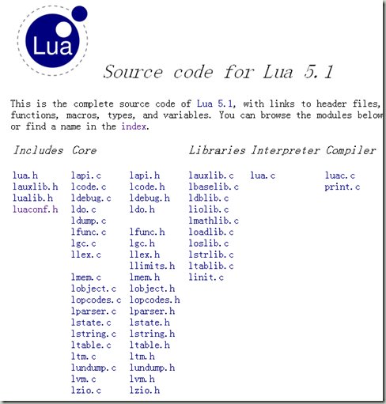
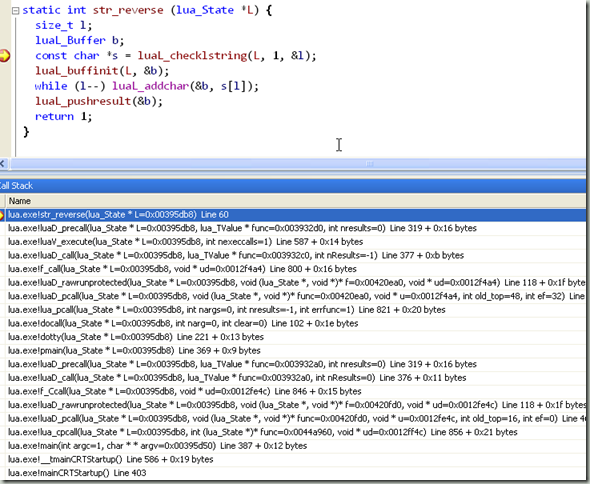
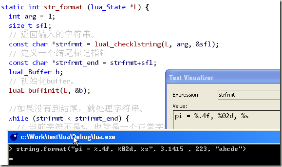
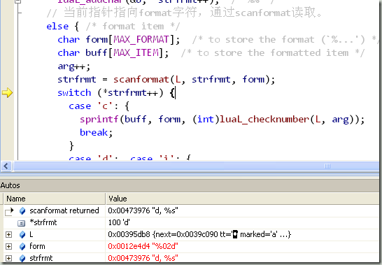

根据[这篇文字](http://lua.javaeye.com/blog/492260)推荐的内容进行粗略阅读，目的是掌握Lua语言整体上设计的思路。对于细节部分暂且忽略。

大家可以参看[这个blog](http://blog.csdn.net/INmouse)，也有一些关于lua代码阅读的文字。

阅读之前的准备也很简单。我使用VC2008+VisualAssitant作为代码阅读器。

关于lua架构设计，有一篇论文是必读的[http://www.codingnow.com/2000/download/The%20Implementation%20of%20Lua5.0.pdf](http://www.codingnow.com/2000/download/The%20Implementation%20of%20Lua5.0.pdf "http://www.codingnow.com/2000/download/The%20Implementation%20of%20Lua5.0.pdf")，另外非常有帮助的是Programming In Lua（简称PIL）这个文档，你可以[从这里下载](http://lua5.googlegroups.com/web/Programming_In_Lua.pdf?gda=HtY9HkkAAAASSOYWD4tgRFTJfuAivyZ65FnLlYS6PtzDoK9GEpK6yKUERBIC6At2WH_HBWB57Q4cGfaqUnl140mX3ln6GoNxhAioEG5q2hncZWbpWmJ7IQ)。

lua源代码可以在这里在线阅读[http://www.lua.org/source/5.1/](http://www.lua.org/source/5.1/ "http://www.lua.org/source/5.1/")，另外还有一个索引页面[http://www.lua.org/source/5.1/idx.html](http://www.lua.org/source/5.1/idx.html "http://www.lua.org/source/5.1/idx.html")也是非常有帮助。

我的这几篇blog仅作为一个学习的记录，所以会比较潦草一些，大家见谅。另外我的代码阅读是从lua解释器开始，如果有时间再阅读luac这个项目。

第一部分，lmathlib.c的阅读。

这段代码与Lua核心实际上是分离的。详细点说就是Math以及String模块的实现不是语言核心组件，而是通过C语言扩展模块的形式提供支持的。Lua的优点其实就在此，它的核心很精巧，扩展机制非常强大。

———————————  
lmathlib.c  
———————————

#undef PI  
#define PI (3.14159265358979323846)  
#define RADIANS\_PER\_DEGREE (PI/180.0)

static const luaL\_Reg mathlib\[\] = {  
  {"abs",   math\_abs},  
  {"acos",  math\_acos},  
  {"asin",  math\_asin},  
  {"atan2", math\_atan2},  
  {"atan",  math\_atan},  
  {"ceil",  math\_ceil},  
  {"cosh",   math\_cosh},  
  {"cos",   math\_cos},  
  {"deg",   math\_deg},  
  {"exp",   math\_exp},  
  {"floor", math\_floor},  
  {"fmod",   math\_fmod},  
  {"frexp", math\_frexp},  
  {"ldexp", math\_ldexp},  
  {"log10", math\_log10},  
  {"log",   math\_log},  
  {"max",   math\_max},  
  {"min",   math\_min},  
  {"modf",   math\_modf},  
  {"pow",   math\_pow},  
  {"rad",   math\_rad},  
  {"random",     math\_random},  
  {"randomseed", math\_randomseed},  
  {"sinh",   math\_sinh},  
  {"sin",   math\_sin},  
  {"sqrt",  math\_sqrt},  
  {"tanh",   math\_tanh},  
  {"tan",   math\_tan},  
  {NULL, NULL}  
};

/\*  
\*\* Open math library  
\*/  
LUALIB\_API int luaopen\_math (lua\_State \*L) {  
  luaL\_register(L, LUA\_MATHLIBNAME, mathlib);  
  lua\_pushnumber(L, PI);  
  lua\_setfield(L, -2, "pi");  
  lua\_pushnumber(L, HUGE\_VAL);  
  lua\_setfield(L, -2, "huge");  
  return 1;  
}

mathlib定义了一个名字（字符串）到函数的映射数组，然后在函数luaopen\_math中，通过luaL\_register注册这个映射数组，这样Lua就可以通过函数名来调用扩展函数。这实际上也是其他C语言扩展Lua最常用的步骤。

另外定义了两个常数pi和huge。

真正工作的函数类似下面这样：

static int math\_ceil (lua\_State \*L) {  
  lua\_pushnumber(L, **ceil**(luaL\_checknumber(L, 1)));  
  return 1;  
}

static int math\_floor (lua\_State \*L) {  
  lua\_pushnumber(L, **floor**(luaL\_checknumber(L, 1)));  
  return 1;  
}

static int math\_fmod (lua\_State \*L) {  
  lua\_pushnumber(L, **fmod**(luaL\_checknumber(L, 1), luaL\_checknumber(L, 2)));  
  return 1;  
}

基本上都是通过标准的ansi C库函数实现了math模块的功能。比较值得一提的是luaL\_checknumber(L, 1)，在PIL（programming in lua一书，以后略写为PIL）是这样介绍的：

> 辅助库中的luaL\_checknumber函数可以检查给定的参数是否为数值类型：如果该参数不是数值类型，则抛出一个错误信息，否则，返回作为参数的数值。

关于lua\_pushnumber，在PIL中的介绍如下：

> 函数lua\_pushnumber可以将数值型的值压栈，该类型可以用C语言中的双精度类型double表示；函数lua\_pushboolean可以将布尔型的值压栈，该类型可以用C语言中的整数类型int来表示；函数lua\_pushlstring可以将含有任意字符的字符串压栈，该类型可以用C语言中的字符指针char \*来表示；而函数lua\_pushstring可以将C风格（以“\\0”结束）的字符串压栈：  
> void lua\_pushnil(lua\_State \* L);  
> void lua\_pushboolean(lua\_State \* L, int bool);  
> void lua\_pushnumber(lua\_State \* L, double n);  
> void lua\_pushlstring(lua\_State \* L, const char \* s, size\_t length);  
> void lua\_pushstring(lua\_State \* L, const char \* s);  
> 同样也有可将C函数和Userdata值压栈的函数

———————————————-

static int math\_min (lua\_State \*L) {  
  int n = lua\_gettop(L);  /\* number of arguments \*/  
  lua\_Number dmin = luaL\_checknumber(L, 1);  
  int i;  
  for (i=2; i<=n; i++) {  
    lua\_Number d = luaL\_checknumber(L, i);  
    if (d < dmin)  
      dmin = d;  
  }  
  lua\_pushnumber(L, dmin);  
  return 1;  
}

取最小值算法：先得到参数个数lua\_gettop(L)，取出值进行比较，最后返回最小值lua\_pushnumber(L, dmin)。

———————————————-

static int math\_random (lua\_State \*L) {  
  /\* the \`%’ avoids the (rare) case of r==1, and is needed also because on  
     some systems (SunOS!) \`rand()’ may return a value larger than RAND\_MAX \*/  
  lua\_Number r = (lua\_Number)(rand()%RAND\_MAX) / (lua\_Number)RAND\_MAX;  
  switch (lua\_gettop(L)) {  /\* check number of arguments \*/  
    case 0: {  /\* no arguments \*/  
      lua\_pushnumber(L, r);  /\* Number between 0 and 1 \*/  
      break;  
    }  
    case 1: {  /\* only upper limit \*/  
      int u = luaL\_checkint(L, 1);  
      luaL\_argcheck(L, 1<=u, 1, "interval is empty");  
      lua\_pushnumber(L, floor(r\*u)+1);  /\* int between 1 and \`u’ \*/  
      break;  
    }  
    case 2: {  /\* lower and upper limits \*/  
      int l = luaL\_checkint(L, 1);  
      int u = luaL\_checkint(L, 2);  
      luaL\_argcheck(L, l<=u, 2, "interval is empty");  
      lua\_pushnumber(L, floor(r\*(u-l+1))+l);  /\* int between \`l’ and \`u’ \*/  
      break;  
    }  
    default: return luaL\_error(L, "wrong number of arguments");  
  }  
  return 1;  
}

static int math\_randomseed (lua\_State \*L) {  
  srand(luaL\_checkint(L, 1));  
  return 0;  
}

随机数算法：首先得到一个随机的小数，然后根据条件返回相应的数值。

———————————————-  
第二部分，lstrlib的阅读。  
———————————————-

static const luaL\_Reg strlib\[\] = {  
  {"byte", str\_byte},  
  {"char", str\_char},  
  {"dump", str\_dump},  
  {"find", str\_find},  
  {"format", str\_format},  
  {"gfind", gfind\_nodef},  
  {"gmatch", gmatch},  
  {"gsub", str\_gsub},  
  {"len", str\_len},  
  {"lower", str\_lower},  
  {"match", str\_match},  
  {"rep", str\_rep},  
  {"reverse", str\_reverse},  
  {"sub", str\_sub},  
  {"upper", str\_upper},  
  {NULL, NULL}  
};

LUALIB\_API int luaopen\_string (lua\_State \*L) {  
  luaL\_register(L, LUA\_STRLIBNAME, strlib);  
  createmetatable(L);  
  return 1;  
}

函数定义方式与lmathlib非常类似，不多介绍。

static int str\_len (lua\_State \*L) {  
  size\_t l;  
  luaL\_checklstring(L, 1, &l);  
  lua\_pushinteger(L, l);  
  return 1;  
}

通过内部辅助函数luaL\_checklstring返回字符串长度。

LUALIB\_API const char \*luaL\_checklstring (lua\_State \*L, int narg, size\_t \*len) {  
  const char \*s = lua\_tolstring(L, narg, len);  
  if (!s) tag\_error(L, narg, LUA\_TSTRING);  
  return s;  
}

实际上是调用了lapi.c中的lua\_tolstring来得到字符串长度。字符串的结构定义如下：

typedef union TString {  
  L\_Umaxalign dummy;  /\* ensures maximum alignment for strings \*/  
  struct {  
    CommonHeader;  
    lu\_byte reserved;  
    unsigned int hash;  
    size\_t len;  
  } tsv;  
} TString;

而字符串本身是通过svalue宏拿到的，这个定义非常有意思

#ifndef cast  
#define cast(t, exp)    ((t)(exp))  
#endif

#define getstr(ts)    cast(const char \*, (ts) + 1)  
#define svalue(o)       getstr(rawtsvalue(o))

也就相当于(const char\*)(o + 1)。

———————————————-

static ptrdiff\_t posrelat (ptrdiff\_t pos, size\_t len) {  
  /\* relative string position: negative means back from end \*/  
  if (pos < 0) pos += (ptrdiff\_t)len + 1;  
  return (pos >= 0) ? pos : 0;  
}

static int str\_sub (lua\_State \*L) {  
  size\_t l;  
  const char \*s = luaL\_checklstring(L, 1, &l);  
  ptrdiff\_t start = posrelat(luaL\_checkinteger(L, 2), l);  
// luaL\_optinteger(L, 3, -1)将会检查第三个参数，如果为none或者nil，那么就用-1来作为默认值。第一第二个值为必须，posrelate()会将-1这样的负索引转为正向索引。  
  ptrdiff\_t end = posrelat(luaL\_optinteger(L, 3, -1), l);  
// Lua中string的索引值也是从1开始  
  if (start < 1) start = 1;  
  if (end > (ptrdiff\_t)l) end = (ptrdiff\_t)l;  
// 如果索引开始值小于结束值，那么截取一段字符串，否则返回空字符串。  
  if (start <= end)  
    lua\_pushlstring(L, s+start-1, end-start+1);  
  else lua\_pushliteral(L, "");  
  return 1;  
}

函数sub在PIL的解释为

> 调用string.sub(s, i, j)可以截取字符串s中包含第i个字符到第j个字符的子串。在Lua中，字符串的第一个索引为1，当然你也可以使用负索引，负索引从字符串的结尾向前计数：索引-1指向字符串的最后一个字符，-2指向字符串的倒数第二个字符，以此类推。所以，string.sub(s, 1, j)返回一个从字符串s头部开始直到第j个字符的子串，string.sub(s, j, -1)返回一个从字符串s第j个字符开始直到尾部的子串（如果不提供第三个参数，则默认为-1，因此string.sub(s, j, -1)可以简写为string.sub(s, j)的形式），而执行string.sub(s, 2, -2)将返回一个去除字符串s的首字符和尾字符后的子串。

——————————————————–

static int str\_reverse (lua\_State \*L) {  
  size\_t l;  
  luaL\_Buffer b;

  const char \*s = luaL\_checklstring(L, 1, &l);  
  luaL\_buffinit(L, &b);  
  while (l–) luaL\_addchar(&b, s\[l\]);  
  luaL\_pushresult(&b);  
  return 1;  
}

其中luaL\_Buffer定义如下：

typedef struct luaL\_Buffer {  
  char \*p;            /\* current position in buffer \*/  
  int lvl;  /\* number of strings in the stack (level) \*/  
  lua\_State \*L;  
  char buffer\[LUAL\_BUFFERSIZE\];  
} luaL\_Buffer;

luaL\_addchar宏定义如下：

#define luaL\_addchar(B,c) \\  
  ((void)((B)->p < ((B)->buffer+LUAL\_BUFFERSIZE) || luaL\_prepbuffer(B)), \\  
   (\*(B)->p++ = (char)(c)))

整理下就是：

static void luaL\_addchar2(luaL\_Buffer\* pBuffer, char c)  
{  
    if (pBuffer->p < (pBuffer->buffer+LUAL\_BUFFERSIZE) || luaL\_prepbuffer(pBuffer))  
    {  
        \*pBuffer->p = c;  
        \*pBuffer->p++;  
    }  
}

当字符串长度超过512的时候，会调用luaL\_prepbuffer这个函数，这个函数代码如下，其中emptybuffer会把buffer中的数据压入stack中，然后重置p指针指向buffer的首地址，最后buffer的lvl加1。

而adjuststack这个函数是保证stack中压入的string buffer满足B->lvl – toget + 1 >= LIMIT，如果超过这个界限，就会调用lua\_concat函数来对栈内已经压入的字符串做concat操作。这也就是为何我们操作频繁大的字符串会比较慢的原因。

LUALIB\_API char \*luaL\_prepbuffer (luaL\_Buffer \*B) {  
  **if (emptybuffer(B))  
    adjuststack(B);  
**  return B->buffer;  
}

static int emptybuffer (luaL\_Buffer \*B) {  
  size\_t l = bufflen(B);  
  if (l == 0) return 0;  /\* put nothing on stack \*/  
  else {  
    **lua\_pushlstring(B->L, B->buffer, l);  
    B->p = B->buffer;  
    B->lvl++;  
**    return 1;  
  }  
}

static void adjuststack (luaL\_Buffer \*B) {  
  if (B->lvl > 1) {  
    lua\_State \*L = B->L;  
    int toget = 1;  /\* number of levels to concat \*/  
    size\_t toplen = lua\_strlen(L, -1);  
    do {  
      size\_t l = lua\_strlen(L, -(toget+1));  
      **if (B->lvl – toget + 1 >= LIMIT || toplen > l) {  
**        toplen += l;  
        toget++;  
      }  
      else break;  
    } while (toget < B->lvl);  
    **lua\_concat(L, toget);  
**    B->lvl = B->lvl – toget + 1;  
  }  
}

str\_reverse最后会调用luaL\_pushresult这个函数，将buffer中的字符串压入lua栈中，然后执行lua\_concat操作，当然，只有当lvl大于2的时候，才会真正调用string的concat操作。

LUALIB\_API void luaL\_pushresult (luaL\_Buffer \*B) {  
  emptybuffer(B);  
  lua\_concat(B->L, B->lvl);  
  B->lvl = 1;  
}

关于前面用到的函数，在PIL中如下解释：

> 使用辅助库中缓冲函数的第一步是声明一个类型为luaL\_Buffer的变量，然后调用luaL\_buffinit初始化该变量，即初始化缓冲区。初始化之后，缓冲区保留了一份Lua状态L的拷贝，因此当我们调用其他操作该缓冲区的函数时就不再需要传递L参数。宏luaL\_putchar将单个字符放入缓冲区。luaL\_addlstring缓冲函数，该函数将一个指定长度的字符串放入缓冲区，而另一个类似的缓冲函数luaL\_addstring将一个以“\\0”结尾的字符串放入缓冲区。最后，luaL\_pushresult刷新缓冲区并将最终字符串放到栈顶。

其中luaL\_putchar实际上就是luaL\_addchar。

————————————————-

static int writer (lua\_State \*L, const void\* b, size\_t size, void\* B) {  
  (void)L;  
  luaL\_addlstring((luaL\_Buffer\*) B, (const char \*)b, size);  
  return 0;  
}

static int str\_dump (lua\_State \*L) {  
  luaL\_Buffer b;  
  luaL\_checktype(L, 1, LUA\_TFUNCTION);  
  lua\_settop(L, 1);  
  luaL\_buffinit(L,&b);  
  if (lua\_dump(L, writer, &b) != 0)  
    luaL\_error(L, "unable to dump given function");  
  luaL\_pushresult(&b);  
  return 1;  
}

关于dump函数，其实没什么特别的，大家可以看出基本上和reverse类似，初始化一个buffer，然后通过writer函数来使用buffer。

不过大家可以注意一下这种设计方法，其中writer是可配置的，也就是说，如果想把这个string写到别的地方，只要修改writer这个函数就可以了。类似的设计有：

typedef const char \* (\***lua\_Reader**) (lua\_State \*L, void \*ud, size\_t \*sz);  
typedef int (\***lua\_Writer**) (lua\_State \*L, const void\* p, size\_t sz, void\* ud);  
typedef void \* (\***lua\_Alloc**) (void \*ud, void \*ptr, size\_t osize, size\_t nsize);

——————————————————-

在string这个模块中除了find，gsub，gmatch这些非常复杂的函数，format算是一个中等复杂度的功能函数了。

我们调试下面这段lua代码来看看。string.format("pi = %.4f, %02d, %s”, 3.1415, 223, "abcde")

第一步取出参数第一部分（luaL\_checklstring(L, 1, &sf1))，赋值给strfrmt字符串。

当我们发现了%，就准备读取format格式字符（else{…}部分），通过调试窗口可以看出scanformat返回值为"d, %s"（第一个格式字符运行窗口没来得及截取，见谅），form返回值为%02d，所以当我们使用switch判断(\*strfrmt)的时候会进入case ‘d’部分。

addintlen(form);将%02d转换为%02ld。接下来，通过sprintf对buff进行格式化。

然后是通过luaL\_addlstring(&b, buff, strlen(buff));将buff字串加入本地的Buffer中。

当字符串过长的时候（长度大于100），Lua会直接将这个参数先放入栈顶，然后放入缓存区。原因可以在PIL的27.2结尾部分看到：

> 基于上述情况的普遍性，辅助提供了一个特殊函数，用来将位于栈顶的值放入缓冲区：  
> void luaL\_addvalue(luaL\_Buffer \* B);

static int str\_format (lua\_State \*L) {  
  int arg = 1;  
  size\_t sfl;  
  // 返回输入的字符串。  
  const char \*strfrmt = luaL\_checklstring(L, arg, &sfl);  
  // 定义一个结尾标记指针  
  const char \*strfrmt\_end = strfrmt+sfl;  
  luaL\_Buffer b;  
  // 初始化buffer。  
  luaL\_buffinit(L, &b);

  //如果没有到结尾，就处理字符串。  
  while (strfrmt < strfrmt\_end) {  
    // 当前字符不是%，也就是一个正常字符串，把它加入buffer中，然后当前指针++后移。  
    if (\*strfrmt != L\_ESC)  
      luaL\_addchar(&b, \*strfrmt++);  
    // 当前指针是%而且下一个也是%，把%字符加入buffer。  
    else if (\*++strfrmt == L\_ESC)  
      luaL\_addchar(&b, \*strfrmt++);  /\* %% \*/  
    // 当前指针指向format字符，通过scanformat读取。  
    else { /\* format item \*/  
      char form\[MAX\_FORMAT\];  /\* to store the format (\`%…’) \*/  
      char buff\[MAX\_ITEM\];  /\* to store the formatted item \*/  
      arg++;  
      strfrmt = scanformat(L, strfrmt, form);  
      switch (\*strfrmt++) {  
        case ‘c’: {  
          sprintf(buff, form, (int)luaL\_checknumber(L, arg));  
          break;  
        }  
        case ‘d’:  case ‘i’: {  
          addintlen(form);  
          sprintf(buff, form, (LUA\_INTFRM\_T)luaL\_checknumber(L, arg));  
          break;  
        }  
        case ‘o’:  case ‘u’:  case ‘x’:  case ‘X’: {  
          addintlen(form);  
          sprintf(buff, form, (unsigned LUA\_INTFRM\_T)luaL\_checknumber(L, arg));  
          break;  
        }  
        case ‘e’:  case ‘E’: case ‘f’:  
        case ‘g’: case ‘G’: {  
          sprintf(buff, form, (double)luaL\_checknumber(L, arg));  
          break;  
        }  
        case ‘q’: {  
          addquoted(L, &b, arg);  
          continue;  /\* skip the ‘addsize’ at the end \*/  
        }  
        case ‘s’: {  
          size\_t l;  
          const char \*s = luaL\_checklstring(L, arg, &l);  
          if (!strchr(form, ‘.’) && l >= 100) {  
            /\* no precision and string is too long to be formatted;  
               keep original string \*/  
            lua\_pushvalue(L, arg);  
            luaL\_addvalue(&b);  
            continue;  /\* skip the \`addsize’ at the end \*/  
          }  
          else {  
            sprintf(buff, form, s);  
            break;  
          }  
        }  
        default: {  /\* also treat cases \`pnLlh’ \*/  
          return luaL\_error(L, "invalid option " LUA\_QL("%%%c") " to "  
                               LUA\_QL("format"), \*(strfrmt – 1));  
        }  
      }  
      // 将buff压入字符串BUFFER中。  
      luaL\_addlstring(&b, buff, strlen(buff));  
    }  
  }  
  //将字符串BUFFER压入堆栈中。  
  luaL\_pushresult(&b);  
  return 1;  
}

—————————————————

关于gsub，gmatch，find这些涉及到正则表达式（lua格式）的函数，就不做解释了，因为其中的逻辑实在是非常难理解，最好的办法就是通过debug方式来跟踪lua的运行轨迹。其中比价值得记忆的c编程技巧就是下面这几个函数的使用，其中有几个我也没听过，但是在K&R上都可以查到。

static int match\_class (int c, int cl) {  
  int res;  
  switch (tolower(cl)) {  
    **case ‘a’ : res = isalpha(c); break;  
    case ‘c’ : res = iscntrl(c); break;  
    case ‘d’ : res = isdigit(c); break;  
    case ‘l’ : res = islower(c); break;  
    case ‘p’ : res = ispunct(c); break;  
    case ‘s’ : res = isspace(c); break;  
    case ‘u’ : res = isupper(c); break;  
    case ‘w’ : res = isalnum(c); break;  
    case ‘x’ : res = isxdigit(c); break;  
    case ‘z’ : res = (c == 0); break;**  
    default: return (cl == c);  
  }  
  return (islower(cl) ? res : !res);}
