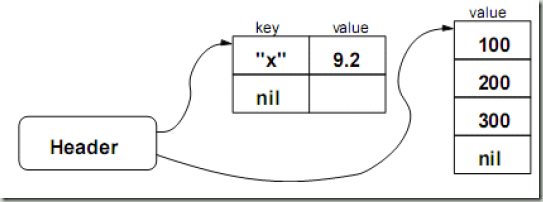
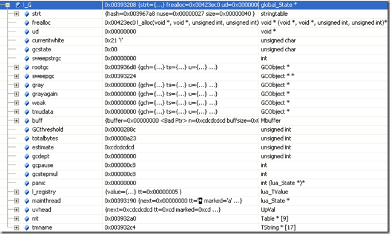
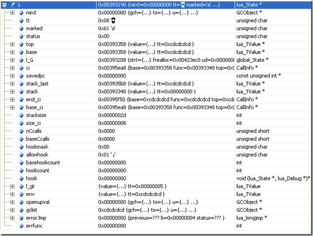

根据[http://lua.javaeye.com/blog/492260](http://lua.javaeye.com/blog/492260 "http://lua.javaeye.com/blog/492260")的推荐，第二部分应该是阅读lapi.c也就是C语言扩展时使用的函数，比如LUA\_API int lua\_error (lua\_State \*L)，这类函数都是以LUA\_API开头（LUA\_API根据编译环境不同表现为\_\_declspec(dllexport)或\_\_declspec(dllimport)或者extern。

可是很多数据结构必须展示出来了，比如lua\_State是什么？所以先做一个铺垫，看看这些数据结构的定义。具体它们的使用，我也是需要一步步深入学习以后才会知道，这篇文字只是个草稿，还需要根据以后的理解不断修订。

lstate.h定义了lua中最重要也最常用的一个数据结构lua\_State。

/\*  
\*\* \`per thread’ state  
\*/  
struct **lua\_State** {  
  CommonHeader;  
  lu\_byte status;  
  StkId top;  /\* first free slot in the stack \*//\*当前栈的第一个空闲槽\*/  
  StkId base;  /\* base of current function \*//\*当前函数栈的基地址\*/  
  global\_State \*l\_G;  
  CallInfo \*ci;  /\* call info for current function \*/  
  const Instruction \*savedpc;  /\* \`savedpc’ of current function \*/  
  StkId stack\_last;  /\* last free slot in the stack \*/  
  StkId stack;  /\* stack base \*/  
  CallInfo \*end\_ci;  /\* points after end of ci array\*/  
  CallInfo \*base\_ci;  /\* array of CallInfo’s \*/  
  int stacksize;  
  int size\_ci;  /\* size of array \`base\_ci’ \*/  
  unsigned short nCcalls;  /\* number of nested C calls \*/  
  unsigned short baseCcalls;  /\* nested C calls when resuming coroutine \*/  
  lu\_byte hookmask;  
  lu\_byte allowhook;  
  int basehookcount;  
  int hookcount;  
  lua\_Hook hook;  
  TValue l\_gt;  /\* table of globals \*/  
  TValue env;  /\* temporary place for environments \*/  
  GCObject \*openupval;  /\* list of open upvalues in this stack \*/  
  GCObject \*gclist;  
  struct lua\_longjmp \*errorJmp;  /\* current error recover point \*/  
  ptrdiff\_t errfunc;  /\* current error handling function (stack index) \*/  
};

第一个成员为CommonHeader，它其实是一个宏定义，里面包含三个成员变量。注释说明是可以使用在所有可收集对象，可以包含在其他对象中。其中的marked跟GC机制有关，与luaC\_white()这个函数经常同时使用。

/\*  
\*\* Common Header for all collectable objects (in macro form, to be  
\*\* included in other objects)  
\*/  
#define CommonHeader    GCObject \*next; lu\_byte tt; lu\_byte marked

还有另外一个结构其实跟它一样的，只不过是以结构（struct）形式表现：

/\*  
\*\* Common header in struct form  
\*/  
typedef struct GCheader {  
  CommonHeader;  
} GCheader;

lu\_byte就是typedef unsigned char lu\_byte。

top和base的类型为StkId，从名字上看跟stack元素非常密切。

typedef TValue \*StkId;  /\* index to stack elements \*/

#define TValuefields    Value value; int tt

typedef struct lua\_TValue {  
  TValuefields;  
} TValue;

TValue结构包含了value和tt，而GCheader也有一个tt，从名字上暂时看不出用处。

而value的定义如下，从注释来看，是所有lua可能值的联合（union）。

/\*  
\*\* Union of all Lua values  
\*/  
typedef union {  
  GCObject \*gc;  
  void \*p;  
  lua\_Number n;  
  int b;  
} Value;

另外一个重要的对象就是GCObject

union GCObject {  
  GCheader gch;  
  union TString ts;  
  union Udata u;  
  union Closure cl;  
  struct Table h;  
  struct Proto p;  
  struct UpVal uv;  
  struct lua\_State th;  /\* thread \*/  
};

gch已经介绍过，TString定义如下，里面比较值得注意的是有一个hash以及len。

/\*  
\*\* String headers for string table  
\*/  
typedef union TString {  
  L\_Umaxalign dummy;  /\* ensures maximum alignment for strings \*/  
  struct {  
    CommonHeader;  
    lu\_byte reserved;  
    unsigned int hash;  
    size\_t len;  
  } tsv;  
} TString;

另外一个重要的数据类型Table，这个值得好好研究。

typedef struct Table {  
  CommonHeader;  
  lu\_byte flags;  /\* 1<
 在Lua5.0 中，对表被用作数组的情形使用了一种新的算法来进行优化：对于键是整数的表项，将不保存键，只将值存入一个真正的数组中。更准确地说，在Lua5.0 中，表以一种混合型数据结构来实现，它包含一个散列表部分和一个数组部分。

我们可以从这个函数中看出table两种数据的操作。一般来说对于table的操作都是成对出现的，比如setarrayvector操作值类型数组，setnodevector操作key-value对。

/\*  
\*\* clear collected entries from weaktables  
\*/  
static void cleartable (GCObject \*l) {  
  while (l) {  
    Table \*h = gco2h(l);

    **int i = h->sizearray;  
**    lua\_assert(testbit(h->marked, VALUEWEAKBIT) ||  
               testbit(h->marked, KEYWEAKBIT));

    if (testbit(h->marked, VALUEWEAKBIT)) {  
      while (i–) {  
        **TValue \*o = &h->array\[i\]; // 先是循环操作array  
**        if (iscleared(o, 0))  /\* value was collected? \*/  
          setnilvalue(o);  /\* remove value \*/  
      }  
    }

    **i = sizenode(h);**     while (i–) {  
      **Node \*n = gnode(h, i); // 然后循环操作node  
**      if (!ttisnil(gval(n)) &&  /\* non-empty entry? \*/  
          (iscleared(key2tval(n), 1) || iscleared(gval(n), 0))) {  
        setnilvalue(gval(n));  /\* remove value … \*/  
        removeentry(n);  /\* remove entry from table \*/  
      }  
    }

    l = h->gclist;  
  }  
}

————————————————

在Table数据结构中，Node包含了TValue和TKey两个成员。

typedef union TKey {  
  struct {  
    TValuefields;  
    struct Node \*next;  /\* for chaining \*/  
  } nk;  
  TValue tvk;  
} TKey;

typedef struct Node {  
  TValue i\_val;  
  TKey i\_key;  
} Node;

在the implementation of lua 5.0中文版中是这样说明key和value对的：

>   Lua 将值表示成带标志的联合结构，即，（t，v）对，其中t 是个整数，代表值v 的类型，v 是一个C 语言union 类型数据结构，它存储有实际的值。  
>   nil 型只有单个值。boolean 和number 实现为未包装的值：v 直接对应于union 中由t指示的域。这意味着union 必须有足够空间容纳一个double 型。string，table，function，thread 和userdata 型数据通过引用来实现：v 中含有一个指向结构的指针，该结构实现由t 指定的类型。  
>   这些结构共用一个头结构，头结构中含有垃圾回收所需的信息。结构的剩余部分包含的信息对应于指定的数据类型。

先走马观花看了这些数据结构，其他的用到再提。

关于lua\_State，它的初始化函数是lua\_newstate，每个c语言扩展lua都需要调用lua\_open，其实就是luaL\_newstate的别名。

LUALIB\_API lua\_State \***luaL\_newstate** (void) {  
  lua\_State \*L = lua\_newstate(l\_alloc, NULL);  
  if (L) lua\_atpanic(L, &panic);  
  return L;  
}

可以看出默认的内存分配函数都是l\_alloc。  
下面是我注释的代码。

LUA\_API lua\_State \***lua\_newstate** (lua\_Alloc f, void \*ud) {  
  int i;  
  lua\_State \*L;  
  global\_State \*g;  
  // 调用alloc函数，分配L以及g的内存。  
  **void \*l = (\*f)(ud, NULL, 0, state\_size(LG));  
**  if (l == NULL)  
      return NULL;

  // LUAI\_EXTRASPACE 可以让用户可以扩展lua\_State，现在为0.  
  L = ((lua\_State\*)( (lu\_byte\*)l + LUAI\_EXTRASPACE );  
  // 全局state指针指向所分配的内存。  
  g = &((LG \*)L)->g;  
  L->next = NULL;  
  // 定义L的类型为thread？  
  L->tt = LUA\_TTHREAD;  
  // GC状态初始化。  
  g->currentwhite = bit2mask(WHITE0BIT, FIXEDBIT);  
  L->marked = luaC\_white(g);  
  set2bits(L->marked, FIXEDBIT, SFIXEDBIT);

  // 初始化L的状态，关联L和g。  
  preinit\_state(L, g);  
  // 设置全局state的内存分配函数  
  g->frealloc = f;  
  // ud默认为NULL  
  g->ud = ud;  
  g->mainthread = L;  
  g->uvhead.u.l.prev = &g->uvhead;  
  g->uvhead.u.l.next = &g->uvhead;  
  g->GCthreshold = 0;  /\* mark it as unfinished state \*/  
  g->strt.size = 0;  
  g->strt.nuse = 0;  
  g->strt.hash = NULL;  
  setnilvalue(registry(L));  
  luaZ\_initbuffer(L, &g->buff);  
  g->panic = NULL;  
  g->gcstate = GCSpause;  
  g->rootgc = obj2gco(L);  
  g->sweepstrgc = 0;  
  g->sweepgc = &g->rootgc;  
  g->gray = NULL;  
  g->grayagain = NULL;  
  g->weak = NULL;  
  g->tmudata = NULL;  
  g->totalbytes = sizeof(LG);  
  g->gcpause = LUAI\_GCPAUSE;  
  g->gcstepmul = LUAI\_GCMUL;  
  g->gcdept = 0;  
  for (i=0; i<NUM\_TAGS; i++)  
      g->mt\[i\] = NULL;

  // 运行f\_luaopen命令  
  if (**luaD\_rawrunprotected(L, f\_luaopen, NULL)** != 0) {  
    /\* memory allocation error: free partial state \*//\*出错了,关闭state\*/  
    close\_state(L);  
    L = NULL;  
  }  
  else  
    luai\_userstateopen(L);  
  return L;  
}

另外比较值得一提的是luaD\_rawrunprotected，当我们正常运行的时候，也是使用这个函数。

/\*  
\*\* open parts that may cause memory-allocation errors  
\*/  
static void **f\_luaopen** (lua\_State \*L, void \*ud) {  
    // 通过G(L)得到全局state  
  global\_State \*g = G(L);  
  UNUSED(ud);  
  **stack\_init(L, L);  /\* init stack \*/  
**  sethvalue(L, gt(L), luaH\_new(L, 0, 2));  /\* table of globals \*/  
  sethvalue(L, registry(L), luaH\_new(L, 0, 2));  /\* registry \*/  
  luaS\_resize(L, MINSTRTABSIZE);  /\* initial size of string table \*/  
  luaT\_init(L);  
  luaX\_init(L);  
  luaS\_fix(luaS\_newliteral(L, MEMERRMSG));  
  g->GCthreshold = 4\*g->totalbytes;  
}

其中的stack\_init会调用luaM\_newvector，它会间接调用全局state中的内存分配函数：  
block = (\*g->frealloc)(g->ud, block, osize, nsize);  
BASIC\_CI\_SIZE为8，LUA\_MINSTACK为20，BASIC\_STACK\_SIZE为40（2\*LUA\_MINSTACK)，而EXTRA\_STACK为5。

static void **stack\_init** (lua\_State \*L1, lua\_State \*L) {  
  /\* initialize CallInfo array \*/  
  L1->base\_ci = **luaM\_newvector**(L, BASIC\_CI\_SIZE, CallInfo);  
  L1->ci = L1->base\_ci;  
  L1->size\_ci = BASIC\_CI\_SIZE;  
  L1->end\_ci = L1->base\_ci + L1->size\_ci – 1;  
  /\* initialize stack array \*/  
  L1->stack = **luaM\_newvector**(L, BASIC\_STACK\_SIZE + EXTRA\_STACK, TValue);  
  L1->stacksize = BASIC\_STACK\_SIZE + EXTRA\_STACK;  
  L1->top = L1->stack;  
  L1->stack\_last = L1->stack+(L1->stacksize – EXTRA\_STACK)-1;  
  /\* initialize first ci \*/  
  L1->ci->func = L1->top;  
  setnilvalue(L1->top++);  /\* \`function’ entry for this \`ci’ \*/  
  L1->base = L1->ci->base = L1->top;  
  L1->ci->top = L1->top + LUA\_MINSTACK;  
}

————————————

我们在lua\_newstate上加一个断点，看看它运行起来的状态，为了方便起见，我们修改lua project的命令行为c:\\test.lua，里面只有两行代码"local str = ‘aabbcc’ "和"print(str)"。

可以看到lua\_newstate在main函数中被调用，在Smain这个结构中保存了程序的参数。

int main (int argc, char \*\*argv) {  
  int status;  
  **struct Smain s;  
**  lua\_State \*L = lua\_open();  /\* create state \*/  
  if (L == NULL) {  
    l\_message(argv\[0\], "cannot create state: not enough memory");  
    return EXIT\_FAILURE;  
  }  
  s.argc = argc;  
  s.argv = argv;  
  status = lua\_cpcall(L, &pmain, &s);  
  report(L, status);  
  lua\_close(L);  
  return (status || s.status) ? EXIT\_FAILURE : EXIT\_SUCCESS;  
}

当lua\_newstate运行完毕，global\_state的状态如下图。

而lua\_State的状态如下图。

前面做的分析基本上等于没有，只是为了熟悉一下这些数据类型。下一篇要阅读的是lapi.c。
