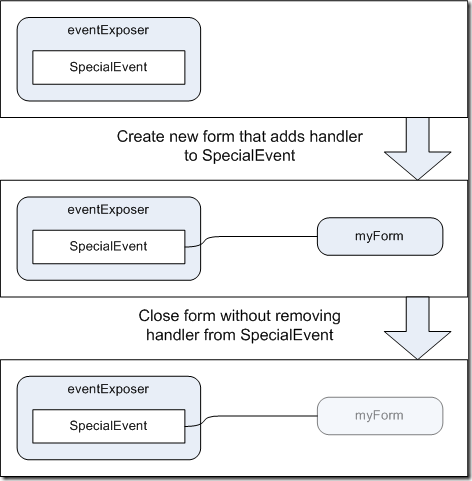

Lua社区最近有很多值得关注的新闻，第一条毫无疑问是Lua5.2.0接近release，最新一版Lua 5.2.0 (beta-rc4)（[http://www.lua.org/work](http://www.lua.org/work "http://www.lua.org/work")），按照作者Luiz Henrique de Figueiredo的说法，大概还有一个多月时间就应该能看到release版本了。Lua5.2.0比较值得关注的是增加了一个关键字（goto），可以通过goto实现continue的功能，所以不出意料的依然没有continue，在twitter上云风回复说他统计了一下自己某个代码，里面好像也是continue远远少于goto的使用。另外还是要赞叹Lua作者的牛逼，现在Lua大概还是二十几个关键字，其它语言上百个关键字的伤不起啊！你都记不全！

另一个新闻是LuaJit也接近release版，现在是2.0.0 Beta8，[http://luajit.org/download.html](http://luajit.org/download.html "http://luajit.org/download.html") 对于性能追求者来说，LuaJit是一个很好的选择，但是支持平台不够多（比如我的PowerPC啊）。最新一版对于ARM的支持是亮点，啥Android、iPhone的，统统都支持。另外FFI Library也是亮点，这个功能可以极大地提高对C API的开发支持。

在新浪微博上（我的微博是[http://weibo.com/sagasw](http://weibo.com/sagasw) ）有人问我，学习Lua与C交互，什么项目比较好。下面是我的建议：

1）主要用Lua，想用C作为模块支持某些特性。如果你想完成类似程序，那么Lua自己的module毫无疑问是最好的学习项目，比如5.2.0中的lbitlib.c、ldblib.c、lstrlib.c、ltablib.c，都是通过Lua API开发出来的。另外比如LuaSocket、LuaFileSystem都是很常用的模块，学学也都不错。

2）主要用C，想用Lua作为动态支持。如果想达到这个目的，可以参考Programming In Lua（可以在网上免费阅读下载）中的示例。与1）也差不多，基本上都是通过Lua stack来与Lua访问。1）和2）基本上编程方式是共通的。

另外可以参考这个项目[http://labix.org/lunatic-python](http://labix.org/lunatic-python "http://labix.org/lunatic-python")，可以实现Lua与Python互操作，类似项目还有[http://pypi.python.org/pypi/lupa/0.17](http://pypi.python.org/pypi/lupa/0.17 "http://pypi.python.org/pypi/lupa/0.17") 

Weak Reference是一个编程领域通用的概念，在[http://en.wikipedia.org/wiki/Weak\_reference](http://en.wikipedia.org/wiki/Weak_reference "http://en.wikipedia.org/wiki/Weak_reference") 这里可以看到比较详细的介绍。DotNet中就有WeakReference这个概念，另外Lua有Weak Table概念。弱引用是指在有垃圾收集机制的程序语言中，常规情况下对某个对象的引用都是强引用，比如a=b，a就引用了b，如果b在其它地方不再被使用，但是a依然存在有效，那么b就仍然是可达的（reachable），或者用引用计数这方式来讲，就是reference count仍然大于0。但是这有一点问题，是我以前碰到过的。

我在某个项目的性能改进中引入了cache机制，有一个全局的对象缓存管理器。我的实现很简单，就是用一个vector保存对象指针，在类析构函数中查找对象缓存管理器，决定是否真正释放对象，还是说仅仅把对象放到管理器中。

由于代码写得不是很完美，其中有一个问题，就是指针在缓冲管理器中放着，但是实际对象实例已经被释放了。也就是说，为了真正释放对象实例，需要做两步才正确：第一步是查找缓存管理器，查找删掉里面的指针引用，第二步是真正释放对象。

很麻烦是不是。对于C#这样的没有确定析构时间的编程语言来说，也有类似问题。我们举一个很典型的例子，如下图所示（from [http://diditwith.net/2007/03/23/SolvingTheProblemWithEventsWeakEventHandlers.aspx](http://diditwith.net/2007/03/23/SolvingTheProblemWithEventsWeakEventHandlers.aspx "http://diditwith.net/2007/03/23/SolvingTheProblemWithEventsWeakEventHandlers.aspx")）：

可以看到当myForm释放，但是没有移除handler，那么handler指向就有问题。

强引用的另外一个问题是会影响垃圾收集。比如我前面那个需要，如果把引用存放到某个全局对象管理器，那么GC会认为这个对象是可达的（reachable），没法正确的释放了。

弱引用就是完成这个目的，一个弱引用对象，可以通过对Target是否为空来判断引用对象是否已经释放，而且不会影响垃圾收集有效性。实现方式（好像是）与我前面提到的也很类似，对象析构时，先从某个全局的弱引用队列中把相关Target删掉，然后再析构（所以弱引用是会影响一点点性能）。

最近在找两个DotNet程序员，最好是有两三年开发经验，如果有WPF/SilverLight经验最好，要求DotNet知识牢固，对编程有兴趣，另外有较强的自学能力，英语能够进行基本对话交流。有意者请发简历到sagasw#gmail.com（替换#哦）。
