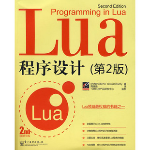

1，Lua学习用什么书？

推荐《Lua程序设计》（简称PIL），译者@周惟迪 (搜Weibo)，可以在淘宝上搜到卖家。比如 [http://item.taobao.com/item.htm?id=13569912375](http://item.taobao.com/item.htm?id=13569912375)

也可以在网上搜到中文版文档，另外可以看手册http://www.lua.org/manual/5.1/ 如果新学Lua，可以直接看Lua5.2的手册 [http://www.lua.org/manual/5.2/](http://www.lua.org/manual/5.2/)

2，Lua编程相关博客和网络链接？

国内一直推Lua的高手只有云风 [http://blog.codingnow.com/](http://blog.codingnow.com/) 我这里也写了一些Lua相关的普及性内容 http://sunxiunan.com/?cat=21

推荐Lua学习者必看的网站，[http://www.lua.org](http://www.lua.org/) 是首选，可以下载源代码，书籍；还有邮件列表的链接 [http://www.lua.org/lua-l.html](http://www.lua.org/lua-l.html) 建议大家加入讨论，其中有\[ANN\]标记的是项目发布通告，另外技术讨论也非常深入；Lua的wiki也值得经常光顾 [http://lua-users.org/wiki/](http://lua-users.org/wiki/) 比如这个FAQ就很有价值 [http://lua-users.org/wiki/LuaFaq](http://lua-users.org/wiki/LuaFaq) ，还有一个比较完整版本的FAQ在这里 [http://www.luafaq.org/](http://www.luafaq.org/) ，我也有一个中文版的LuaFAQ在这里 [http://sunxiunan.com/?p=1515](http://sunxiunan.com/?p=1515)；最后建议大家经常看的网站是github.com，搜索Lua关键字就可以找到很多开源项目。

3，Lua安装程序？

Ubuntu以及Debian下安装 http://sunxiunan.com/?p=1529 ，也可以直接用apt-get安装。

Windows下的安装可以安装[http://code.google.com/p/luaforwindows/](http://code.google.com/p/luaforwindows/)这个集成安装包，里面的第三方库有些旧，但是一般使用也足够了。

4，我博客中关于Lua编程的部分文字推荐

[http://sunxiunan.com/?p=2044](http://sunxiunan.com/?p=2044) Lua的优点以及与Javascript不同之处

[http://sunxiunan.com/?p=1949](http://sunxiunan.com/?p=1949) Lua和Python协程相关资料

http://sunxiunan.com/?p=1919 Lua非官方FAQ翻译

http://sunxiunan.com/?p=1681 Lua Unicode（wiki翻译）

[http://sunxiunan.com/?p=1680](http://sunxiunan.com/?p=1680) static link luasocket into lua with VC2010 under windows，静态链接Luasocket到Lua可执行程序中

[http://sunxiunan.com/?p=1654](http://sunxiunan.com/?p=1654) 【译文】比较Lua协程与Python生成器

[http://sunxiunan.com/?p=1597](http://sunxiunan.com/?p=1597) 谈新技术学习方法-如何学习一门新技术新编程语言

[http://sunxiunan.com/?p=1503](http://sunxiunan.com/?p=1503) Lua Wiki 部分翻译 — Lua源代码

[http://sunxiunan.com/?p=1498](http://sunxiunan.com/?p=1498) How to create c extension for lua and pass complex structure step by step

[http://sunxiunan.com/?p=1447](http://sunxiunan.com/?p=1447) 勿用屠龙来杀猪-论如何正确整合Lua与C++

[http://sunxiunan.com/?p=1358](http://sunxiunan.com/?p=1358) Lua代码阅读(1)，可惜烂尾了

[http://sunxiunan.com/?p=1258](http://sunxiunan.com/?p=1258) Lua通过COM调用外部程序excel及调用windows api

5，有趣的Lua开源项目推荐

第一名当然是LuaJit [http://luajit.org/](http://luajit.org/) 最新版本Luajit2.00 beta10，有人把其中的FFI抽取出来做成了单独项目，可以在github上搜到。

[http://openresty.org/](http://openresty.org/) 这是@agentzh 的项目，基于Nginx和lua-module做的一个整合包，如果是新的大并发系统，很大力推荐使用openresty。

[https://github.com/keplerproject/](https://github.com/keplerproject/) Lua web开发相关的一个项目，包含不少子项目。其中Luafilesystem和Luarocks很知名!

[https://github.com/stevedonovan/Penlight](https://github.com/stevedonovan/Penlight) Penlight是一个对Lua标准库的扩展，有点类似Jquery对于Javascript的作用。

[https://github.com/fab13n/metalua](https://github.com/fab13n/metalua) metalua，给Lua加上了强大的元编程能力（metaprogramming），0.5版使用Lua实现，不需要修改Lua代码了!

[https://github.com/antirez/redis](https://github.com/antirez/redis) redis的2.6版本包含了Lua脚本能力

[https://github.com/kripken/emscripten](https://github.com/kripken/emscripten) 可以将Python，Lua通过llvm编译成javascript

[https://github.com/leafo/moonscript](https://github.com/leafo/moonscript) 就相当于coffeescript和javascript的关系一样，一种新的语言，可以编译成Lua代码。

另外有个项目Lua2c可以把lua编译成c，这个比较简单，一搜便有。

[https://github.com/LuaDist/Repository](https://github.com/LuaDist/Repository) 最新出现的Lua安装器，下载后编译一条龙服务，类似nuget，gem，easy\_install这些程序，Windows下也可以使用（mingw）。

[https://github.com/luvit/luvit](https://github.com/luvit/luvit) 仿造node.js，用Lua代码进行高并发编程

[https://github.com/jmckaskill/luaffi](https://github.com/jmckaskill/luaffi) 前面说的从luajit抽取的ffi项目

[https://github.com/LuaLanes/lanes](https://github.com/LuaLanes/lanes) Lanes is a lightweight, native, lazy evaluating multithreading library for Lua 5.1

[http://www.lua.inf.puc-rio.br/luagravity/](http://www.lua.inf.puc-rio.br/luagravity/) Lua下的async，await，这个项目应该很好玩，但是我没仔细看过。LuaGravity is a reactive language that implements the synchronous approach for concurrency. It is roughly based on Esterel and FrTime, two synchronous reactive languages, the former having an imperative style, the latter being functional.

[https://github.com/chaoslawful/lua-nginx-module](https://github.com/chaoslawful/lua-nginx-module) Nginx的Lua模块，openresty的核心部分，其中cosocket是利用协程实现的socket，好处是什么，我也不知道啊（因为服务器端编程实在很少接触）

总之，

大家可以到 [https://github.com/saga/following](https://github.com/saga/following) 看我watch的项目，其中很大一部分是跟Lua相关的。
