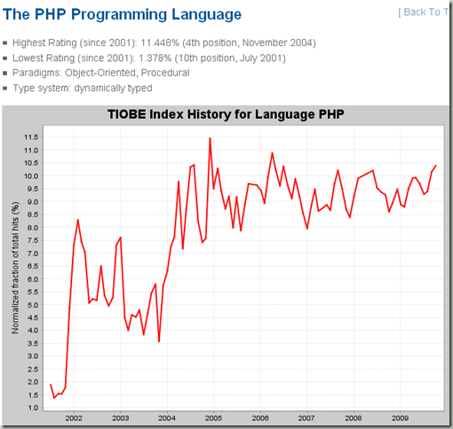
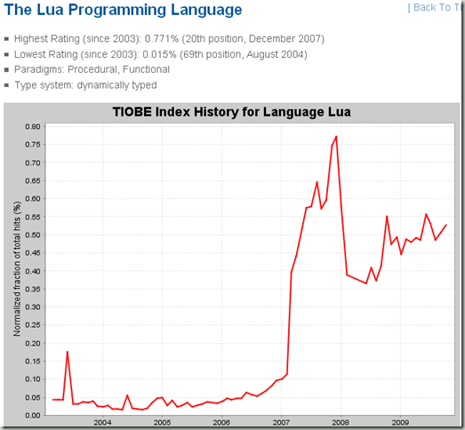
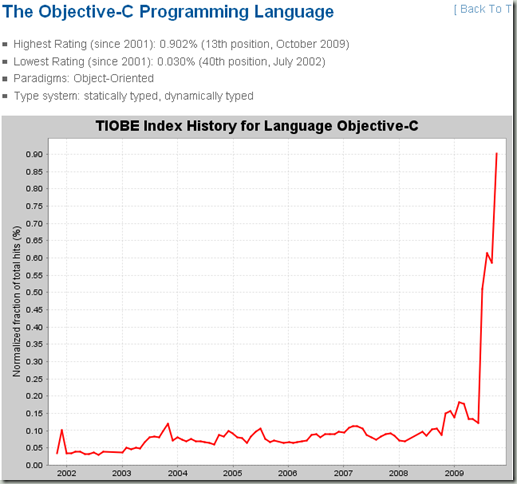

[http://www.tiobe.com/index.php/content/paperinfo/tpci/index.html](http://www.tiobe.com/index.php/content/paperinfo/tpci/index.html "http://www.tiobe.com/index.php/content/paperinfo/tpci/index.html")

这次排名最大的变化就如副标题说的一样：Objective-C is on its way to the top 10.

毫无疑问，Obj-c的兴起与iphone开发的火热有直接关系，iphone新闻不断以及app store的钱途广大，都吸引了开发者进入这个领域。

另外一个比较有意思的地方是php进位第三，把c++挤出三甲，也显示出web开发强烈发力，c++适用的业务领域越来越小，比如我们公司新的软件都开始用c#。

lua仍然是在20名左右徘徊，作为一个设计精巧，标准库甚至可以说是简陋的脚本式语言，lua能够一直吸引众多眼球，不得不说有其独到之处。看看它前面的语言就知道，要么是一些特定领域的语言（比如PL/SQL，SAS，ABAP）要么就是知名已久，比如perl、lisp，lua依靠魔兽的支持能占据20名，非常不易。

[http://www.tiobe.com/index.php/paperinfo/tpci/Lua.html](http://www.tiobe.com/index.php/paperinfo/tpci/Lua.html "http://www.tiobe.com/index.php/paperinfo/tpci/Lua.html")

[http://www.tiobe.com/index.php/paperinfo/tpci/Objective-C.html](http://www.tiobe.com/index.php/paperinfo/tpci/Objective-C.html "http://www.tiobe.com/index.php/paperinfo/tpci/Objective-C.html")

从上面的语言趋势图可以看出，php已经进入稳定期，可以预见会有两到三年的稳定上升空间。

lua也是进入稳定期，如果没有另外一款杀手型游戏的支持，lua估计会稳定一两年后，逐渐进入衰退期。

而obj-c的陡直曲线让人瞠目，但是就iphone的火热程度来看，obj-c会至少强劲上升三四年，进入前十估计也就是在后面几个月的时间了。
