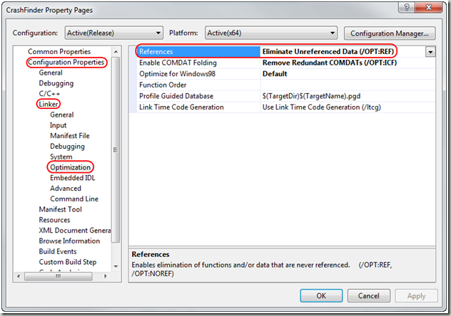

刚写完[一个CST问题的教训](http://sunxiunan.com/?p=1294)，发现John Robbins大牛最近也写了一篇博客《[Correctly Creating Native C++ Release Build PDBs](http://www.wintellect.com/CS/blogs/jrobbins/archive/2009/08/31/correctly-creating-native-c-release-build-pdbs.aspx)》（正确地建立原生C++Release Build PDB文件），里面有不少说法跟我那篇文字近似。在这里再介绍一下John博客里面的大意。关于pdb文件的重要性，John也有另外一篇博客介绍[PDB Files: What Every Developer Must Know](http://www.wintellect.com/CS/blogs/jrobbins/archive/2009/05/11/pdb-files-what-every-developer-must-know.aspx)，感兴趣的同学可以去看看。

1）最重要的一点，任何一个项目一定要build时生成PDB文件，而且要根据不同的发布版本保存起来，这个对于以后的除错非常有用。

2）建立PDB文件基本上是这几个选项，a)在project setting的C++属性中，选择生成program database，或者直接手动加入/Zi选项，如果有/Z7，把它替换成/Zi。b)在link选项中选择Generate debug info，或者直接加入/debug选项，另外注意/pdb应该是类似/PDB:".\\Release/yourproj.pdb"这样的，如果不是手动修改。

3）有的人会担心包含debug信息以后文件变大，修改link中这两个选项/OPT:REF和/OPT:ICF会减小最终生成的文件大小。在这里借用一下John Robbins的截图。

其实我在[Windows下C++编程生成minidump文件](http://sunxiunan.com/?p=1022)中也介绍过这两个参数。
