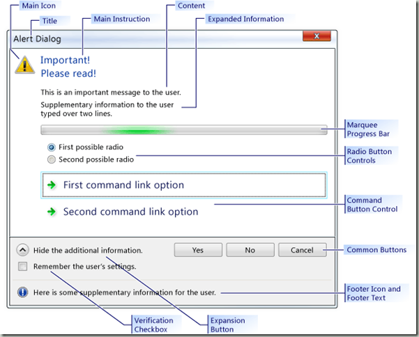

[http://msdn.microsoft.com/en-us/library/dd465215%28VS.100%29.aspx](http://msdn.microsoft.com/en-us/library/dd465215%28VS.100%29.aspx "http://msdn.microsoft.com/en-us/library/dd465215%28VS.100%29.aspx")

可以看到VC2010有以下变化：

1）MFC部分增加了CTaskDialog，这个应该是windows7的样式，在toplanguage上有人唱衰MFC，不过个人认为MFC与VC++应该是同生共存的关系。

2）[Lambda Expressions in C++](http://msdn.microsoft.com/en-us/library/dd293608%28VS.100%29.aspx)

这个对于VC++来说算是个有意思的东西，尽管大部分的解释型语言（如ruby，python，lua）都有lambda的支持。

3）static\_assert

这个东西在boost也有实现，就是boost::static\_assert。简单说就是让assert功能在编译时就可以工作，如果出现错误，可以在编译过程中输出错误结果。

有一些讨论可以[参考这里](http://groups.google.com/group/pongba/browse_thread/thread/d8df8fc5f60feeb/f4dff41c5bca2fc8?lnk=gst&q=assert#f4dff41c5bca2fc8)。

在这里想多说两句lambda，比较一下vc++与lua的实现。lambda可以粗略认为是一个匿名函数，由于c++不支持嵌套函数，所以lambda实现是这样的：

// even\_lambda.cpp
// compile with: /EHsc
#include <algorithm>
#include <iostream>
#include <vector>
using namespace std;
int main() 
{
   vector<int> v;
   for (int i = 0; i < 10; ++i) 
   {
      v.push\_back(i);
   }

   int evenCount = 0;

   // 加色标粗部分就是lambda，实现功能是对于传入的数字进行奇偶判断。
   for\_each(v.begin(), v.end(), **\[&evenCount\] (int n) {
      cout << n;
      if (n % 2 == 0) 
      {
         cout << " is even " << endl;
         evenCount++;
      }
      else 
      {
         cout << " is odd " << endl;
      }
   }**);

   cout << "There are " << evenCount << " even numbers in the vector." << endl;
}

// 另外一个例子，定义了一个function对象

// compile with: /EHsc
#include <iostream>
#include <functional>
int main()
{
   using namespace std;
   using namespace std::tr1;

   int i = 3;
   int j = 5;

   // 函数声明部分。在这里需要注意的是j是传引用，而i是传值，所以lambda会保存一份i的拷贝

   function<int (void)> f = \[=, &j\] { return i + j; };
   // Change the values of i and j.
   i = 22;
   j = 44;
   // 当我们调用f的时候，lambda中的i没有随着本地变量的变化而变化，依然是3.
   cout << f() << endl;

   // 最终打印结果为47
}

我们使用lua来模拟一下就是这样的

local i, j = 3, 5  
local function func\_(j)  
  local i = i  
  return function(j)  
    return i+j  
  end  
end

local f= func\_()  
i, j = 22, 44  
print(f(j))

这里使用了尾调用来实现对于局部变量i的缓存，我原来以为lua是会保存一份i的值，可惜我的想法是不对的，嘿嘿。

对于lua来说，i和j的捕获应该是在第二次对ij赋值以后，python好像也是如此，大家可以试试下面的python代码。

i = 2  
j = 3  
def f (x):  
    return i + x

i = 22  
j = 44  
print(f (j))

结果就是66.

关于lambda，大家可以参看这篇文字：

[http://blog.csdn.net/hikaliv/archive/2009/09/08/4532958.aspx](http://blog.csdn.net/hikaliv/archive/2009/09/08/4532958.aspx "http://blog.csdn.net/hikaliv/archive/2009/09/08/4532958.aspx")

或者[直接看原文](http://blogs.msdn.com/vcblog/archive/2008/10/28/lambdas-auto-and-static-assert-c-0x-features-in-vc10-part-1.aspx)。
