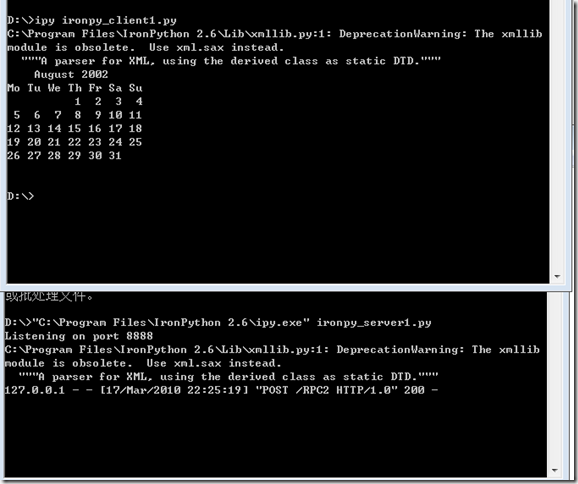

最近准备学习dotnet，要有一些代码练练手。看好了sliverlight或者wpf，毕竟是下一代显示技术。

基本设想如下，客户端运行程序，读取数据，动态生成投票（或者是survey）界面，运行，保存，然后将数据传回服务器端。

技术问题不算多，也有，比如sliverlight其实是没法直接连接数据库的，这个从安全角度也说得通。所以就要引入WCF或者RIAService技术，又多了一层曲线要学。

如何让读取保存数据过程更简单，容易实现？我想到了ironpython。

下载了最新版本的ironpython，搜索一下xmlrpc就能找到这篇文章：

[http://www.ibm.com/developerworks/library/ws-pyth10.html](http://www.ibm.com/developerworks/library/ws-pyth10.html "http://www.ibm.com/developerworks/library/ws-pyth10.html")

其中服务器代码如下：

import calendar, SimpleXMLRPCServer

#The server object  
class Calendar:  
    def getMonth(self, year, month):  
        return calendar.month(year, month)

    def getYear(self, year):  
        return calendar.calendar(year)

calendar\_object = Calendar()  
server = SimpleXMLRPCServer.SimpleXMLRPCServer(("localhost", 8888))  
server.register\_instance(calendar\_object)

#Go into the main listener loop  
print "Listening on port 8888"  
server.serve\_forever()

客户端代码如下

import xmlrpclib

server = xmlrpclib.ServerProxy("[http://localhost:8888")](http://localhost:8888"\))

month = server.getMonth(2002, 8)  
print month

主要是python的标准库实现了xmlrpc机制，而WCF技术说白了，也就是类似XMLRPC这样的remote process calling技术，换个马甲我就不认识你了么？

应该也可以通过dotnet framework，没那兴趣继续研究，就到这里吧。

ironpython应用于WPF的文章也很多，有机会试验了以后写出来。

