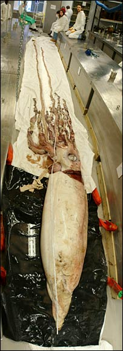

今天，仍然继续进行公司的技术交流，中午饭是“海之乡”的日本料理套餐鳗鱼饭，味道还不错。

忽然想起一个小笑话，讲过大家听听：  
就说有一年三八节，某电台点歌节目里一个小女孩打进电话，娇嫩的童音可爱极了，主持人也不由自主变成了儿童节目主持人风格。  
“小妹妹，你要点歌么”。  
“嗯，我给我妈妈点一首歌”。  
“真懂事，你要点什么歌啊”。  
“嗯，我要给我妈妈点一首《女人何苦为难女人》。”  
“￥％……￥^!#$”

在网上瞎逛，看到BBC有一则趣闻很有意思，说是伦敦捕到一只八米多长的鱿鱼（squid），嘿嘿，大连人爱吃烧烤鱿鱼，这么大的鱿鱼估计拿来烤也得弄个相当隆重的仪式才行。

新闻链接在这里  
http://news.bbc.co.uk/1/hi/sci/tech/4756514.stm

  
原文在这里，我做个简单翻译。

Giant squid grabs London audience  
巨型鱿鱼抓住伦敦游客

By Rebecca Morelle  
BBC News science reporter

One of the biggest and most complete giant squids ever found is on display at London’s Natural History Museum.  
Measuring a monstrous 8.62m (28ft), the animal was caught off the coast of the Falkland Islands by a trawler.  
迄今为止发现的最大完整巨型鱿鱼在伦敦自然历史博物馆被展示。体长约有8.62米，这只鱿鱼是在福克兰群岛被捕捞船捕获的。

Researchers at the museum undertook a painstaking process to preserve the giant creature, which is now on show in a 9m- (30ft-) long glass tank.  
博物馆的研究人员进行了一番艰苦的过程来保存这个巨型生物，现在被展示在一张9米的长玻璃盒子上面。

Giant squid, once thought to be sea serpents, are very rarely seen and live at depths of 200-1,000m (650-3,300ft).  
巨型鱿鱼曾经被认为是一种海蛇，是非常少见的生物，一般生活在200至1000米深的大海里。

They can weigh up to a 1,000kg; the largest ever spotted measured a vast 18.5m and was found in 1880 off Island Bay in New Zealand.  
它们可能长到1000公斤，观察到最大的有18.5米，在1880年在新西兰的离岛海湾（？）发现。

“Most giant squid tend to be washed up dead on beaches, or retrieved from the stomach of sperm whales, so they tend to be in quite poor condition,” explained Jon Ablett, the mollusc curator at the Natural History Museum who led preservation efforts.  
“大多数鱿鱼死后会被冲到海滩，或者在抹香鲸的胃里，所以它们常常出入非常艰苦的条件里。”，博物馆里领导保存鱿鱼项目的软体动物馆馆长Jon Ablett这样解释。

As a result, finding such a large, complete specimen was something of a rarity, he said.  
所以，发现如此巨大的完整的鱿鱼很少见。

Archie the squid

The team nicknamed the creature Archie, after its Latin name Architeuthis dux , but it may have to revise this after finding out that the squid is probably female.

TOTAL LENGTH COMPARISON  
Scientists admit they know little about the largest of the squid

It took several months to prepare the squid for display.  
“The first stage was to defrost it; that took about four days. The problem was the mantle – the body – is very thick and the tentacles very narrow, so we had to try to thaw the thick mantle without the tentacles rotting,” Mr Ablett told the BBC News website.

The scientists did this by bathing the mantle in water, whilst covering the tentacles in ice packs, after which they injected the squid with a formol-saline solution to prevent it from rotting.

The team then needed to find someone to build a glass tank which could not only hold the huge creature, but could leave the squid accessible for future scientific research, and they decided to draw upon the knowledge of an artist famed for displaying preserved dead animals.  
“We contacted Damien Hirst’s group after seeing their animals preserved in formalin. They put us in touch with a company who could make these tanks,” explained Mr Ablett.

The squid now resides in a glass tank, filled to the brim with preservative solution, and is one of 22 million specimens that can be seen as part of the behind-the-scenes Darwin Centre tour of the Natural History Museum.

Story from BBC NEWS:  
http://news.bbc.co.uk/go/pr/fr/-/1/hi/sci/tech/4756514.stm

Published: 2006/02/28 13:26:48 GMT
