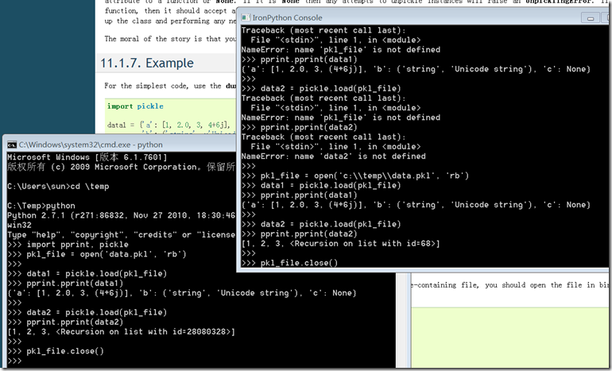

上一次讨论[http://sunxiunan.com/?p=1854](http://sunxiunan.com/?p=1854 "http://sunxiunan.com/?p=1854") 发出去以后提问者回复了一些问题，然后也提出一些新问题，觉得这种总体设计还是挺有趣的，值得发出来一起看看。

>     首先说明下为什么会有这样的想法吧—-公司里面有很多不同部门, 部门之间有不同的产品, 对于不同的产品和项目都有着自己的测试方案, 有手工的也有自动化的, 自动化的里面又有使用各种语言的(包括Tcl, Python, Lua等), 即使使用同一种语言, 也有使用各种框架的, 这样就导致了不同产品间很难沟通(最典型的案例就是需要互相借人的时候, 发现要重新学习一套测试方式, 周期太长), 同时也不便于管理. 于是呢, 领导们就突发奇想, 是不是可以统一一种语言和框架呢?为了能满足领导们以及测试部门等各方面的诉求,就有了以上的想法…..
> 
>     再来说说我的想法吧. 目前领导要统一已经是一个不可避免的问题了, 因此我非常希望可以引导到Python上面来(其实有些部门是使用Python的), 这里大概和我的个人喜好, 同时我也相信Python可以胜任这种情况. 于是为了证明这个, 所以我就有了以上的尝试. 所有的一切都是为了尽量少改动现有的代码而实现新的统一的目标，想调用Java的原因是有大量的类库目前可以使用，希望调用C/C++的原因是因为其他部门非常有可能需要与硬件相关的C/C++的扩展来实现框架，要尽量满足大家的需求大家才会支持你 。。。。。。

>     至于框架方面，说实话，现在Python的测试框架好像还没有特别成熟的，相对来说见得多的是Robot Framework，不过其实我自己的构想是重新创建的一个可以将各个部门完全分离同时又可以分别集群的架构，不过这些都是后话了。
> 
> 至于这位仁兄说的这条：
> 
> 3）IronPython无法调用C扩展，但是很容易调用C#，可以考虑将其作为C#与CPython的包装层，仅此而已，不要用的太多。  
> 4）Jython也是一样，仅用于Java与CPython的包装。
> 
> 鉴于我才疏学浅，不大理解具体怎么做，因为我的理解是Jython和IronPython都是重新实现的解释器，如何去包装CPython呢？（类似Pyhon For .net的做法？如果是这样的话，这个难度还是相当大的。。。。）
> 
> 希望能进一步解释。

\============================

我的回答如下：

包装层（wrapper）是一个抽象概念，有句名言说：编程问题大多数可以通过引入新的抽象来解决（当然，同时也产生新的问题）。

我们以IronPython和CPython以及现有的C# DotNet程序、C++程序为例来做个探讨好了。在上一次讨论提问者描述以后，我的感觉就是他对性能要求不高，交互紧密性要求不高（也就是未必有IronPython必须不得不直接调用C编写的Python扩展要求），只要把异构系统整合起来能够互相通讯就好。

整合异构系统，需要分清主次，我这里的设计方案，是以CPython为主，其它编程语言的应用程序或者以DLL形式存在或者被CPython程序调用激活，或者是驻留系统中等待CPython主程序的消息。如果你的方案不是这样，建议你重新考虑一下，没有主次之分的系统设计是有问题的。

另外看这位提问者的描述，他对于系统之间传递的内容，以及交互的紧密程度，要求不是很高，甚至感觉上就是只要Python能调用一下这些系统就行了。

这也是设计者需要考虑的，真正需要整合起来做什么，把方案做得细致一些，多考虑一些。

类似这种不同语言的系统进行通讯，基本上有这样几个办法：

1，基于消息Message Queue通讯

定义通用格式消息或者使用通用现成格式（比如ProtocolBuffer、Thrift、Json、XML、MsgPack等等），使用跨开发平台通讯方式比如zeromq、http web service进行通讯支持。这是扩展性最好、实现也不麻烦的解决方案，在Python-cn中Zoom.Quiet也提出同一种方案。

[http://en.wikipedia.org/wiki/%C3%98MQ](http://en.wikipedia.org/wiki/%C3%98MQ "http://en.wikipedia.org/wiki/%C3%98MQ")

[http://nichol.as/zeromq-an-introduction](http://nichol.as/zeromq-an-introduction "http://nichol.as/zeromq-an-introduction")

关于数据序列化比较，可以参考这里

[http://en.wikipedia.org/wiki/Comparison\_of\_data\_serialization\_formats](http://en.wikipedia.org/wiki/Comparison_of_data_serialization_formats "http://en.wikipedia.org/wiki/Comparison_of_data_serialization_formats")

另外在Windows下，如果是本机，也可以通过Windows自定义消息在不同系统之间传递。

Python、IronPython也好，C#也好，或者是C++、Lua、Java，它们都很容易建立Web Server，这种方案可以优先考虑。而且scalablity比较好，容易扩展。

2，基于COM

这个对开发者要求比较高，另外只能用于IronPython和Python以及C++之间，不能用于Jython和Java。但是如果不需要考虑Java系产品，可以考虑COM，其实COM技术即使在DotNet发展到4.0的现在，依然有强大的生命力。而且开发其实也不难。

3，基于数据库或文件系统传递

这种方案也是比较通用的，如果你不需要序列化对象，只关心结果（比如数字、字符串、时间等等），这个方案也可以参考。优点是相比第一种，更容易学习使用。可以使用SQLite这样轻量的数据库。

4，基于Python序列化传递对象

这是针对Python编程语言特定的办法。同时也回答了这个问题：怎么叫用IronPython作CPython和C#之间的包装器？

如果了解Python，应该知道Python有个序列化方法pickle，可以把对象保存到文件中，以后载入。

幸运的是，经过我的实验，IronPython2.7支持pickle，与CPython之间通过pickle文件传递对象，那是非常容易。

也就是说，C#程序运行完毕，或者通过IronPython运行完毕，可以将结果保存到pickle文件中，CPython载入以后继续运行，装得跟直接一样。

通过我的描述可以看出，IronPython和CPython还是没关联，你是你我是我。这的确没办法，因为它们各自都是完整的系统，设计初衷也没考虑到直接交互，但是IronPython发展前景不错，值得跟进。相比Python.Net而言，我还是建议使用CPython和IronPython。

最后要说的是，这种大一统的方案，如果没有强力领导介入和长期支持，基本上不能成功。但这不是技术方案需要考量的。
