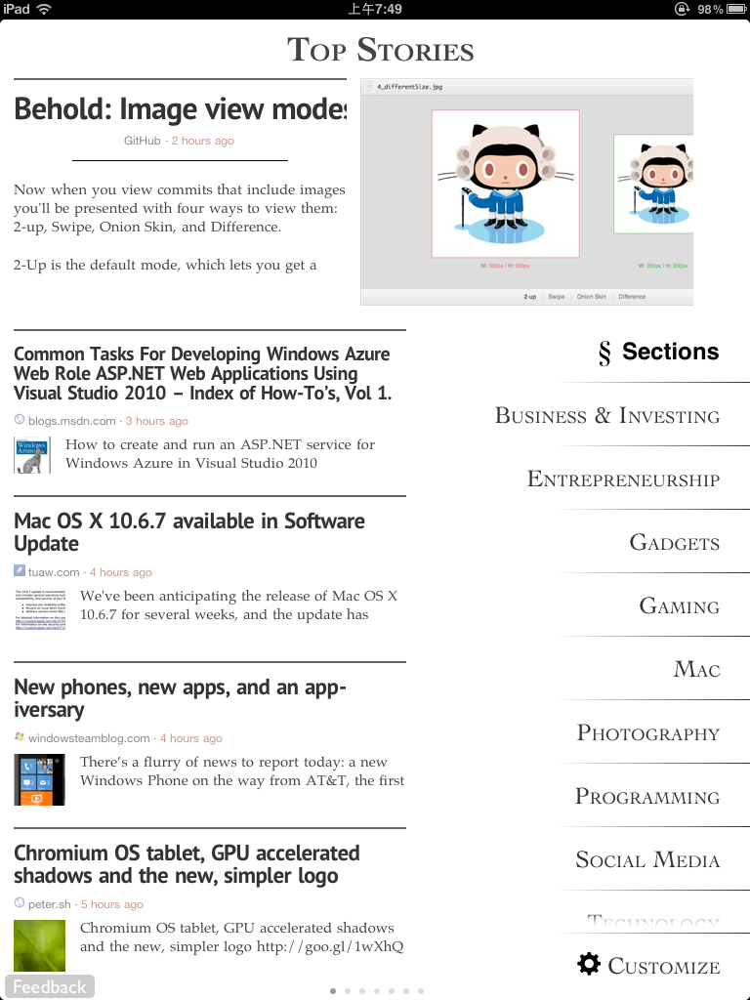
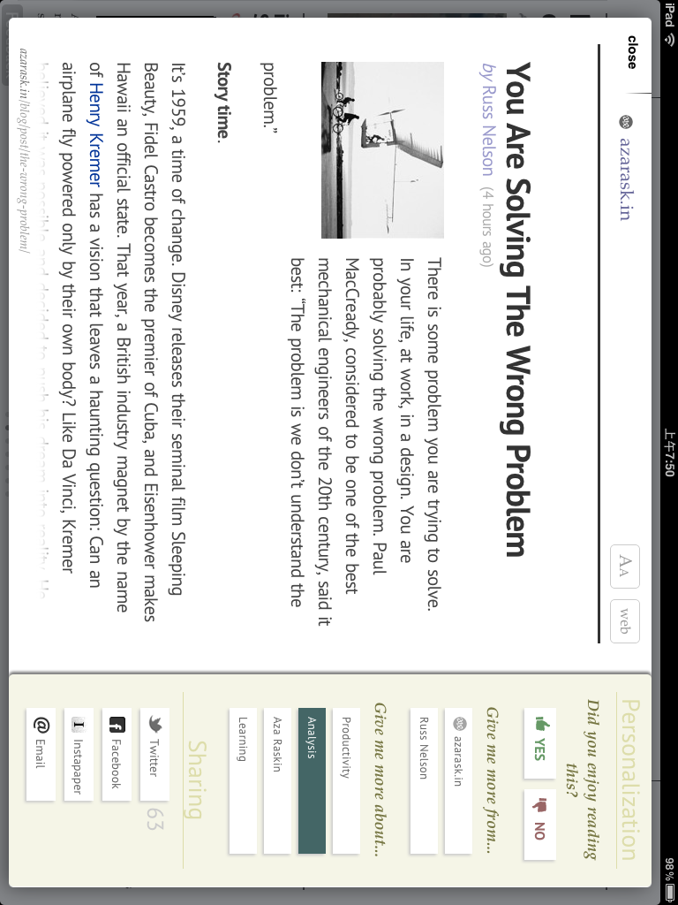
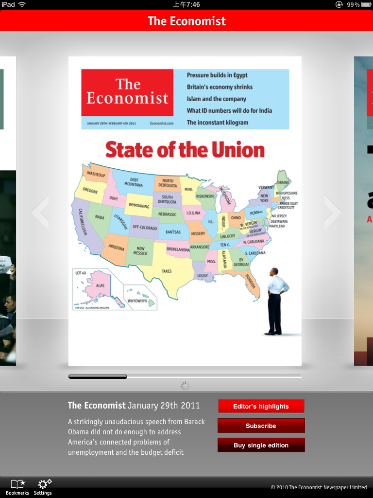
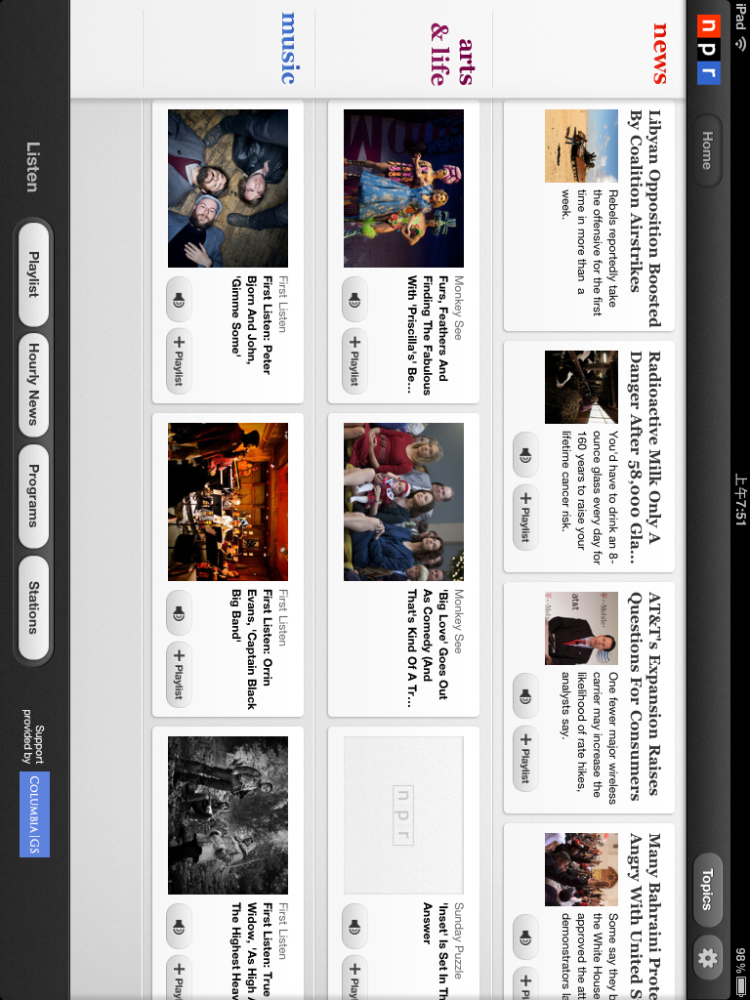
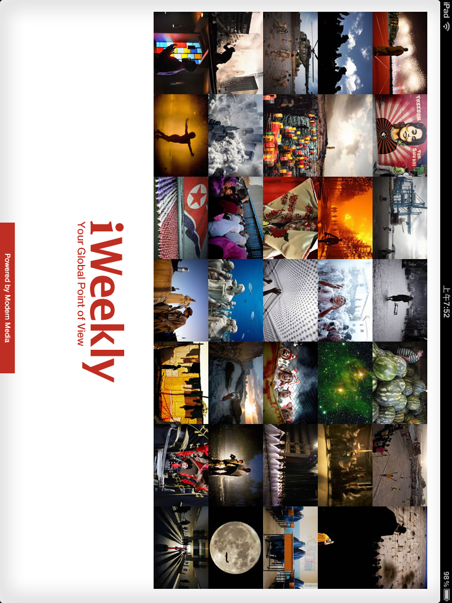
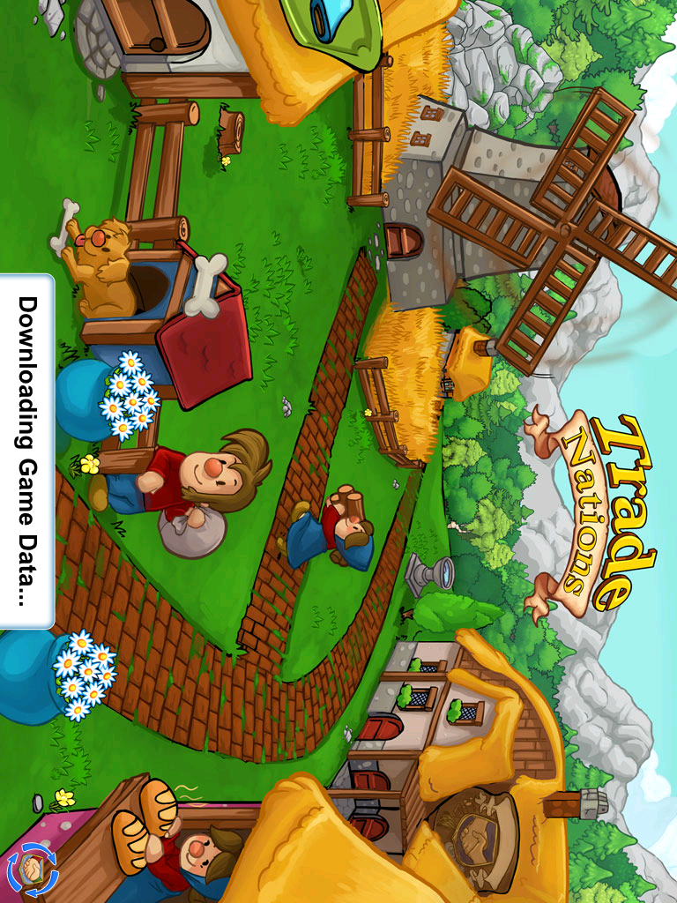

我的iPad系统是iOS4.3没有越狱，推荐下面这些免费软件给各位iPad玩家。

这些软件都是通过美国app store下载来的，不用信用卡注册一个美国app store其实很简单，就是购买一个free的软件就行了。某些情况下也许需要翻墙。

**下面推荐的软件都是免费的，在app store中可以搜索名字找到下载。不需要越狱也不需要破解，基本上已经满足了我日常需求。**

先说说我觉得应该有但是现在还不够好（或者我还不知道的）软件：

1）浏览器，safari无法浏览桌面版google reader，太惨了，是我最不可容忍的。Firefox或者Chrome有iOS版本么？或者有什么软件浏览google reader比较像是正常浏览器的？

2）pdf阅读软件，我想要的pdf阅读器其实就需要两个功能，一个是固定缩放比例，一个是固定缩放view或者说是切白边的功能，Apabi可以切白边，但是不能固定缩放。而且我也不喜欢翻页模式，如果能做成电脑上那种pdf连续阅读模式就更好了，为什么非要模拟实体书阅读呢？这些程序设计者其实也进入一个误区。

当然也可以买ibook或者kindle，那是另外一个事情了。

3）游戏方面，没有特别好玩的，操作感以及游戏大作各方面比较，都比psp差多了，这让我也感到很欣慰，psp不需要下岗。至于愤怒的小鸟，其实不很好玩。玩游戏还是需要有手柄才有感觉。

我推荐的这些软件主要分几大类，下面让我一一道来：

**编程技术相关**

推荐软件就是一个Zite。由于没有碰到好的RSS阅读软件，或者有些软件（比如MobileRSS之类）的阅读习惯与google reader差别太大，基本不推荐。

[http://itunes.apple.com/us/app/zite/id419752338?mt=8&ls=1](http://itunes.apple.com/us/app/zite/id419752338?mt=8&ls=1)

Zite这个软件号称是可以学习你的阅读习惯，进入软件以后可以先定制自己喜欢的频道，或者加上自己感兴趣的tag keyword，不过要注意这些tag关键字都是Zite预置的，现在还不存在你自己添加个新关键字的可能。

在文章阅读页面，可以选择”喜欢“”不喜欢“，或者“一直给我推荐这个网站文章”“分享到twitter/FB/Email”等等功能。所谓能自我学习，也就是从读者不断地点击喜欢不喜欢来计算权值，进行文章推荐的吧。

由于没有VPN，所以只能把自己喜欢的文章用email发给自己。

**英语、时事相关**

推荐《The Economist》《usa today》《nytimes》《CNN》《NPR》。

免费版的经济学人《The Economist》只能看到“Editor’ s highlights”，但是基本上也足够了，因为不像是技术文章那么容易看懂。另外”经济学人“还可以下载音频收听，选择右上角的耳机图标就可以了。

在通过听看新闻学英语的这些资源中，比较推荐”CNN“和”NPR“，因为他们几乎所有的音视频都有脚本字幕（transcript），如果遇到看不懂听不懂的，看看脚本就可以了。

**杂项新闻相关**

推荐iWeekly周末画报，Zaker，Flipboard。

其中周末画报相对制作比较精美，而Zaker由于来源比较混杂，排版不是很好看，有了Zite以后，基本上就不用Zaker了。

**游戏相关**

推荐TradeNations。

除了切水果，跳跃忍者，愤怒的小鸟这一类大家总所周知的游戏，TradeNations算是一个社交加农场养成类的游戏，你可以加好友，然后到好友的农场里进行交易，买花买家具买衣服等等，这个游戏是tinyfool在twitter上推荐，还真是挺好玩，每天稍微打理一下就可以了，如果你也玩了这个游戏，欢迎加我的账号sagasw。

**读书相关**

推荐CloudReader，Stanza，Apabi Reader（方正阅读器），ibook，kindle。

没有特别出色的，相比来说Apabi特点突出一些，但也不是很好用。基本上ibook，kindle，Apabi阅读pdf都属于残废。但是我已经想到一个用ipad阅读pdf的方法，正在研究中。

**免费、限期免费相关**

推荐”app每日推送“以及”软件游戏猎手“这两款。
