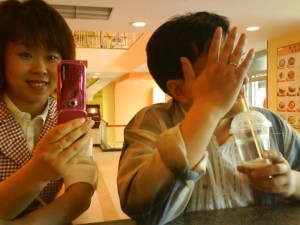
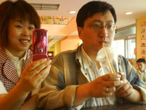

周六陪宝宝玩了一天，多少有点累。因此决定第二天哪里也不去，让帅哥好好歇歇。

星期天睡了大大懒觉的我起来后第一次吃到现成的饭菜，虽然是婆婆给带回来的饺子，好歹也是人家帅哥热给我吃哦，感动得我就差泪光点点了。当时就在憧憬着以后每个星期天的早晨都能吃上老公做的饭菜——哪怕偶尔把前晚剩下的放微波炉里转两圈也行啊！

更让人开心的是饭后帅哥边刷碗边问我是否需要洗衣服，得到肯定回答后就麻利地把洗衣机搬进去，接好电源和上下水管，只等我将衣服分门别类放进去加洗衣粉选择程序按动开关。洗衣机勤勤恳恳工作中，我把自己解放出来收拾整理卧室和客厅，然后用洗衣机放出来的水涮拖布，擦第一遍地，看到帅哥今天心情格外好，就乘胜追击，说帅哥今天太棒了，帮我做那么多家务，跟他商量看能否把我刚草草擦过的地扫一下，人家从床上一个高蹦下来，说绝对没问题，我心里那个美啊。

等到后来那位仁兄就一发不可收拾了，不但帮我把漂洗节省下来的水放到洗衣机里让它进行第二拨劳作，看我忙着擦第二次地还雄赳赳气昂昂地帮我晾衣服，天啊天啊，活脱脱一个勤劳善良的模范丈夫啊。我早该在他帮忙做家务后就立刻表扬鼓励的，其实人家不是不干活，是不稀得干啊，干了我也没表示，人家凭什么要干呢?

家务活的确挺烦躁的，但如果是两个人分担就变得轻松多了，而且能省出许多时间用来交流感情哦。

为了庆祝俩人合作愉快，晚上做大菜一道：萝卜炖牛肉，可能味道就是好，也可能真的饿了，满满一盆儿吃得精光，哈哈，简直好极。

除了一起劳动一起吃大菜还一起看大片《黑客帝国》，当然，他只是又复习一遍，我呢因为之前没看过，显得异常紧张兴奋，亏得有他在身边适当做解释，不然，实在看着费力呢。原来总说在电影院看大片才有感觉，那都是小资情调在作祟，跟爱人在一起守着电脑看其实也蛮不错的，嘿嘿。

参加由二舅公请客的家庭聚餐后我们又领大家去K歌，跟帅哥一首《知心爱人》唱的还算可以，反正公公婆婆都说好听，帅哥工作一天早已经折腾累了，我想着之前定好的这题目就噼里啪啦上来敲打一番。假期还剩一周，等上班后不知还能否有心力好好经营二人世界，还是否有时间经常过来记账呢。

偶尔有朋友恭维说我文章写得耐看，说我写出的的生活那么美好，也有朋友说我文笔实在有待提高，不管怎么说吧，生活就是这样，你不管怎么写都得好好过好好体会才行，而且就算写得再光鲜亮丽也肯定是酸甜苦辣咸五味俱全，或者苦乐参半的。静下心来想想咱这二人世界可能维持不了多久，现在萌萌还小，我们有些自私地把她托付给老人照看，等她大了上学了，需要我们辅导功课了，还是要回归成三口之家，或者升级到一家五口的。

最后贴两张我们去年六月用手机拍的搞笑照片吧，二人世界的瞬间展示

 

去丽英达给萌萌拍照片后，跟帅哥在青泥洼桥的雅惠歇脚喝冷饮，等待接坐火车回大连的妹妹。俺说咱俩很久没有合影了，用手机对着镜子来一张吧，那家伙死活不肯给面子，勉强拍了第一张他居然把脸挡上了；第二张是在我好说歹说以后心不甘情不愿才把手放下来，却做了呆呆木木地表情，很有当年送我那只硕大加菲猫的味道，哈哈。
