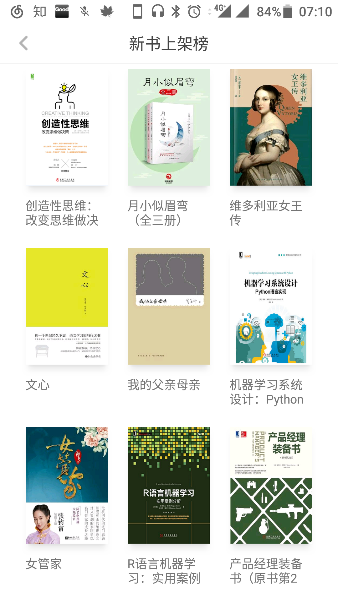

这里面列出的应用，大多数不是其他人经常提到，甚至我认为有的软件很少有人听过。推荐一下，展示下我觉得可以自我学习的这些app。  
1，网易蜗牛读书

这是网易今年新推出的读书类软件，我的手机上装的最多的也是这类软件，比如多看掌阅微信读书追书神器，一大堆都有了。网易蜗牛读书的特点是可以每天免费阅读一小时，如果付费大概是一天一块钱，也不贵。

我看到的网易蜗牛上的好书，比如穷查理宝典，东野圭吾系列等等。实话说一天一小时的免费足够使用了，而且蜗牛秉承了网易家逼格高的特点，小编推荐信我是每次都看得很细。

2，getpocket

没有办法用苹果手机和mac本办公，这个app就是我最重要的生产力工具。最常用的场景是看到一篇好的文章，点击分享直接存到getpocket里面，需要的时候搜索一下。他们还提供了chrome浏览器插件，也是可以一键保存。方便是我对此类软件的最大要求。

最近getpocket还加入了朋友推荐和热门推荐的功能，多少缓解了我对Zite这款软件的思念。

3，inoreader

自从Google把reader给黑掉了，我就一直想找一个好用的RSS阅读器。用了inoreader一两个月，感觉它大致可以满足要求了。比较喜欢它在web端可以切换不用阅读视图。因为我对某些订阅就是浏览标题，有的就要求直接全文显示，它可以很灵活的切换。

而且inoreader和getpocket有直接集成，对我而言也是大加分项。
