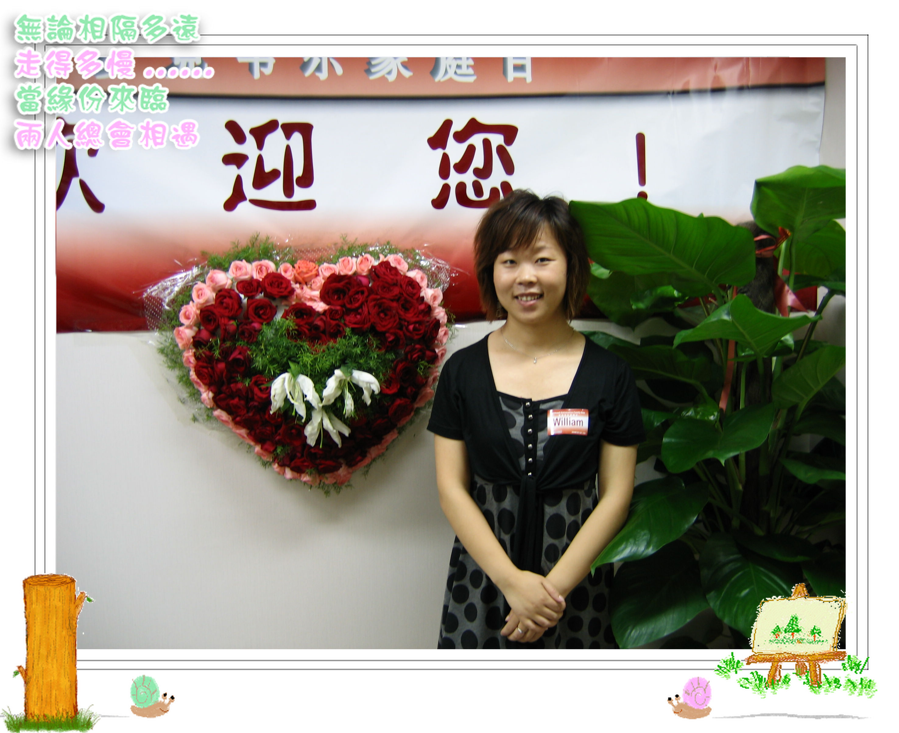

帅哥他们公司第三次家庭日活动，我死乞白赖地去参加了，之前都是二老带孩子去的，这次赶上考完技能有时间，俺也跟着混一把，呵呵。

     活动分两天，第一天主要是看电影《赤壁》和晚宴，第二天参观公司，看足球赛以及晚上的金沙滩烧烤，实在是丰富多彩。因为很久没有参加那么大型的活动，不免 有些紧张，担心举止不得体在那么多人面前给帅哥丢脸;) 他刚进公司的时候才二三十人，现在已经一两百了，很多都是生面孔，好在我记性不算太差，有一些还是能认出来的。值得一提的是两年没见，他们老板依旧那么风度翩翩，还是那么幽默睿智……

     晚宴中有一项重要内容是跟帅帅的老板合影留念，轮到我们的时候，帅哥的老板边微笑边跟我交谈，他说：“发现你是天天写blog啊，还说我坏话，什么老板一 来员工就要倒霉，加班儿，我可是电脑高手，黑客……”，我只能笑嘻嘻地说：“那是什么年头的事情了，当时不是产后抑郁嘛，别跟我一般见识！”现在想来如果不是那黑色幽默，当时还真的会有点儿窘，帅哥他们老板把公司管理的这么好，还经常组织丰富多彩的活动给员工，说他好还来不及，咋能讲人家坏话呢？

      他们公司这几年急剧扩张，现在大厦已经有三层都是他们的领地了，属于他的那个空间挺不错的，光线很好，身后就是窗户，可以远眺街景，可惜搞得有点儿乱，我 乘机帮着收拾一下，人家还老大不乐意呢。午餐前的小游戏，除了员工我们家属都可以参加，高尔夫，俺实在是玩不来，因为是左撇子，临时用右手死活就是不进；飞镖，还凑合，得了两张电影票；21点，人很多没过去玩。下午的足球比赛也挺好看，绿队技术不错，脚法很灵活，可惜最终跟对手蛋比蛋了。第二场，终于绿队 进了一个球，不枉我们看了一下午啊。

     晚上金沙滩的烧烤，大家也吃得也很开心，不过，我还是喜欢烤给大家吃，呵呵，贤妻良母的作风哦……

     两天的活动的确很充实，第二天晚上回家，觉得疲惫不堪呢，而且身上全是烧烤的味道，嘻嘻。帅哥星期天要去杭州出差，等我我帮他打点好行装，已经累得不行，足足休息一整天才算恢复体力，看来玩儿也是件幸苦的事情啊，不过，还是希望有机会能多参加这样的活动！起码可以丰富我的博客内容啊，豆腐帐也得有得记才行

 
