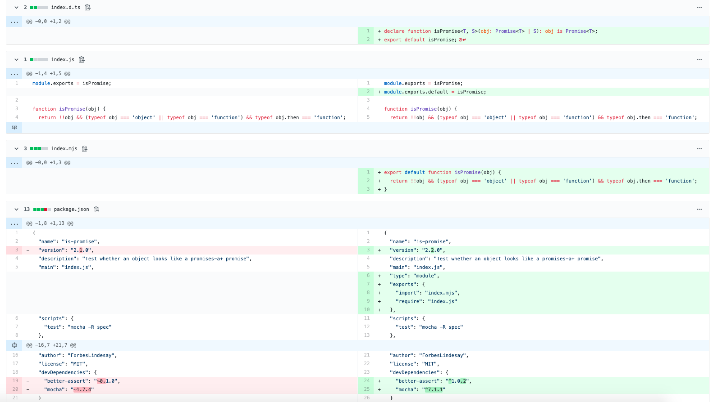
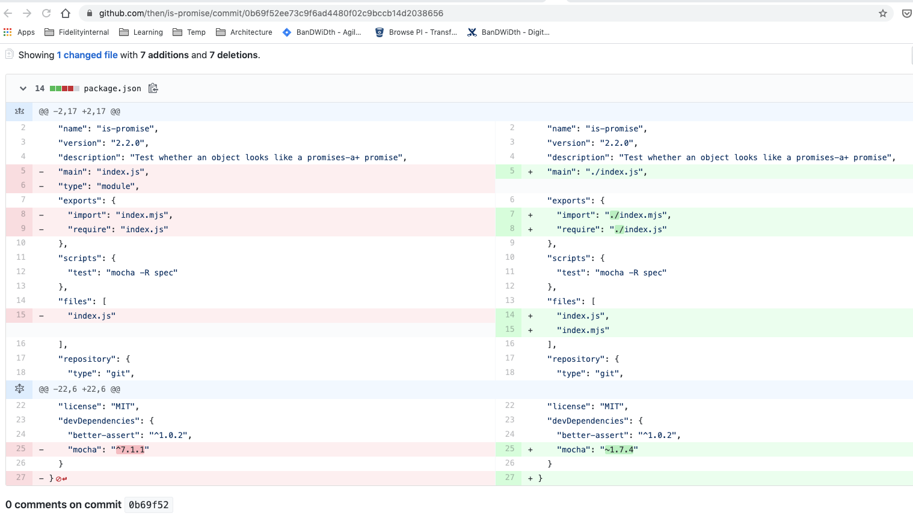

(Updated)开发者自己做了一个事后分析，比我讲的清晰多了，当然主要原因还是JS module依赖设计的复杂度[https://medium.com/javascript-in-plain-english/is-promise-post-mortem-cab807f18dcc](https://medium.com/javascript-in-plain-english/is-promise-post-mortem-cab807f18dcc) 在这一点上我很看好deno这个新工具。

——————————-

看到微信群里有人转关于“is-promise”更新导致的问题，公众号文章说的非常夸张，但又语焉不详，看了毫无头绪。于是看了些英文文章，做了点技术分析。

首先声明，因为水平不够理解不深，这篇文章并没有解释清楚问题的原因，只是说了一下我看到的现象，确保将来写类似代码的时候，心里有点谱。

“is-promise“有问题的版本更新是2.2.0，看了更新diff没发现什么明显问题。更新的目的主要是增加ES module风格的默认import。

首先得熟悉一下ES Module的import，还有commonjs的require。

先说一下ES6标准化的module，在浏览器中可以通过<script type=”module”>导入模块脚本，代码是这样的：”import xxx from ‘module-name'”。如果用CommonJS呢，就是“const package = require(‘module-name’)”。

在Nodejs v12之前使用的是commonjs，在v12的时候引入了ES Module的支持。在node中可以通过条件导入同时支持两种方式（麻烦！）[https://nodejs.org/dist/latest-v12.x/docs/api/esm.html#esm\_conditional\_exports](https://nodejs.org/dist/latest-v12.x/docs/api/esm.html#esm_conditional_exports)

在nodejs的官方文档中[https://nodejs.org/dist/latest-v12.x/docs/api/esm.html#esm\_dual\_commonjs\_es\_module\_packages](https://nodejs.org/dist/latest-v12.x/docs/api/esm.html#esm_dual_commonjs_es_module_packages) 特意解释了双模式package的问题，其中特意提到了“Dual Package Hazard”（双Package风险），说实话这部分有些复杂，我也没有太理解。在后面提到了“Differences Between ES Modules and CommonJS“，其中第一条就是”Mandatory file extensions“，但是文档说的还是不清不楚的。

我们看一下is-promise的bug fix能理解更深一些。[https://github.com/then/is-promise/commit/0b69f52ee73c9f6ad4480f02c9bccb14d2038656](https://github.com/then/is-promise/commit/0b69f52ee73c9f6ad4480f02c9bccb14d2038656) 可以看到主要就是对文件路径指定，变成使用”./xxx.js”方式。为什么原来有问题，现在就能fix，说实话我还是没看懂。我在本地做了一个极为简单的node js脚本文件，引入了is-promise 2.2.0版本，尝试了import和require两种方式，没发现有问题。我也尝试从bug report中找点线索，但是大多数都是说xxx有问题了，没有细节。我甚至到create-react-app中查找is-promise，根本就没有，简直是磕了。

先这样吧，等我理解更多了再更新此文。

另外在HN上关于这件事的讨论[https://news.ycombinator.com/item?id=22979245](https://news.ycombinator.com/item?id=22979245) 也是非常热烈，不过没人分析原因，要么吐槽，要么建议用npm指定版本方式（版本号不用^和～）。
