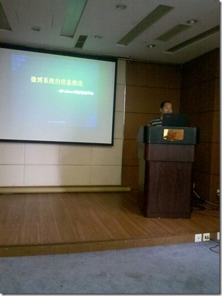

2011年的7月23日必定会成为一个令人难忘的日子，因为这一天发生了太多神奇的新闻。不过这里想说的是大连IT从业者、程序员的一次聚会，是由InfoQ组织的QClub。

（下文中提到的推，是指的twitter，而微博指的是新浪微博）

大概一两个月之前，有人在微博上提醒我，@侯伯薇 会组织一次大连的QClub活动。这个事让我感觉很兴奋、很开心。

作为程序员，会经常被人搭上各种各样固定的tag，比如“宅”，比如“闷”、“无聊”，“不会沟通”，“害羞”，“冷笑话”等等。QClub不能说是宅男们的反击，而应该说是程序员期待与人面对面沟通交流的那种感觉。在这个时候，一个名字、一个ID会变得更鲜活生动，更加有生命力。

早上起来发现天气极为恶劣，@gamtin在推上说，也许又要像去年Python用户组那次（[大连Python用户组活动简记](http://sunxiunan.com/?p=1686 "大连Python用户组活动简记")）的天了，好在接近中午的时候雨渐渐小了，而且天气也开始放晴。侯伯薇在微博上发消息说，他已经出发去会场准备了。

我也提前一小时出发，到的时候大概是一点左右（定的是一点半开始），屋子里还没有几个人，前面有两三个人在准备电脑神马的，由于去的早，InfoQ的海报也还没有放在会议室外面，我是好一顿撒磨（大连话，意为探头探脑的看）才敢进去，吼吼。

过了十几分钟，侯伯薇与欧兰辉 @ouland 一起到了，侯伯薇看上去比网上感觉的要年轻，这也是搞技术的最大好处啊！！我们简单交谈了几句，提到了这次InfoQ对于大连程序员以及搞IT方面的朋友，真是极为难得。侯伯薇提到了百年人寿对本次活动提供赞助。

这次QClub主要是三个议题，由于是架构专场，演讲议题都与架构有关系。首先是时代麦微（follow5）的CTO张爽介绍了follow5这个微博平台的架构。个人感觉由于不是太了解听众群兴趣、层次，张爽的presentation偏向于普及，我比较感兴趣的问题涉及的不多，也许是不方便，具体的数据也不多（比如具体架构选型，神马Linux用了神马开源项目，数据流量多少，哪个微博同步量更多，基于用户微博是否有二次数据挖掘的想法，如何盈利，下一步计划等等）由于我也是一个Open话题的主持人，所以就没法分身与张爽进行讨论。其实大言不惭的说一下，我对另外两个讨论话题或多或少都有涉及，比如微博同步，我有写过一个twitter同步到新浪、腾讯微博的小程序，用了GAE；再比如NodeJS，那件让人羞射的T恤就是我研究写文章得来的哦。

第二个话题是侯伯薇主讲的“选择合适的架构”。其中我觉得很关键很同意的观点就是，架构本身不是一成不变的，要根据具体的情况来做平衡（trade off）抉择，架构师之所以值钱，不是因为他们知道架构如何如何，而是他们知道在某种情况下应该选择什么架构、不应该选择什么架构技术，而且能够用代码把这种技术的可能性show出来。

第三个议题我这里也有参与，准备的话题是“35岁程序员这个坎，如何进行职业规划职业发展”，没想到参与的人也不少。欧兰辉在开始帮我撑了一会场子（后来这家伙跑到别的讨论组去了）。为什么要选这个话题？其实大家搜索一下各种招聘网站或者是各种博客就能发现“35岁为程序员应聘上限”“35岁以后不写程序，要搞管理”“35岁以后的程序员没有前途”之类的言论比比皆是。35岁以后就必须转型？不能搞技术？不是做管理就不行了？这次讨论组就想跟其他朋友一起探讨一下这个问题。

首先让大家做了一个简单的自我介绍，发现做了几年、接近35的开发者还不少，也有刚毕业入职的学生对前途比较迷茫，还有人对程序员这个职业很迷惑不知道该如何走，另外也有人关注程序员这个群体的健康问题。关注的点都非常有价值，我把问题记在便签上，后面慢慢讨论。

要说明的是，我提到的35岁程序员，指的是在这个年龄段可能是Senior Developer，可能是Leader或Manager，也可能是架构师，也可能是业余的移动App开发者；这里说的程序员，指的是35岁以及35岁以后还有兴趣继续编程，而且在工作中也能够继续编程，而且以编程为乐趣的IT从业者。如果把程序员局限在某个头衔下，天天看着式样书敲程序的码工（coding worker）那我也不同意35岁的时候还是这样。

在讨论中我提出一个观点，在总结的时候也是这样说的，就是程序员这个职业，在中国现阶段，赚钱方面比其他行业可能还要差一些，如果坚持做技术可能会有类似的问题。很多人选择程序员作为职业，是因为自己喜欢编程，喜欢编程中能控制一切的感觉，喜欢与电脑打交道的直接（而不是管理团队要考虑的麻烦事），或者说，编程就是一种业余爱好。如果觉得大连程序员收入低，可以试试北上广，或者试试肉身翻墙，学英文学日文的翻墙出去有啥用？我们这样搞技术的技术移民那就相对容易多了。另外也可以试试与志同道合的朋友一起搞搞App开发，虽然说现在不是那种一个人包打天下的时代，但是两三个高手做出一个应用程序，也不是不可能。最重要的还是要经营自己的品牌，把自己在这个圈子里变得知名，把技术功底打得扎扎实实，这样才有比较好的前途有比较多的选择方向。

有些朋友选择程序员，是因为就学的这个专业，也找不到别的好工作（类似工资水平下）。这时候我的建议是，在30岁之前考虑你的转型问题，30岁左右开始做转型。程序员在现阶段的中国，只能算是一个中等甚至中等偏下的行业，它的长久发展可持续性在中国体现的非常不够（在日美这些地方就不一样了）。所以说，但你仅仅为了养家糊口而选择成为程序员，要么早点考虑转行，要么早点出国多赚钱镀金。

大家讨论了一个多小时，在5点多的时候各位主持人做了总结发言。然后会议结束。

这次QClub可以说是一个胜利的大会，一次奋发向上的大会，一次令人斗志昂扬的大会，一次红旗飘飘的大会。。。。。。
