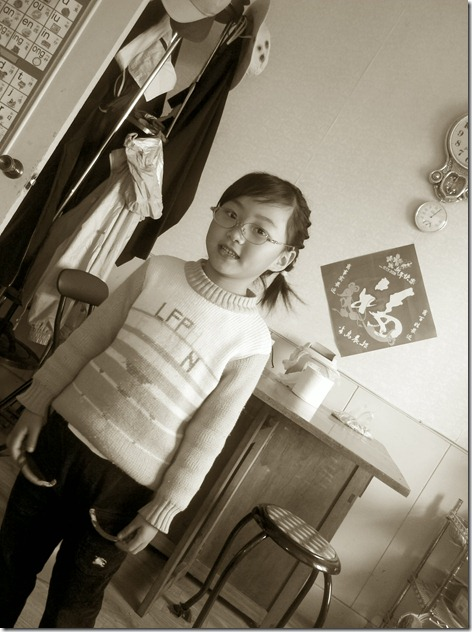

星期天回到父母家，晚上吃饭的时候不知怎么父亲想起萌萌一个事，说她聪明”不好糊弄了“，说捡来的故事不相信了。

萌萌这时候接了一句”我是从妈妈肚子里生出来的“样子颇为认真，让我感觉非常有意思，于是想逗逗她。

”你不是妈妈肚子里生出来的，是从天上来的天使”。

萌萌开始很怀疑，“我就是妈妈肚子里生出来的”，于是我把故事说的比较像回事“你是从天上飞下来的，我和你妈妈把你的翅膀都保存起来了，放在银行里“。

萌萌开始围绕这个问题不停地问“那我安上翅膀会不会飞？能不能把翅膀让我看看？我不信我就是妈妈肚子里生出来的“诸如此类，小脸兴奋地通红。

说着说着，突然冒出一句”爸爸是从白菜叶子里出来的，爸爸是菜青虫！“把我们笑到不行。

宝贝，你就是我们的天使啊！

