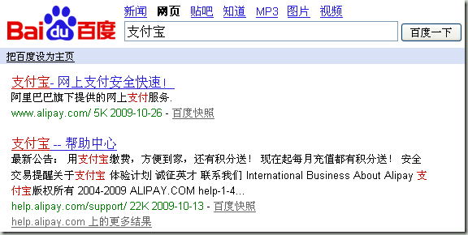
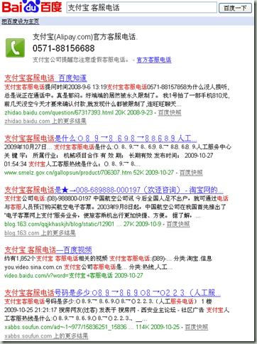
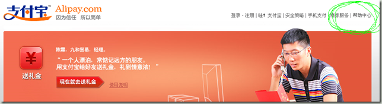
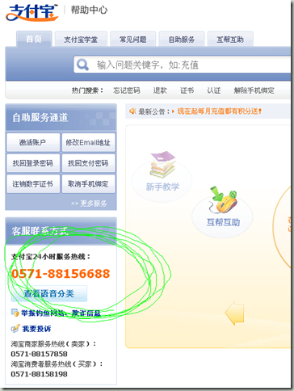
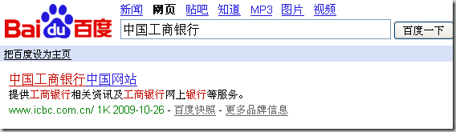
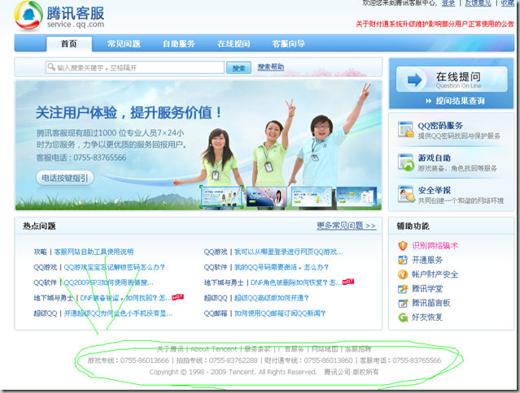
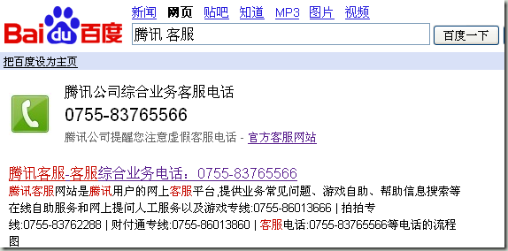
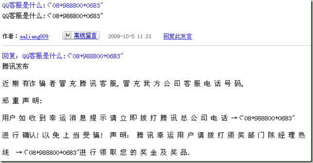

首先，系统要经常进行更新，windows update最好打开自动下载选项，如果可以的话，使用mac系统或者linux桌面系统来代替windows操作系统是非常好的选择。

其实要使用一个好一点的杀毒软件，比如我在家里使用AVG free版本就非常棒（[参考这篇](http://sunxiunan.com/?p=1340)）。杀毒软件也是应该时时更新，然后坚持每周做一次整机杀毒操作。

上网最好选用IE以外的浏览器，比如火狐或者苹果的safari、google的chrome都可以，各大下载软件网站（如skycn.com）都可以下载。

这些都是一些必要条件，保证使用者能够安全的使用互联网。

另外注意的是，如果使用QQ或者淘宝旺旺，对于好友发来的链接，最好问一下这个连接的内容是什么，有些病毒可以通过QQ或者旺旺自动发送木马网站网址。问一句的话就可以避免此类情况发生。另外电子邮件中的网址也尽量不要点击，哪怕是好友发来的。

密码管理也是一个大问题。一般要把密码分成几种，一种是通用密码，普通的网站注册，比如普通论坛就用这个密码。另外一种是复杂重要密码，使用拼音数字加上标点符号的组合，最好达到8个字母以上。这个密码用作你的QQ、支付宝、主要电子邮箱以及网上银行使用。最安全的方法是这几个密码都有所不同，但是那样记忆起来比较麻烦。复杂重要密码不要广泛使用，只用于几个重要网站或者软件即可。

对于个人信息也是应该非常注意，家庭的座机电话尽量不要公开，如果需要，只公开手机或者工作时的座机电话，这样防止有人恶意骚扰。另外，家庭住址或者比较私密的信息也不要在网上公开（如你的学校寝室，父亲母亲姓名电话，同学朋友的信息、电话等）。有个真实的例子，我们班5460同学录上信息暴露，结果我们班同学就收到不少骗子电话（包括我）。

另外说明一点，如果是短信或者网上发消息借钱、要求汇款，如果真有此事，最好打个电话确认信息的准确性。比如银行账号、汇款金额，毕竟现在丢手机或者QQ盗号情况太严重。

对于安全进行网上购物，最重要一点就是先申请一个招行或者其他行的**借记卡，看准了，一定要是借记卡，没有透支功能的。**

这张借记卡上不要存太多钱，一般留个千八百就可以，如果买大件商品再事先多往里存一些。我推荐大家申请一个招行的借记卡，然后开通网上银行业务。

网上购物不要去其他网站，就去[www.taobao.com](http://www.taobao.com)就可以，会减小不少风险。为了防止网上被骗，使用taobao购物的时候，**一定要用支付宝支付，而且跟卖家的通话使用淘宝旺旺进行**，这样通话记录会存在淘宝服务器上留作证据，将来有纠纷时候，淘宝可以直接使用这些通话记录。

**支付的时候，再申明一次，一定要用支付宝支付，然后使用前面提到的那个专用的借记卡支付。不要用信用卡或者其他有大额存款的银行卡。**

另外，如果访问银行网站或者查找客服电话，应该直接到他们的官方网站上，比如支付宝的网址，通过百度可以查到是[www.alipay.com](http://www.alipay.com)。

另外需要注意的是，绝大多数的正规网站都是使用.com域名，比如taobao.com，163.com，baidu.com，只有少数网站使用.com.cn形式，非常非常少数网站使用.cn。一般骗子网站喜欢用.cn这样的网址。

另外需要注意多积累熟悉那些官方网站的网址。比如taobaovip.com，taobao163.com，taobao1.cn，qqvip.org，54kfqq.com，大多数是骗子网站惯用的网址，一般不明真相的用户看到里面有taobao的拼音就认为是官方网站然后就被骗了。

如果你直接查找支付宝客服电话，那就千奇百怪了。这个官方客服电话0571-88156688也是最近加入的，以前根本就没有这种明显的提示。

在支付宝的首页上没有留支持电话，但是点击网站首页的帮助中心

就可以看到很明显的提示信息：

另外，中国工商银行的网址是[www.icbc.com.cn](http://www.icbc.com.cn)，

**工商银行的服务电话是95588，招商银行服务电话是95555，如果哪个银行的客服电话不是9开头的五位数字，那你不要理，一定是假的。**

如果你的QQ有问题，到qq.com直接点击右上角的腾讯客服，就会进入客户服务网站，一般服务电话都是留在最下面。

或者到百度搜索腾讯客服，可以得到：

需要注意的是，不要相信百度贴吧，论坛上贴出的客服电话以及网址，比如这个贴吧留的骗子电话：

这篇文字还好心的提醒大家不要上当受骗，如果一查区号0898就知道，这个区号是在海口，难道腾讯搬到海口了？

**为了安全起见，不要直接使用我截图上的电话，最好你自己到官网上找这些号码。**

小心一点，多长个心眼，经常到淘宝的交易安全[http://trust.taobao.com/](http://trust.taobao.com/ "http://trust.taobao.com/")专栏看看骗术以及防骗招数，你就不会上当受骗了。
