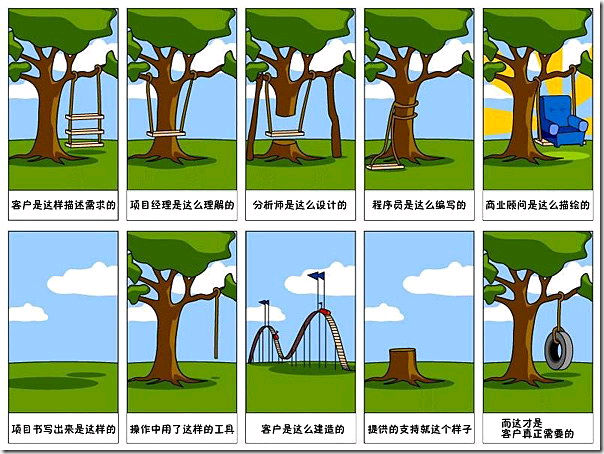

闲逛javaeye论坛，发现一个很有趣的帖子《[面子驱动编程](http://www.javaeye.com/topic/325987)》，里面的观点简单说就是：从客户需求出发，实事求是，面向用户（或者说面向需求）来做设计。

前面我写了一篇文字[如果我来做软件（1）- 评《走出软件作坊》](http://sunxiunan.com/?p=1302)，这里想写的是软件开发最重要的一个时期，也就是所谓的**需求分析阶段**。

在维基百科上是这样解释需求分析的：

> 在[软件工程](http://zh.wikipedia.org/wiki/%E8%BD%AF%E4%BB%B6%E5%B7%A5%E7%A8%8B)中，**需求分析**指的是在建立一个新的或改变一个现存的[电脑系统](http://zh.wikipedia.org/w/index.php?title=%E7%94%B5%E8%84%91%E7%B3%BB%E7%BB%9F&action=edit&redlink=1)时描写新系统的目的、范围、定义和功能时所要做的所有的工作。需求分析是软件工程中的一个关键过程。在这个过程中，系统分析员和软件工程师确定顾客的需要。只有在确定了这些需要后他们才能够分析和寻求新系统的解决方法。
> 
> 在软件工程的历史中，很长时间里人们一直认为需求分析是整个软件工程中最简单的一个步骤，但在过去十年中越来越多的人认识到它是整个过程中最关键的一个过程。假如在需求分析时分析者们未能正确地认识到顾客的需要的话，那么最后的软件实际上不可能达到顾客的需要，或者软件无法在规定的时间里完工。

简单的说，需求分析实际上就是客户想要做什么，想要一个什么样的产品，想实现一个什么样的功能。这个阶段可以分得更细一些，但是大体意思就是你要做什么不要做什么。

为何这个最重要？做过软件编程的朋友都知道，一个错误的设计无论如何也得不到正确的结果，哪怕你是再牛逼的大师来编码。

一个软件从初始到客户验收使用，中间会经历很多人的构思描述，伴随出现大量的文档，而一开始的方向一定要正确，才能保证后面走的路也是正确的。

用户提出的叫做业务需求，可能是一个功能，可能是一个流程，但是不一定能和程序设计挂钩，业务需求需要转化为软件需求，才真正能够进行具体的设计。

简单的说，一个软件的需求可能有下面几个动机：

1，客户需要一个信息管理系统或者物流或者财务报表系统。这种客户的特点是比较了解业务流程，不了解IT具体如何实现。阿朱那本《走出软件作坊》在这方面的介绍比较多一些，大家可以参考书里面的内容。只想说明一点是，在一些企业中，尤其是国内企业，领导与具体做事的人往往对一个系统的理解是不同的，而国内企业的软件开发，基本上都是“面向领导”编程，一开始一定要在生活中搞定领导，让他们能把单子签下来才可能继续开发软件，而具体使用软件的人对软件的看法又是另外一回事，这里面的玄机不在于技术。

2，软件需求从内部提出。这种需求也比较广泛，比如我们公司就是开发硬件配套的软件，需求可能从客户提出，也很多是从公司内部的分析师提出来的。这种软件需求分析相比第一类要简单一些，通常来说提出需求的人都有一定的技术基础，比较容易从业务需求转化成为软件需求。

如何写软件需求，我就不多说了，毕竟自己只是一个程序员，对于这些很高层的分析还是不熟悉，只想提一些个人零散的看法。

“你真的不需要它”，这句话对于做需求分析的朋友来说，应该时时在心里提醒自己。喜欢构造大而全系统的代表基本上都是那些大公司。我们知道微软的业务来源主要有几个方面，一个是office系列，另外一个是操作系统系列，还有就是开发平台系列（visual studio）以及各种服务器系统（sql server），另外不怎么赚钱的web service。微软软件的需求估计就是非常的庞大，什么都想完成，可是作为微软用户，一些不方便不好用的地方却是一直存在到windows7，如那个简陋的画笔程序，以及不好用的搜索程序，直到最新版本的windows才有所改进。一方面是越来越庞大的软件功能，一方面是不好用的软件体验，真是很讽刺。另外对于一些架构师或者分析师，他们喜欢描绘复杂系统，分层分架构高扩展性庞大的部属，也许不这样就无法体现他们的水平。这种面向自我的需求设计，带来的往往是悲剧性的后果，这些问题却要程序员或者测试人员去承担责任。

如何避免这种无谓的过度设计。最重要的就是紧靠用户的需求，不过多考虑什么扩展性，如果需要从两个方案中选择一个，那就选择简单的那一个（奥卡姆剃刀原理），以完成用户需求为宗旨。

另外需要注意的是通常来说20%的功能就能满足用户80%的日常需求，那些不常用的功能往往需要程序员更多的时间去编码实现，如何掌握常用与不常用需求的比例，也是需要长时间经验教训来获取。

关于需求分析方法，大家可以参考后面的链接，写的比我强多了。

[http://en.wikipedia.org/wiki/You\_ain%27t\_gonna\_need\_it](http://en.wikipedia.org/wiki/You_ain%27t_gonna_need_it "http://en.wikipedia.org/wiki/You_ain%27t_gonna_need_it")

[http://zh.wikipedia.org/wiki/需求分析](http://zh.wikipedia.org/wiki/%E9%9C%80%E6%B1%82%E5%88%86%E6%9E%90 "http://zh.wikipedia.org/wiki/%E9%9C%80%E6%B1%82%E5%88%86%E6%9E%90")

[http://en.wikipedia.org/wiki/Requirements\_analysis](http://en.wikipedia.org/wiki/Requirements_analysis "http://en.wikipedia.org/wiki/Requirements_analysis")

[http://icecloud.javaeye.com/blog/34957](http://icecloud.javaeye.com/blog/34957 "http://icecloud.javaeye.com/blog/34957") [敏捷需求分析](http://icecloud.javaeye.com/blog/34957)

[http://blog.nona.name/tag/analyst](http://blog.nona.name/tag/analyst "http://blog.nona.name/tag/analyst")

补记：

[http://www.far2go.cn/blog/post/what-is-the-goal.html](http://www.far2go.cn/blog/post/what-is-the-goal.html "http://www.far2go.cn/blog/post/what-is-the-goal.html") 

#### 目标是什么?

> **如果我当年去问顾客他们想要什么，他们肯定会告诉我：“一匹更快的马” ——福特**
> 
> 一句大家十分熟悉的名言，当人们想要一匹更快的马的时候，福特造出了一辆汽车。很多时候我们迷失在执行上而忽略了真相，做事情一定要首先问自己：目标是什么？
> 
> 人们说：“我要一匹更快的马”，很多人听到了这个"需求"，然后冲进马场去选马配种。
> 
> 如果先问一下：“为什么要一匹更快的马？”  
> “因为更快的马跑得更快”
> 
> “为什么要跑得更快？”  
> “这样我就比以前更快的到家”
> 
> “所以你的目的是什么？”  
> "更快的到达目的地，节约路上的时间！“
> 
> OK,这个时候，我们可以问自己，或对身旁的那帮天才说：”同志们，什么东西、任何东西，可以人们更快的达到目的地，节约时间？“  
> 忘掉可怜的马吧，飞的怎么样？或者……
