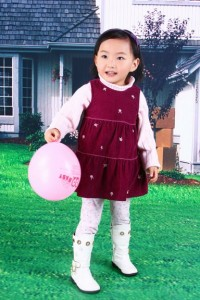

过年对于我们大人来说似乎越来越没意思，除了能多些时间陪陪家人之外，用萌萌的话说简直就是索然无味。

  

腊月二十四从娘家回来后因为身心疲惫，足足在床上躺了两天，跟本没有精神去办什么年货，两个人甚至连双新袜子都没买。幸亏宝宝有爷爷奶奶照看，俺们也是

照例回沟里过年。如果说没有年货好像还有点儿冤枉了，福字倒是买了几个，呵呵。

虽没办什么年货，卫生还是打扫了一下的。先是大洗一通，把衣物床单被罩之类都清洗干净；然后把所有房间的灯具都擦拭干净

，还把坏掉的灯泡给换了；第三是把浴室彻底刷洗一遍，算是做到亮亮堂堂过大年吧。前两个活帅哥都起了很大作用，洗衣机由他搬进去，拆卸灯具也全是他的功劳，之前我总说人家不做家务，其实是大大地冤枉了，人家一年到头地负责刷碗，我咋给忘了呢，人家经常往家里办置生活用品我咋给忽略了，人家偶尔还会主动洗衣服扫地……

初一帅哥大舅全家到沟里串门儿，我们着实热闹也辛苦了一番，初二本来帅哥奶奶家亲戚搞家庭聚会，我因为娘家的特殊情况没有参加，急匆匆赶回去帮妈妈招待初三的大批客人，大厨的名声也因此传将出去。可惜因为妈妈的不信任和唠叨俺一走神儿割破了手指，幸亏伤口不是很深，今天已经没有那么红肿了。初四到长辈们家里拜年一上午（正规行礼那种）下午简单招待小姨后跟妹妹送其回家，跟一老同学仓促见面后，大晚上地搭朋友的顺风车赶回大连，因为没有吃好睡好加上紧张劳累，在车上有些恶心想吐呢。

实在折腾瘦了，今早称一下只剩94斤，一冬天不但没长肉反倒掉了五六斤，唉！初五幺幺睡了一天，才觉得缓过来一些。今儿阳光明媚，俩人儿高高兴兴去沟里陪老人孩子直到晚上才回来，想想很久没记账了，在帅哥的撺掇下，草草写几句，明儿还要回沟里包饺子，因为是小孩儿的日子，呵呵，年说过去就过去了，除了折腾就是折腾，难怪妈妈总说过年最没意思，唉。

之前听同事说好像初八上班，到现在没消息简直太好了，希望能按照原计划二月中旬开工吧，！！！
