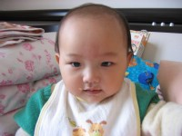
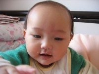
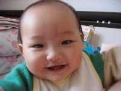

**这三张是宝宝吃鸡蛋膏时的狼狈相，点击看大图就会发现不但嘴边挂满鸡蛋膏，还因为刚打个喷嚏而搞出来的鼻涕泡呢，哈哈……**

这几天萌萌几乎能把一碗鸡蛋糕全部吃光，吃奶粉也很顺当，再不用先拿母乳糊弄了。好的时候便便就跟着正常了，已经连续三天下午一把就便便了。算上之前两天的大小babami就是五天啊，五天足以养成习惯了吧？睡眠质量比前一阵子好多了，昨晚才起来一两次，￥＃◎**可能是傍晚嗷嗷叫唤的太厉害累了吧**◎＃￥

也是因为感冒还学会了两个搞怪的故事：一个是因为鼻子不透气，吃奶时总是没几口就开始夸张地换气，嘶哈嘶哈地表演一通，有点像小狗狗夏天里被热得够戗的样子，而且有过之而无不及；第二个是打呵欠，感冒药里的扑尔敏有发困的副作用，这在咱萌萌身上表现得很明显。药力一旦上来她就呵欠不断，而且还打出花样来了，先是把小嘴一喔喔，然后深深吸口气，再分几次把气吐出同时还”啊……啊……啊……”地发出声音呢，被她笑死了，那小家伙看大家喜欢就更加起劲表演。

虽然宝宝这次病没什么大影响，我也有点跟着上火，鼻子下起了个疖子，现在正疼呢，哎，千万不要以为是借口啊，哈哈！
