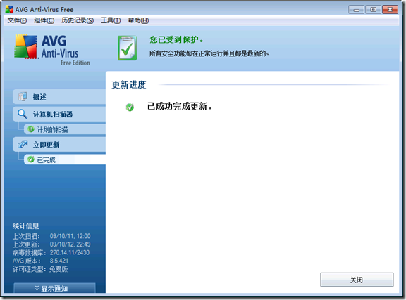

在本子上安装了Windows7，感觉还是很炫的，给大家简单介绍介绍。

第一个特点是taskbar的改动，估计以后的程序员就需要在taskbar上多花心思了。举一个最简单的例子，当我下载一个文件，下载进度可以在图标的渐变进度上体现出来，非常直观。另外taskbar也实现了鼠标滑过显示预览的功能，但是这效果太费cpu资源让我关掉了。

安装好系统以后，需要安装一些常用软件，我推荐下面这个列表。

1，杀毒软件，不用什么花钱的，免费的AVG就不错，而且有中文界面，使用非常方便。

2，QQ在windows7上没有问题，但是QQ拼音好像不太好用。

3，输入法还是选择“搜狗拼音输入法”，对windows7的支持已经很好了。

4，风行，pplive，这两个视频软件的最新版都支持的很好了。

5，迅雷，utorrent运行也很完美。

6，IE8运行有些问题，估计是某个软件的插件导致的，可以使用遨游浏览器或者firefox。

以上基本上都是大众口味的软件，我自己用的lua for windows以及python也都支持的很好。总而言之，从Windows XP转换到使用Windows7基本上没差太多，不需要另外学习什么。只要记得经常更新windows的补丁以及升级杀毒软件，使用起来就不用担心什么了。
