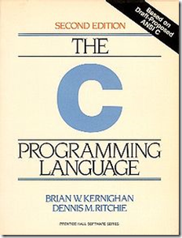

一般计算机专业的都学过C语言，至少我们那时候是这样的，那时候我们寝室老六一句名言：C语言无所不能。这话想想其实还真没错，C语言写出了各种操作系统，写出了Python、Lua、Ruby这样的编程语言，写出了大量的大中小型程序，最近一个月的TIOBE编程语言排行，C语言这杆老枪甚至又抢回头名，把Java赶下台。

C语言一般是学K&R，[http://en.wikipedia.org/wiki/The\_C\_Programming\_Language\_%28book%29](http://en.wikipedia.org/wiki/The_C_Programming_Language_%28book%29 "http://en.wikipedia.org/wiki/The_C_Programming_Language_%28book%29")，当然也有人用谭浩强那本，但是无论哪一本都会介绍C语言的标准库。

之所以称之为标准库，是因为在大多数实现了C语言编译器的操作系统上都包含了这些库函数的实现，最常见的如printf, malloc, free等，它们都是库函数。

好吧，你有没有像我一样，曾经好奇过这些库函数是如何实现的呢？

一般这些库函数都是由操作系统作者编写，当你在自己的程序中调用这些函数如printf，就会将标准库中的函数链接到你的程序中，我说的不是很准确，具体的过程可以参考linker and loader这本书，或者是《程序员自我修养》这本。

好在我们有了开源的标准库实现，就是glibc（注意不是glib，那是另外一个东西了）[http://en.wikipedia.org/wiki/Glibc](http://en.wikipedia.org/wiki/Glibc "http://en.wikipedia.org/wiki/Glibc")，下载了glibc的代码，你就会找到里面对这些神奇的函数的具体实现，当然，类似malloc这样的函数复杂的要命。比如

[http://fxr.watson.org/fxr/source/stdlib/malloc.c?v=FREEBSD-LIBC](http://fxr.watson.org/fxr/source/stdlib/malloc.c?v=FREEBSD-LIBC "http://fxr.watson.org/fxr/source/stdlib/malloc.c?v=FREEBSD-LIBC")

就是FreeBSD的malloc的实现（malloc.c）

[http://fxr.watson.org/fxr/source/stdlib/qsort.c?v=FREEBSD-LIBC](http://fxr.watson.org/fxr/source/stdlib/qsort.c?v=FREEBSD-LIBC "http://fxr.watson.org/fxr/source/stdlib/qsort.c?v=FREEBSD-LIBC") 这个是qsort函数的实现。都比较复杂。

这时候，就要隆重介绍我要推荐的主角了，它就是dietlibc，一个非常精简的C标准库实现，用于C语言学习非常适合，而且代码写的也很清晰，至少比glibc清晰多了，原因也很简单，因为glibc要做大量的取舍平衡速度优化，里面自然存在不少丑陋的代码。

[http://www.fefe.de/dietlibc/](http://www.fefe.de/dietlibc/ "http://www.fefe.de/dietlibc/")

我写这篇文章时，dietlibc的最新版是0.32，大约是09年5月底发布的，我下载的压缩包大概是580KB左右。解压以后，可以找到这个目录dietlibc-0.32\\lib，里面就是C标准库函数的实现代码。malloc的代码是在alloc.c中，qsort的实现大概50行左右，也比FreeBSD的简单多了。

在[www.fefe.de](http://www.fefe.de)这个页面还可以发现大量C语言相关的项目，涉及到各个方面，用来C语言编程学习是非常有帮助的。
