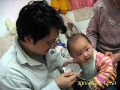
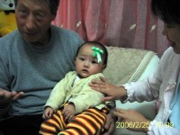
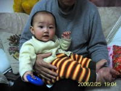

前天是周五，跟奶奶抱萌萌去防治站扎预防针。没想到周昨天下午就开始发高烧，好一顿处理才于今天上午恢复正常。

要说这热的也真快，上午我一同学跟男朋友来访还好好的呢，下午睡了一觉醒来脸就红了。亏得宝宝比较泼实，没怎么闹人，还由爸爸负责喂了排骨加蔬菜肉泥呢。而且赶上爷爷奶奶也在，帮着捂弄到很晚，不然我肯定被撂倒！就这也是1414的呢。对了，这个泼实也是大连话，大致就是性格活泼开朗，不娇气，不磨人，身体结识的意思。

宝宝这次扎的麻疹，是减毒的活疫苗，本不应该有什么反应的。发热可能是上次的感冒还没好利索引起的。最初测38.5度，我实在有点慌了，就打电话给萌萌姥爷和在防治站工作的两个朋友，都说应该问题不大，可以先用物理降温，实在不行用点小孩子吃的退热药。如果第二天上午还不见好转再去医院看看。

于是就先开始物理降。在萌萌的手脚心，前后心，以及腋下和腹股沟擦酒精。好一番折腾也就退了不到半度。已经傍晚了，眼看着宝宝小脸通红，又困又热，哼哼唧唧难受的样子，决定还是吃药吧。吃过药没多久她就睡了，半小时后醒来温度降了了一点，精神心情都好多了。爷爷奶奶陪着玩了好久，我每半个小时给她测一次，后来降至37度多，总算可以放心了，只要睡前再服一次药，夜里不突然烧起来就好。

这一夜真是难熬，宝宝频频哭着醒来，我基本就没怎么睡，幸运的是温度控制得尚好，早上起来一测36.8度，最后再吃一次药看看吧，下午不烧就万事大吉！

谢天谢地，正如预期的那样，宝宝终于回复了正常！这一天食欲心情都很好。希望睡个好觉吧……

以下是昨天的几张照片

  

1.下午宝宝已经开始热了，当时状态还很好，爸爸给弄的排骨肉泥＋蔬菜泥吃得很香。

2.晚上热度退一点了，把郝阿姨送的礼物翻出来稀罕，连包装都不放过，花花取下来贴头上，表示人家是个漂亮的美眉，只是表情看上去怎么像跟大家诉说：”我是小病号，成了重点保护对象”呢？可怜的娃！

3.小孩子一点都不装病。吃过药，小睡起来后精神头就好多了，虽然近38度，脸蛋还是红扑扑的，心情却不错，跟爷爷玩的很开心哦。

4.可惜今天奶奶给宝宝做的蔬菜排骨汤面没来得及拍下来，不过宝宝吃得很香就足够啦。

就到这里，再见吧，晚安！！！
