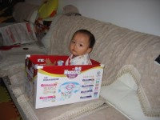
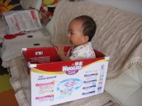
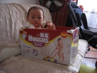

奶奶今天不舒服在家休息，爷爷傍晚的时候过来了。

除了奶奶，萌萌也很喜欢跟爷爷玩。我给宝宝做好晚饭到客厅看祖孙两个玩的怎么样，准备给她喂面条。一进屋简直被他俩笑死了，爷爷居然把萌萌放在纸盒箱子里，那小家伙在里面玩的还挺高兴，见我进来爷爷也呵呵笑着说萌萌在里面玩的一包劲，干脆就在里面吃饭得了！！！这孩子简直成小鸡崽儿了（我小时候她姥姥就把小鸡放在纸箱里面养的，嘻嘻）

这不，随手拍了几张照片，可惜没拍到吃饭的场面……

1.看样子好像挺无辜

2.其实玩的很高兴

3.最后舒服得往箱壁上一靠，把脚丫子都举起来了
