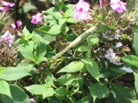
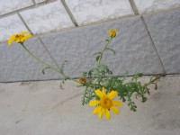
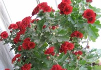

  

第一张点击看大图会有意外发现！！！

过完百岁时去姥姥家呆了一个多月，期间拍了不少照片，以上三张是妈妈闲暇时拍的两幅”作品”，自己觉得很有”艺术价值”哈哈，跟大家分享一下

1.别以为这是简单的花草，里面可大有内容哦。仔细看看就会发现上面趴了一只螳螂，而且正凶残地在啃噬一只可怜的小蜜蜂。印象中，螳螂应该算是益虫的，蜜蜂更不用说了，可是好人怎么会向好人发难呢？可能我们人类太主观了，大自然就是这样的物竞天择，弱肉强食啊！

2.钢筋混凝土的空隙里不但长出了这株植物还绽放出美丽动人的花朵，生命真的值得敬畏。告诉大家吧，这是一棵茼蒿。

3.国庆节，窗台上一盆国庆菊开得火爆，很合时宜吧，咱是不是也挺爱国的？

呵呵，就到这里。秀楠爸等着用电脑了：）
