[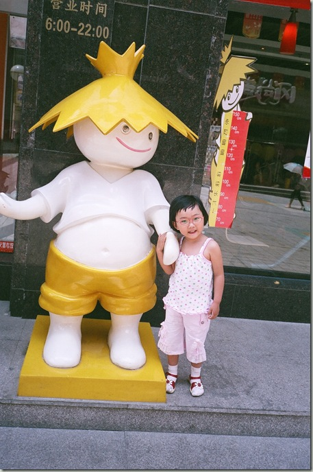](http://sunxiunan.com/wp-content/uploads/2009/08/96470021.jpg)

与永和豆浆门口的吉祥物合个影[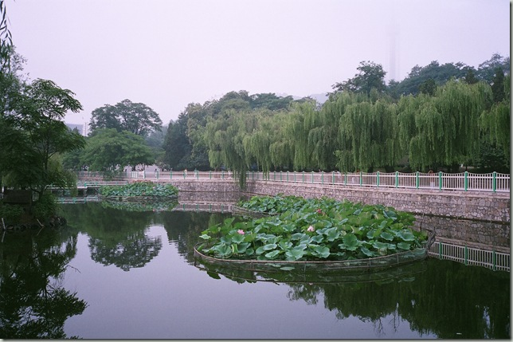](http://sunxiunan.com/wp-content/uploads/2009/08/96470010.jpg)

劳动公园的荷花池。

[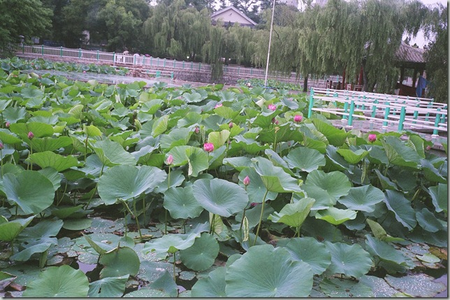](http://sunxiunan.com/wp-content/uploads/2009/08/96470011.jpg)

夏日荷花

[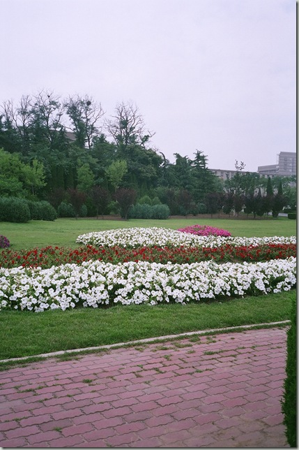](http://sunxiunan.com/wp-content/uploads/2009/08/96470016.jpg) 

海事大学的草坪，我们本科同学十年聚会，很开心。

[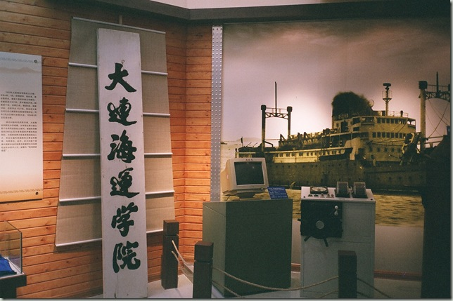](http://sunxiunan.com/wp-content/uploads/2009/08/96470020.jpg)

以前，海大叫做海运学院。

[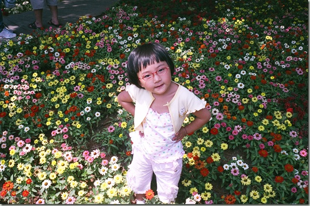](http://sunxiunan.com/wp-content/uploads/2009/08/96470023.jpg)

劳动公园的花坛。

[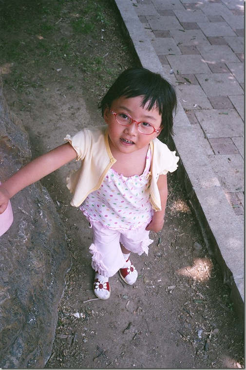](http://sunxiunan.com/wp-content/uploads/2009/08/96470028.jpg) 

宝贝，你这表情也太成熟了。

[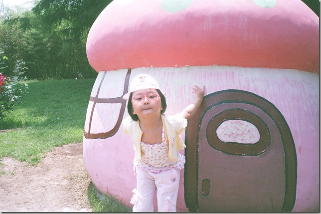](http://sunxiunan.com/wp-content/uploads/2009/08/96470036.jpg)

蘑菇房子。

[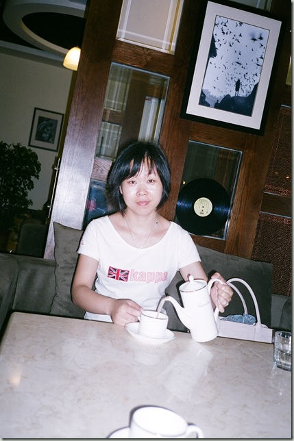](http://sunxiunan.com/wp-content/uploads/2009/08/96470006.jpg) 

马格南咖啡馆，点了一份奶茶和意大利肉酱面，味道还不错，不过更适合小资白领呆上一下午上上网什么的。我们去就是为了吃饭！

[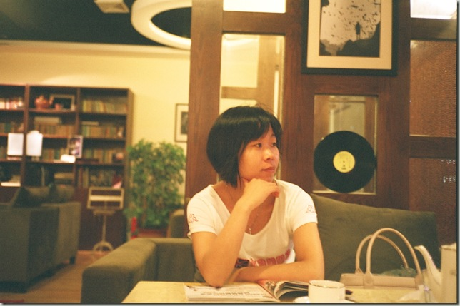](http://sunxiunan.com/wp-content/uploads/2009/08/96470001.jpg)

小姨子对这一张很不爽，评论是“矫揉造作”。

[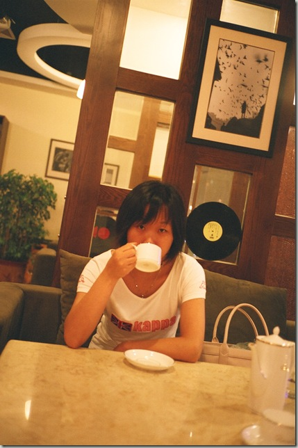](http://sunxiunan.com/wp-content/uploads/2009/08/96470005.jpg)
