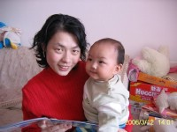
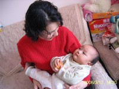
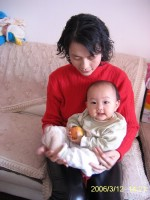

赵本山和范伟以及高秀敏在前两年春晚上演的小品《卖拐》里面”缘分啊……”这句台词实在可笑，不过您还别说，缘分这东西真是很奇妙。远的不说，暂且举个我在妇产医院生宝宝时的一个例子吧。

那段经历我很少愿意提起，不过有件事儿却是有一定讲头的：生萌萌那天晚上公公婆婆都没在跟前，回家休息了，老公一个人忙的晕头转向。等我跟宝宝回到病房，临床比我们早生一天的那家人帮了不少忙，又是介绍经验又是送红糖什么的，当时真是被感动的不行。

我当天大出血，只有婆婆在，她慌的不知怎么好，后来都吓哭了，也亏得临床姐妹的婆婆提醒并帮忙到处找大夫。

还有那宝宝的爸爸更是热心的不得了，愣是把我那什么都不懂的老公给培训成合格奶爸了！在医院那几天基本是婆婆和我娘家妈值白班，老公自己值夜班。起初宝宝一哭闹老公就忙的一头汗，后来在那哥们儿的耐心指导和帮忙下，他渐渐上道了。给宝宝弄奶，换尿布，哄睡觉一丝不苟，还嫌白班的老娘不中用呢。

就这样一来二去两家关系处的很好。直到出院以后也没断，适当的时机会联系一下。今天恰好她们两口人到我家附近找亲戚看牙医，顺便来看看。这一见真是感慨万千啊，事隔九个多月，感觉还是那么亲切，连萌萌都一点没认生，还跟人家粘糊的不行。穿衣服要走她还不乐意，直往阿姨怀里扑。这难道不是缘分吗？

可惜的是我们两家文化背景和养育孩子的方式有些不同，要不然共同话题会更多。这样也好，大家可以互通有无取长补短啊，呵呵。

以下是随手拍的宝宝跟阿姨在一起的照片

