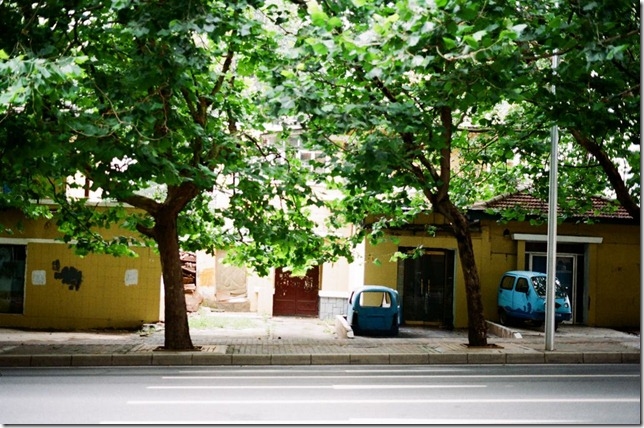
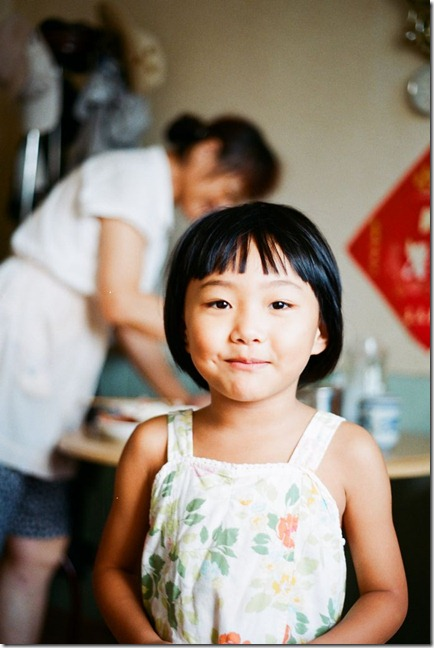
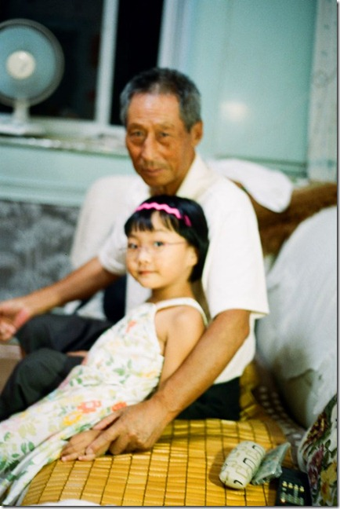

一方面是喜欢胶片的粗糙感觉以及拍摄以后等待冲洗的那种心情，另一方面，也是主要原因暂时没那么多经费上数码单反，于是从ebay上拍了一台胶片单反相机。

这台胶片单反相机已经有将近30年的历史，曾经在八十年代初得到欧洲相机大奖，也号称是用了它就能达到美。没错，就是美能达x700。

第一卷使用Kodak proimage100胶卷。

下面的片子都没有经过ps处理（当然不排除店家扫描的时候p了），第一卷完全使用P模式。

这是高尔基路。

 

刚起床，这是开头几张，很没经验，对焦对到衣服上了。

妈妈养的花。

 

过曝了，不过还算能看。

萌萌在疯跑中。

装成熟的小女孩。

   

拿着巧虎星象仪。

爷孙俩。
