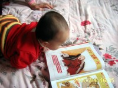
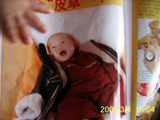
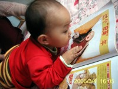
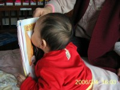

最近几天总是瞎忙，没上来给萌萌记什么东西

先整理一组照片出来吧，又能编成一个类似”韭菜与葱”的小故事呢，大家跟着一起乐乐

   

别忘了，点击小图看大图，看看书上的小宝宝怎么也没几根头发呢，嘻嘻

1.奶奶正陪宝宝看《妈咪宝贝》，翻到这一页，宝宝突然停住了，盯着看个没完

2.片刻，小手覆了上去，看看是什么吸引了她的注意呢？

3.原来是个穿着时装的婴儿小模特，而且是个小伙子哦！此时，萌萌已经凑的更近了，是在研究衣服的质地和款式吗？

4.答案揭晓：这个小色丫，她相中了上面的小帅哥，奔儿！上去就亲了一口……

我跟奶奶反复试了几次，她唯独对这个图片有兴趣，先是尖叫然后就是亲亲，哈哈！
