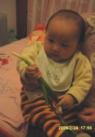
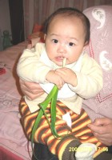

傍晚，我去厨房找东西，无意间发现奶奶洗好的菜里有一棵挺特别的，顺手拿过去给萌萌看，没想到她不但看得认真，还正经八百品尝了一下呢，很有一番神农尝百草的精神啊！

点击看大图

1.小东西拿到菜先是左看右看的，心想：什么东西呢，好吃的？

2.决定咬一口看看啥滋味

3.刚一入口没什么感觉

4.再狠狠来一下吧，哇，好辣呦！

大家不要以为萌萌咬的是棵小葱，那可是被奶奶扒掉两个叶子的韭菜芯啊，见过这么粗壮的韭菜吗？恐怕跟南方人心目中的葱没什么两样吧，哈哈……
