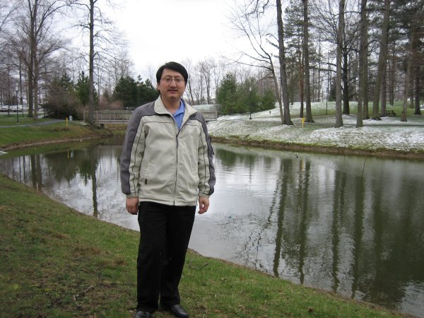

因为在这里的人不多，所以吃的还是挺爽的。

1 red lobster吃龙虾的地方，点了一个lobster lover’s dream，但是里面有pasta，后悔了，龙虾还是很好吃。

2 legacy village里面的cheesecake factory。这地方的牛排不错，但蛋糕更有名。legacy villiage算得上cleveland的奢侈消费场所。giant eagle是卖蔬菜水果食品烟酒的地方，比walmart好多了。买了一瓶napa出产的红酒，那里的红酒真的是太多了，大多十几二十左右，不贵但看上去很好。还有一家加州比萨饼店，我们去吃了两回，相对牛排要便宜很多。

3 fishmarket。是cleveland吃鱼的地方，大比目鱼和salmon都很好吃。

4 fishmarket附近一家超爽超贵的牛排店。ribeye很好吃，是我唯一一次完全把牛排全吃完的，要的是medium。

5 PF.chang一家老外开的中餐店，很少有中国人去，主要原因是比中国人开的中餐要贵一些，但是很干净。我perfer去PF.chang而不是中餐馆。宫保鸡丁酸辣汤麻婆豆腐都和国内口味差别较大，但是不难吃。

啤酒这次也喝了不少品种，sameul adams和machlob ultra, corana, gennieus, 还有一种荷兰进口的啤酒（不是喜力）也很好喝，其中爱尔兰(irish?)的健力士最苦。萨缪尔亚当斯比较醇厚。我都挺喜欢的。

hilton楼下的早餐也很不错，有一天早上有黑莓吃，味道独特，相当的好吃。平时都让人给做一个蔬菜煎鸡蛋，放上菠菜（不是很确信）洋葱，青椒，mushroom，番茄，没有放什么调料，保持了原汁原味。

在公司后面拍的照片  

