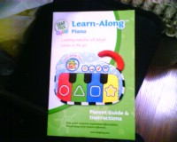
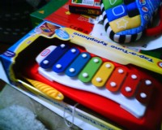
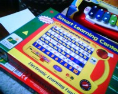
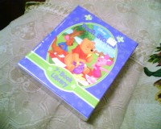
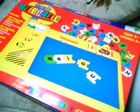
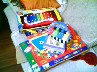

上图了，相机被大丫带回家，只能用手机拍，效果奇差。

一个发声玩具，可以学颜色、形状，还可以切换到简单琴或者音乐的功能。在walmart买的，大约13美元。

一个类似木琴的东西，声音很好听，可以发七个音。这个是在某个商店在公司里特价时买的，也是十几美元，十分好玩。

可以用来学习二十六个字母的玩具，会问什么是大象，然后就按E这个字母。功能强大，正常市场价格在三四十美元左右，特价也是13美元。

小熊维尼图画书，一套七册。

可以当小黑板，也可以做拼字游戏，里面有磁铁。

大家一起来一张。

